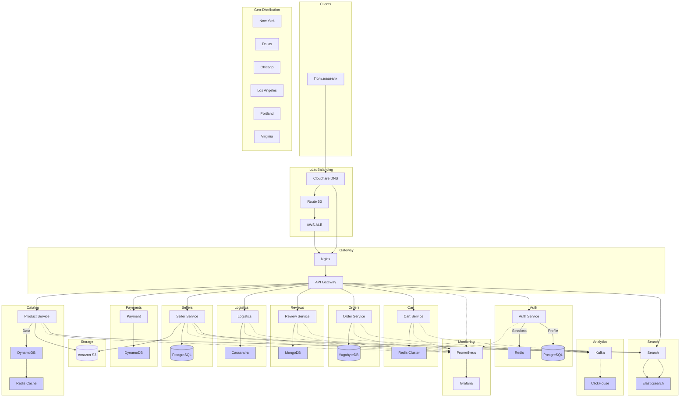

```mermaid
graph TD
  subgraph Clients
    UI["Пользователи"]
  end

  subgraph Gateway
    NGINX[Nginx] --> APIGW[API Gateway]
  end

  subgraph Auth
    AuthService["Auth Service"] -->|Sessions| RedisSessions[Redis]
    AuthService -->|Profile| PostgresUsers[(PostgreSQL)]
  end

  subgraph Catalog
    Products["Product Service"] -->|Data| DynamoDBProducts[DynamoDB]
    DynamoDBProducts --> RedisProductCache[Redis Cache]
  end

  subgraph Cart
    CartService["Cart Service"] --> RedisCart[Redis Cluster]
  end

  subgraph Orders
    OrderService["Order Service"] --> YugabyteOrders[(YugabyteDB)]
  end

  subgraph Reviews
    ReviewService["Review Service"] --> MongoReviews[MongoDB]
  end

  subgraph Logistics
    LogisticsService["Logistics"] --> CassandraShipments[Cassandra]
  end

  subgraph Sellers
    SellerService["Seller Service"] --> PostgresSellers[(PostgreSQL)]
  end

  subgraph Search
    SearchService["Search"] --> ElasticSearch[Elasticsearch]
  end

  subgraph Payments
    PaymentService["Payment"] --> DynamoPayments[DynamoDB]
  end

  subgraph Analytics
    Kafka[Kafka] -.-> ClickHouse[ClickHouse]
  end

  subgraph Storage
    S3[(Amazon S3)]
  end

  subgraph Monitoring
    Prometheus[Prometheus] --> Grafana[Grafana]
    APIGW -.-> Prometheus
    AuthService -.-> Prometheus
    Products -.-> Prometheus
    CartService -.-> Prometheus
    OrderService -.-> Prometheus
    ReviewService -.-> Prometheus
    SellerService -.-> Prometheus
    LogisticsService -.-> Prometheus
  end

  subgraph LoadBalancing
    ALB["AWS ALB"] --> NGINX
    Route53["Route 53"] --> ALB
    Cloudflare["Cloudflare DNS"] --> Route53
  end

  subgraph DataCenters["Geo-Distribution"]
    NYC["New York"]
    DAL["Dallas"]
    CHI["Chicago"]
    LA["Los Angeles"]
    PDX["Portland"]
    VA["Virginia"]
  end

  UI --> Cloudflare
  Cloudflare --> NGINX

  APIGW --> AuthService
  APIGW --> Products
  APIGW --> CartService
  APIGW --> OrderService
  APIGW --> ReviewService
  APIGW --> SellerService
  APIGW --> SearchService
  APIGW --> PaymentService
  APIGW --> LogisticsService

  Products --> S3
  SellerService --> S3

  OrderService -.-> Kafka
  CartService -.-> Kafka
  ReviewService -.-> Kafka
  LogisticsService -.-> Kafka
  SellerService -.-> Kafka

  SearchService --> ElasticSearch
  Products --> SearchService
  SellerService --> SearchService

  classDef db fill:#ccf,stroke:#333,stroke-width:1px;
  class PostgresUsers,PostgresSellers,DynamoDBProducts,YugabyteOrders,MongoReviews,CassandraShipments,DynamoPayments,ClickHouse,ElasticSearch,RedisSessions,RedisCart,RedisProductCache db;

  %% Обозначения:
  %% Прямая линия — синхронный вызов
  %% Пунктирная линия — асинхронный вызов (например, Kafka, Prometheus)
```
