```mermaid
graph TD
  subgraph frontend
    mobile_client["mobile client"]
    web_client["web client"]
    public_client["public client"]

    mobile_nginx["mobile nginx"]
    web_nginx["web nginx"]
    public_nginx["public nginx"]

    mobile_client -->|"синхронный запрос"| mobile_nginx
    web_client -->|"синхронный запрос"| web_nginx
    public_client -->|"синхронный запрос"| public_nginx
  end

  subgraph gateway
    api_gateway["API-Gateway"]
  end

  subgraph backend_services
    AuthService["Auth Service"]
    Products["Product Service"]
    CartService["Cart Service"]
    OrderService["Order Service"]
    ReviewService["Review Service"]
    LogisticsService["Logistics"]
    SellerService["Seller Service"]
    SearchService["Search"]
    PaymentService["Payment"]
  end

  subgraph workers
    AuthWorker["Auth Worker"] -->|Sessions| RedisSessions[Redis]
    AuthWorker -->|Profile| PostgresUsers[(PostgreSQL)]

    ProductWorker["Product Worker"] -->|Write| DynamoDBProducts[DynamoDB]
    DynamoDBProducts --> RedisProductCache[Redis Cache]

    CartWorker["Cart Worker"] --> RedisCart[Redis Cluster]
    OrderWorker["Order Worker"] --> YugabyteOrders[(YugabyteDB)]
    ReviewWorker["Review Worker"] --> MongoReviews[MongoDB]
    LogisticsWorker["Logistics Worker"] --> CassandraShipments[Cassandra]
    SellerWorker["Seller Worker"] --> PostgresSellers[(PostgreSQL)]
    SearchWorker["Search Worker"] --> ElasticSearch[Elasticsearch]
    PaymentWorker["Payment Worker"] --> DynamoPayments[DynamoDB]
  end

  subgraph analytics
    Kafka[Kafka] -.-> ClickHouse[ClickHouse]
  end

  subgraph storage
    S3[(Amazon S3)]
  end

  subgraph monitoring
    Prometheus[Prometheus] --> Grafana[Grafana]
    api_gateway -.-> Prometheus
    AuthService -.-> Prometheus
    Products -.-> Prometheus
    CartService -.-> Prometheus
    OrderService -.-> Prometheus
    ReviewService -.-> Prometheus
    SellerService -.-> Prometheus
    LogisticsService -.-> Prometheus
  end

  subgraph LoadBalancing
    ALB["AWS ALB"] --> NGINX[Nginx]
    Route53["Route 53"] --> ALB
    Cloudflare["Cloudflare DNS"] --> Route53
  end

  subgraph DataCenters["Geo-Distribution"]
    NYC["New York"]
    DAL["Dallas"]
    CHI["Chicago"]
    LA["Los Angeles"]
    PDX["Portland"]
    VA["Virginia"]
  end

  mobile_nginx -->|"синхронный запрос"| api_gateway
  web_nginx -->|"синхронный запрос"| api_gateway
  public_nginx -->|"синхронный запрос"| api_gateway

  UI["Пользователи"] --> Cloudflare
  Cloudflare --> NGINX

  api_gateway --> AuthService
  api_gateway --> Products
  api_gateway --> CartService
  api_gateway --> OrderService
  api_gateway --> ReviewService
  api_gateway --> SellerService
  api_gateway --> SearchService
  api_gateway --> PaymentService
  api_gateway --> LogisticsService

  AuthService --> AuthWorker
  Products --> ProductWorker
  CartService --> CartWorker
  OrderService --> OrderWorker
  ReviewService --> ReviewWorker
  LogisticsService --> LogisticsWorker
  SellerService --> SellerWorker
  SearchService --> SearchWorker
  PaymentService --> PaymentWorker

  OrderWorker -.-> Kafka
  CartWorker -.-> Kafka
  ReviewWorker -.-> Kafka
  LogisticsWorker -.-> Kafka
  SellerWorker -.-> Kafka

  ProductWorker --> S3
  SellerWorker --> S3

  SearchWorker --> ElasticSearch
  ProductWorker --> SearchWorker
  SellerWorker --> SearchWorker

  classDef db fill:#ccf,stroke:#333,stroke-width:1px;
  classDef backend fill:#cbd3f5,stroke:#333,stroke-width:1px;
  classDef services fill:#e0d1f5,stroke:#333,stroke-width:1px;
  classDef proxy fill:#cce5cc,stroke:#333,stroke-width:1px;
  classDef client fill:#f9f9f9,stroke:#333,stroke-width:1px;
  classDef broker fill:#eeeeee,stroke:#333,stroke-width:1px;
  classDef worker fill:#fff2cc,stroke:#333,stroke-width:1px;

  class mobile_nginx,web_nginx,public_nginx proxy;
  class mobile_client,web_client,public_client client;
  class api_gateway backend;
  class Kafka,ClickHouse broker;
  class RedisSessions,RedisCart,RedisProductCache,PostgresUsers,PostgresSellers,DynamoDBProducts,YugabyteOrders,MongoReviews,CassandraShipments,DynamoPayments,ElasticSearch,S3 db;
  class AuthWorker,ProductWorker,CartWorker,OrderWorker,ReviewWorker,LogisticsWorker,SellerWorker,SearchWorker,PaymentWorker worker;
```

[Ссылка на красивую схему](https://www.mermaidchart.com/raw/23bbb5f7-032b-4d15-9c2c-597d3ca1046c?theme=light&version=v0.1&format=svg)

---

##  **Сервисы проекта Amazon **

###  Основные микросервисы:

1. **Auth Service**  
   - Регистрация, авторизация, управление профилем пользователя.  
   - Проверка доступа для заказов, оплаты и логистики.  
   - Взаимодействует с PostgreSQL и Redis через AuthWorker.

2. **Payment Service**  
   - Обработка платежей и Amazon Prime подписок.  
   - После успешной транзакции обновляет профиль через Auth Service.

3. **Review Service**  
   - Создание отзывов и оценок товаров.  
   - Данные пишутся в MongoDB, отправляются в Kafka для последующего анализа.

4. **Product Service**  
   - Отвечает за каталог товаров, обновление информации.  
   - Чтение из Redis, запись в DynamoDB и публикация в S3.

5. **Search Service**  
   - Полнотекстовый поиск по товарам и продавцам.  
   - Данные приходят из PostgreSQL через SearchWorker и индексируются в Elasticsearch.

6. **Cart Service**  
   - Управление корзиной пользователя.  
   - Высокочастотный доступ через Redis.

7. **Order Service**  
   - Оформление заказов.  
   - Информация о заказе передаётся в Kafka и сохраняется в YugabyteDB.

8. **Seller Service**  
   - Управление профилем продавца, добавление товаров.  
   - Хранение данных — PostgreSQL + публикация в S3 и Elasticsearch.

9. **Logistics Service**  
   - Обработка логистики и трекинг посылок.  
   - Сохраняет статусы в Cassandra, события отправляет в Kafka.

10. **Recommendation Service**  
    - Выдача персональных рекомендаций на основе отзывов (Mongo), заказов (Yugabyte), просмотров (ClickHouse).  
    - Вычисления через алгоритм косинусного сходства. *(можно выделить как отдельный воркер позже)*

11. **Rating Updater**  
    - Периодически анализирует отзывы и обновляет рейтинги в PostgreSQL.

12. **Content Upload Service**  
    - Используется администраторами для загрузки новых товаров и изображений.  
    - Информация отправляется в PostgreSQL и S3.

13. **Moderation Service**  
    - Отвечает за модерацию отзывов и товаров, прежде чем они становятся публичными.  
    - Получает сообщения из Kafka.

14. **Metrics Collector**  
    - Получает метрики от всех сервисов.  
    - Сохраняет их в Prometheus, визуализация — через Grafana.

---

##  **Потоки данных :**

| Поток | Описание | Тип |
|-------|----------|-----|
| **1. Авторизация** | `API-Gateway → AuthService → Redis, PostgreSQL` — регистрация, вход, проверка токена | **Синхронный** (→) |
| **2. Платежи** | `API-Gateway → PaymentService → AuthService (обновление токена)` | **Синхронный** (→) |
| **3. Оформление заказа** | `API-Gateway → OrderService → YugabyteDB` | **Синхронный** (→) |
| **4. Событие заказа** | `OrderWorker ↠ Kafka (topic: order_created)` | **Асинхронный** (↠) |
| **5. Обновление корзины** | `API-Gateway → CartService → Redis` | **Синхронный** (→) |
| **6. Отзыв/оценка** | `API-Gateway → ReviewService → MongoDB` | **Синхронный** (→) |
| **7. Событие отзыва** | `ReviewWorker ↠ Kafka (topic: review_created)` | **Асинхронный** (↠) |
| **8. Рейтинги** | `RatingService ↠ PostgreSQL` (по расписанию) | **Асинхронный** (↠) |
| **9. Рекомендации** | `RecommendationService ↠ PostgreSQL, Redis` (по расписанию) | **Асинхронный** (↠) |
| **10. Поиск** | `SearchService → Elasticsearch` (поиск товаров) | **Синхронный** (→) |
| **11. Индексация поиска** | `ProductWorker/SellerWorker ↠ SearchWorker → Elasticsearch` | **Асинхронный** (↠) |
| **12. Доставка** | `API-Gateway → LogisticsService → Cassandra` | **Синхронный** (→) |
| **13. Событие логистики** | `LogisticsWorker ↠ Kafka (topic: shipment_updated)` | **Асинхронный** (↠) |
| **14. Каталог товаров** | `API-Gateway → ProductService → DynamoDB, Redis` | **Синхронный** (→) |
| **15. Загрузка контента** | `Admin → ContentUploader → PostgreSQL, S3` | **Синхронный** (→) |
| **16. Модерация** | `Kafka ↠ ModerationService → PostgreSQL` | **Асинхронный** (↠) |
| **17. Метрики** | `Все сервисы ↠ Prometheus → Grafana` | **Асинхронный** (↠) |
| **18. Кеширование** | `RecommendationService/SearchService → Redis Cache` | **Синхронный** (→) |

---

**Синхронные (→)**   
**Асинхронные (↠)** 
---

---
