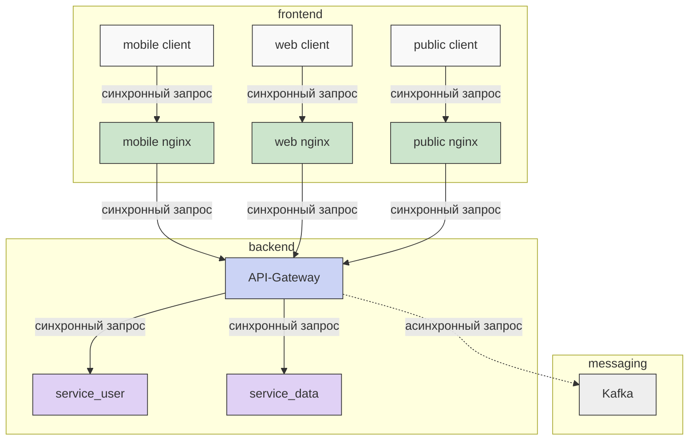

```mermaid
graph TD
  subgraph frontend
    mobile_client["mobile client"]
    web_client["web client"]
    public_client["public client"]

    mobile_nginx["mobile nginx"]
    web_nginx["web nginx"]
    public_nginx["public nginx"]

    mobile_client -->|"синхронный запрос"| mobile_nginx
    web_client -->|"синхронный запрос"| web_nginx
    public_client -->|"синхронный запрос"| public_nginx
  end

  subgraph backend
    api_gateway["API-Gateway"]
    service_user["service_user"]
    service_data["service_data"]
  end

  subgraph messaging
    kafka[Kafka]
  end

  mobile_nginx -->|"синхронный запрос"| api_gateway
  web_nginx -->|"синхронный запрос"| api_gateway
  public_nginx -->|"синхронный запрос"| api_gateway

  api_gateway -->|"синхронный запрос"| service_user
  api_gateway -->|"синхронный запрос"| service_data
  api_gateway -.->|"асинхронный запрос"| kafka

  classDef backend fill:#cbd3f5,stroke:#333,stroke-width:1px;
  classDef services fill:#e0d1f5,stroke:#333,stroke-width:1px;
  classDef proxy fill:#cce5cc,stroke:#333,stroke-width:1px;
  classDef client fill:#f9f9f9,stroke:#333,stroke-width:1px;
  classDef broker fill:#eeeeee,stroke:#333,stroke-width:1px;

  class mobile_nginx,web_nginx,public_nginx proxy;
  class mobile_client,web_client,public_client client;
  class api_gateway backend;
  class service_user,service_data services;
  class kafka broker;
```
