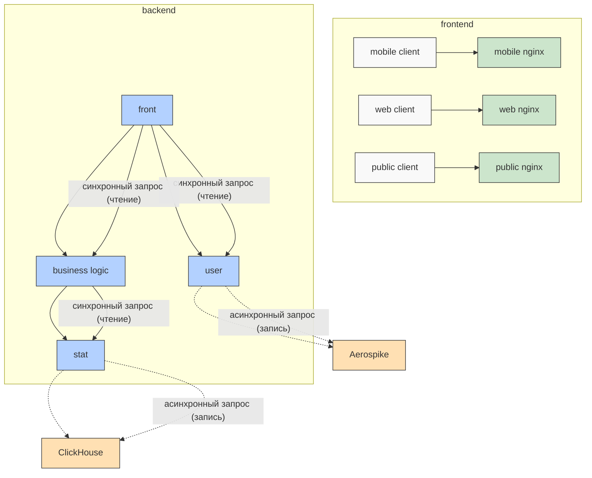

```mermaid
graph TD
  subgraph frontend
    mobile_client["mobile client"]
    web_client["web client"]
    public_client["public client"]

    mobile_nginx["mobile nginx"]
    web_nginx["web nginx"]
    public_nginx["public nginx"]

    mobile_client --> mobile_nginx
    web_client --> web_nginx
    public_client --> public_nginx
  end

  subgraph backend
    front["front"]
    user["user"]
    business_logic["business logic"]
    stat["stat"]

    front --> user
    front --> business_logic
    business_logic --> stat
  end

  user -.-> Aerospike[Aerospike]
  stat -.-> ClickHouse[ClickHouse]

  classDef backend fill:#b3d1ff,stroke:#333,stroke-width:1px;
  classDef db fill:#ffe0b3,stroke:#333,stroke-width:1px;
  classDef proxy fill:#cce5cc,stroke:#333,stroke-width:1px;
  classDef client fill:#f9f9f9,stroke:#333,stroke-width:1px;

  class mobile_nginx,web_nginx,public_nginx proxy;
  class mobile_client,web_client,public_client client;
  class user,business_logic,stat,front backend;
  class Aerospike,ClickHouse db;

  %% Визуализация синхронных и асинхронных запросов
  front -->|"синхронный запрос (чтение)"| user
  front -->|"синхронный запрос (чтение)"| business_logic
  business_logic -->|"синхронный запрос (чтение)"| stat

  user -.->|"асинхронный запрос (запись)"| Aerospike
  stat -.->|"асинхронный запрос (запись)"| ClickHouse
```
