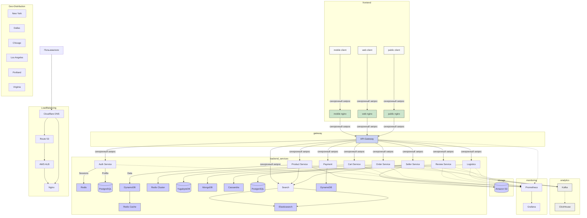

```mermaid
graph TD
  subgraph frontend
    mobile_client["mobile client"]
    web_client["web client"]
    public_client["public client"]

    mobile_nginx["mobile nginx"]
    web_nginx["web nginx"]
    public_nginx["public nginx"]

    mobile_client -->|"синхронный запрос"| mobile_nginx
    web_client -->|"синхронный запрос"| web_nginx
    public_client -->|"синхронный запрос"| public_nginx
  end

  subgraph gateway
    api_gateway["API-Gateway"]
  end

  subgraph backend_services
    AuthService["Auth Service"] -->|Sessions| RedisSessions[Redis]
    AuthService -->|Profile| PostgresUsers[(PostgreSQL)]
    Products["Product Service"] -->|Data| DynamoDBProducts[DynamoDB]
    DynamoDBProducts --> RedisProductCache[Redis Cache]
    CartService["Cart Service"] --> RedisCart[Redis Cluster]
    OrderService["Order Service"] --> YugabyteOrders[(YugabyteDB)]
    ReviewService["Review Service"] --> MongoReviews[MongoDB]
    LogisticsService["Logistics"] --> CassandraShipments[Cassandra]
    SellerService["Seller Service"] --> PostgresSellers[(PostgreSQL)]
    SearchService["Search"] --> ElasticSearch[Elasticsearch]
    PaymentService["Payment"] --> DynamoPayments[DynamoDB]
  end

  subgraph analytics
    Kafka[Kafka] -.-> ClickHouse[ClickHouse]
  end

  subgraph storage
    S3[(Amazon S3)]
  end

  subgraph monitoring
    Prometheus[Prometheus] --> Grafana[Grafana]
    api_gateway -.-> Prometheus
    AuthService -.-> Prometheus
    Products -.-> Prometheus
    CartService -.-> Prometheus
    OrderService -.-> Prometheus
    ReviewService -.-> Prometheus
    SellerService -.-> Prometheus
    LogisticsService -.-> Prometheus
  end

  subgraph LoadBalancing
    ALB["AWS ALB"] --> NGINX[Nginx]
    Route53["Route 53"] --> ALB
    Cloudflare["Cloudflare DNS"] --> Route53
  end

  subgraph DataCenters["Geo-Distribution"]
    NYC["New York"]
    DAL["Dallas"]
    CHI["Chicago"]
    LA["Los Angeles"]
    PDX["Portland"]
    VA["Virginia"]
  end

  mobile_nginx -->|"синхронный запрос"| api_gateway
  web_nginx -->|"синхронный запрос"| api_gateway
  public_nginx -->|"синхронный запрос"| api_gateway

  UI["Пользователи"] --> Cloudflare
  Cloudflare --> NGINX

  api_gateway -->|"синхронный запрос"| AuthService
  api_gateway -->|"синхронный запрос"| Products
  api_gateway -->|"синхронный запрос"| CartService
  api_gateway -->|"синхронный запрос"| OrderService
  api_gateway -->|"синхронный запрос"| ReviewService
  api_gateway -->|"синхронный запрос"| SellerService
  api_gateway -->|"синхронный запрос"| SearchService
  api_gateway -->|"синхронный запрос"| PaymentService
  api_gateway -->|"синхронный запрос"| LogisticsService

  OrderService -.-> Kafka
  CartService -.-> Kafka
  ReviewService -.-> Kafka
  LogisticsService -.-> Kafka
  SellerService -.-> Kafka

  Products --> S3
  SellerService --> S3

  SearchService --> ElasticSearch
  Products --> SearchService
  SellerService --> SearchService

  classDef db fill:#ccf,stroke:#333,stroke-width:1px;
  classDef backend fill:#cbd3f5,stroke:#333,stroke-width:1px;
  classDef services fill:#e0d1f5,stroke:#333,stroke-width:1px;
  classDef proxy fill:#cce5cc,stroke:#333,stroke-width:1px;
  classDef client fill:#f9f9f9,stroke:#333,stroke-width:1px;
  classDef broker fill:#eeeeee,stroke:#333,stroke-width:1px;

  class mobile_nginx,web_nginx,public_nginx proxy;
  class mobile_client,web_client,public_client client;
  class api_gateway backend;
  class Kafka,ClickHouse broker;
  class RedisSessions,RedisCart,RedisProductCache,PostgresUsers,PostgresSellers,DynamoDBProducts,YugabyteOrders,MongoReviews,CassandraShipments,DynamoPayments,ElasticSearch,S3 db;
```
