```mermaid
flowchart TD
 subgraph frontend["frontend"]
        mobile_client["mobile client"]
        web_client["web client"]
        public_client["public client"]
        mobile_nginx["mobile nginx"]
        web_nginx["web nginx"]
        public_nginx["public nginx"]
  end

 subgraph gateway["gateway"]
        api_gateway["API-Gateway"]
  end

 subgraph backend_services["backend_services"]
        AuthService["Auth Service"]
        Products["Product Service"]
        CartService["Cart Service"]
        OrderService["Order Service"]
        ReviewService["Review Service"]
        LogisticsService["Logistics"]
        SellerService["Seller Service"]
        SearchService["Search"]
        PaymentService["Payment"]
        RecommendationService["Recommendation Service"]
  end

 subgraph workers["Workers"]
	  subgraph databases["Databases"]
	        RedisSessions["Redis (Sessions)"]
	        PostgresUsers["PostgreSQL (Users)"]
	        PostgresProducts["PostgreSQL (Products)"]
	        RedisProductCache["Redis Cache (Products)"]
	        RedisCart["Redis (Cart)"]
	        PostgresOrders["PostgreSQL (Orders)"]
	        MongoReviews["MongoDB (Reviews)"]
	        PostgresShipments["PostgreSQL (Shipments)"]
	        PostgresSellers["PostgreSQL (Sellers)"]
	        ElasticSearch["Elasticsearch"]
	        MongoPayments["MongoDB (Payments)"]
	        PostgresRatings["PostgreSQL (Ratings)"]
	        PostgresRecommendations["PostgreSQL (Recommendations)"]
	  end
        AuthWorker["Auth Worker"]
        ProductWorker["Product Worker"]
        CartWorker["Cart Worker"]
        OrderWorker["Order Worker"]
        ReviewWorker["Review Worker"]
        LogisticsWorker["Logistics Worker"]
        SellerWorker["Seller Worker"]
        SearchWorker["Search Worker"]
        PaymentWorker["Payment Worker"]
        RatingWorker["Rating Worker"]
        RecommendationWorker["Recommendation Worker"]
  end

 subgraph analytics["analytics"]
        ClickHouse["ClickHouse"]
        Kafka["Kafka"]
  end

 subgraph storage["storage"]
        S3[("Amazon S3")]
  end

 subgraph monitoring["monitoring"]
        Grafana["Grafana"]
        Prometheus["Prometheus"]
  end

 subgraph LoadBalancing["LoadBalancing"]
        NGINX["Nginx"]
        ALB["AWS ALB"]
        Route53["Route 53"]
        Cloudflare["Cloudflare DNS"]
  end

 subgraph DataCenters["Geo-Distribution"]
        NYC["New York"]
        DAL["Dallas"]
        CHI["Chicago"]
        LA["Los Angeles"]
        PDX["Portland"]
        VA["Virginia"]
  end

    %% Frontend → Gateway
    mobile_client --> mobile_nginx
    web_client --> web_nginx
    public_client --> public_nginx

    mobile_nginx --> api_gateway
    web_nginx --> api_gateway
    public_nginx --> api_gateway
    UI["Пользователи"] --> Cloudflare
    Cloudflare --> Route53
    Route53 --> ALB
    ALB --> NGINX
    NGINX --> mobile_nginx & web_nginx & public_nginx

    %% Gateway → Backend Services
    api_gateway --> AuthService & Products & CartService & OrderService & ReviewService & SellerService & SearchService & PaymentService & LogisticsService & RecommendationService

    %% Backend Services → Workers
    AuthService --> AuthWorker
    Products --> ProductWorker
    CartService --> CartWorker
    OrderService --> OrderWorker
    ReviewService --> ReviewWorker
    ReviewService --> RatingWorker
    SearchService --> SearchWorker
    RecommendationService --> RecommendationWorker
    LogisticsService --> LogisticsWorker
    SellerService --> SellerWorker
    PaymentService -.-> PaymentWorker

    %% Workers → Databases
    AuthWorker --> RedisSessions
    AuthWorker --> PostgresUsers

    ProductWorker --> PostgresProducts
    PostgresProducts --> RedisProductCache

    CartWorker --> RedisCart
    OrderWorker --> PostgresOrders

    ReviewWorker -.-> MongoReviews
    LogisticsWorker --> PostgresShipments
    SellerWorker --> PostgresSellers
    SearchWorker --> ElasticSearch
    RecommendationWorker --> PostgresRecommendations
    RecommendationWorker --> ElasticSearch
    PaymentWorker --> MongoPayments
    RatingWorker --> PostgresRatings

    ProductWorker --> S3
    ProductWorker --> SearchWorker
    SellerWorker --> S3

    %% Workers → Kafka (as one group)
    workers -->|async| Kafka
    Kafka --> ClickHouse

    %% Monitoring
    Prometheus --> Grafana
    api_gateway -.-> Prometheus
    AuthService -.-> Prometheus
    Products -.-> Prometheus
    CartService -.-> Prometheus
    OrderService -.-> Prometheus
    ReviewService -.-> Prometheus
    SellerService -.-> Prometheus
    LogisticsService -.-> Prometheus
    RecommendationService -.-> Prometheus

    %% Classes
    classDef db fill:#ccf,stroke:#333,stroke-width:1px
    classDef backend fill:#cbd3f5,stroke:#333,stroke-width:1px
    classDef services fill:#e0d1f5,stroke:#333,stroke-width:1px
    classDef proxy fill:#cce5cc,stroke:#333,stroke-width:1px
    classDef client fill:#f9f9f9,stroke:#333,stroke-width:1px
    classDef broker fill:#eeeeee,stroke:#333,stroke-width:1px
    classDef worker fill:#fff2cc,stroke:#333,stroke-width:1px

    class mobile_client,web_client,public_client,UI client
    class mobile_nginx,web_nginx,public_nginx,NGINX,ALB,Route53,Cloudflare proxy
    class api_gateway backend
    class AuthService,Products,CartService,OrderService,ReviewService,SellerService,SearchService,PaymentService,LogisticsService,RecommendationService services
    class AuthWorker,ProductWorker,CartWorker,OrderWorker,ReviewWorker,LogisticsWorker,SellerWorker,SearchWorker,PaymentWorker,RatingWorker,RecommendationWorker worker
    class RedisSessions,PostgresUsers,PostgresProducts,RedisProductCache,RedisCart,PostgresOrders,MongoReviews,PostgresShipments,PostgresSellers,ElasticSearch,MongoPayments,PostgresRatings,PostgresRecommendations,S3 db
    class Kafka,ClickHouse broker

```

[Ссылка на красивую схему](https://www.mermaidchart.com/raw/23bbb5f7-032b-4d15-9c2c-597d3ca1046c?theme=light&version=v0.1&format=svg)

---

##  **Сервисы проекта Amazon **

###  Основные микросервисы:

---

### 1. **Auth Service**
- Регистрация, авторизация, обновление профиля.
- Подтверждение личности при оформлении заказа и оплате.
- Работает с:
  - `PostgreSQL (Users)` — для хранения профилей
  - `Redis (Sessions)` — для хранения JWT/сессий
- Поддерживается через `AuthWorker`
- Метрики: отправляются в Prometheus

---

### 2. **Payment Service**
- Обработка платежей, Amazon Prime, возвраты.
- Взаимодействует с `MongoDB (Payments)` через `PaymentWorker`.
- При успешной оплате отправляет события:
  - В Kafka
  - В `AuthService` (для обновления подписки или статуса)

---

### 3. **Product Service**
- Управление карточками товаров: создание, редактирование, удаление.
- Работает с:
  - `PostgreSQL (Products)` — основное хранилище
  - `Redis Cache` — для быстрого отображения
  - `ElasticSearch` — для индексации и поиска
  - `S3` — для изображений
- Публикует события через `SearchWorker` и `ProductWorker`.

---

### 4. **Search Service**
- Полнотекстовый поиск, фильтрация, фасеты.
- Индексирует данные из `PostgreSQL`, `Redis` и `ElasticSearch`.
- Управляется через `SearchWorker`.

---

### 5. **Cart Service**
- Временное хранилище корзины пользователя.
- Использует `Redis (Cart)` с высокой частотой доступа.
- Поддерживается `CartWorker`, отправляет изменения в Kafka (для аналитики).

---

### 6. **Order Service**
- Создание и отслеживание заказов.
- Использует `PostgreSQL (Orders)` (с шардированием).
- `OrderWorker` обрабатывает бизнес-логику и публикует в Kafka.

---

### 7. **Review Service**
- Добавление отзывов на товары и продавцов.
- Хранение — в `MongoDB (Reviews)` через `ReviewWorker`.
- Также запускает `RatingWorker` для пересчёта оценок.
- Данные идут в Kafka для ML/аналитики.

---

### 8. **Rating Service / Rating Updater**
- Асинхронно обновляет агрегированные рейтинги.
- Использует `PostgreSQL (Ratings)`
- Вызывается из `ReviewService`
- Работает через `RatingWorker`, пушит статистику в Kafka

---

### 9. **Recommendation Service**
- Персонализированные рекомендации для пользователя:
  - Основаны на поиске (`ElasticSearch`), заказах (`PostgreSQL`), отзывах (`MongoDB`).
- Хранит рекомендации в `PostgreSQL (Recommendations)`
- `RecommendationWorker` анализирует поведение и пересчитывает результат.
- Может использовать:
  - Алгоритмы: TF-IDF, cosine similarity, кластеризацию
  - События: Kafka, ClickHouse

---

### 10. **Logistics Service**
- Обработка доставки и статусов посылок.
- Использует `PostgreSQL (Shipments)` вместо Cassandra.
- Публикует статусы в Kafka, поддерживается `LogisticsWorker`.

---

### 11. **Seller Service**
- Управление продавцами, верификация, добавление товаров.
- Использует:
  - `PostgreSQL (Sellers)`
  - `S3` — для документов
  - `ElasticSearch` — для поиска по продавцам
- Работает через `SellerWorker`

---

### 12. **Content Upload Service** *(можно выделить как часть Product/Seller)*
- Администрирование загрузки изображений и описаний.
- Хранение: `PostgreSQL + S3`
- Может публиковать уведомления в Kafka (модерация, AI-фильтрация)

---

### 13. **Moderation Service**
- Проверка отзывов и товаров перед публикацией.
- Получает события из Kafka
- Может взаимодействовать с AI/ML сервисом или ручной модерацией.

---

### 14. **Metrics Collector**
- Собирает данные о:
  - Загрузке сервисов
  - Ошибках
  - Времени ответа
- Использует:
  - `Prometheus` — сбор
  - `Grafana` — визуализация

---

### 15. **Search/Recommendation Indexer (Background)**
- Фоновый обработчик изменений в товарах, индексирует в `ElasticSearch`.
- Может пересчитывать популярность, релевантность.

---

## Связанные технологии

| Сервис          | База данных / система     | Характеристика                  |
|-----------------|---------------------------|---------------------------------|
| Auth            | PostgreSQL, Redis         | Транзакции, сессии              |
| Products        | PostgreSQL, Redis, S3     | Каталог, медиа                  |
| Cart            | Redis                     | Высокочастотный доступ          |
| Orders          | PostgreSQL (шарды)        | Транзакции                      |
| Reviews         | MongoDB                   | Гибкое хранение                 |
| Ratings         | PostgreSQL                | Аггрегации                      |
| Recommendations | PostgreSQL, ElasticSearch | Персонализация, аналитика       |
| Payments        | MongoDB                   | Гибкие поля, сохранение токенов |
| Shipments       | PostgreSQL                | Логистика, трекинг              |
| Search          | ElasticSearch             | Быстрый поиск                   |
| Analytics       | Kafka, ClickHouse         | Потоковая обработка             |

---

##  **Потоки данных :**

| Поток | Описание | Тип |
|-------|----------|-----|
| **1. Авторизация** | `API-Gateway → AuthService → RedisSessions, PostgreSQL (Users)` — регистрация, вход, проверка токена | **Синхронный** (→) |
| **2. Платежи** | `API-Gateway → PaymentService → MongoDB (Payments)` | **Синхронный** (→) |
| **3. Обновление профиля после оплаты** | `PaymentWorker → AuthService (обновление подписки)` | **Синхронный** (→) |
| **4. Оформление заказа** | `API-Gateway → OrderService → PostgreSQL (Orders)` | **Синхронный** (→) |
| **5. Событие заказа** | `OrderWorker ↠ Kafka (topic: order_created)` | **Асинхронный** (↠) |
| **6. Обновление корзины** | `API-Gateway → CartService → Redis (Cart)` | **Синхронный** (→) |
| **7. Добавление отзыва** | `API-Gateway → ReviewService → MongoDB (Reviews)` | **Синхронный** (→) |
| **8. Событие отзыва** | `ReviewWorker ↠ Kafka (topic: review_created)` | **Асинхронный** (↠) |
| **9. Обновление рейтингов** | `RatingWorker → PostgreSQL (Ratings)` | **Асинхронный** (↠) |
| **10. Персональные рекомендации** | `RecommendationWorker → PostgreSQL (Recommendations)` | **Асинхронный** (↠) |
| **11. Поиск** | `API-Gateway → SearchService → Elasticsearch` | **Синхронный** (→) |
| **12. Индексация товара** | `ProductWorker ↠ SearchWorker → Elasticsearch` | **Асинхронный** (↠) |
| **13. Индексация продавца** | `SellerWorker ↠ SearchWorker → Elasticsearch` | **Асинхронный** (↠) |
| **14. Отображение рекомендаций** | `RecommendationService → Redis Cache / PostgreSQL (Recommendations)` | **Синхронный** (→) |
| **15. Доставка и логистика** | `API-Gateway → LogisticsService → PostgreSQL (Shipments)` | **Синхронный** (→) |
| **16. Событие логистики** | `LogisticsWorker ↠ Kafka (topic: shipment_updated)` | **Асинхронный** (↠) |
| **17. Каталог товаров** | `API-Gateway → ProductService → PostgreSQL (Products), Redis Cache` | **Синхронный** (→) |
| **18. Загрузка изображений** | `ProductWorker/SellerWorker → S3` | **Синхронный** (→) |
| **19. Загрузка контента админом** | `Admin UI → ContentUploader → PostgreSQL, S3` | **Синхронный** (→) |
| **20. Модерация отзывов/товаров** | `Kafka ↠ ModerationService → PostgreSQL` | **Асинхронный** (↠) |
| **21. Метрики и мониторинг** | `Все сервисы ↠ Prometheus → Grafana` | **Асинхронный** (↠) |
| **22. Обогащение ClickHouse** | `Kafka ↠ ClickHouse (аналитика)` | **Асинхронный** (↠) |

---

**Синхронные (→)** — используются в запросах пользователя с немедленным ответом  
**Асинхронные (↠)** — фоновая обработка, публикация в Kafka, задания по расписанию

---

