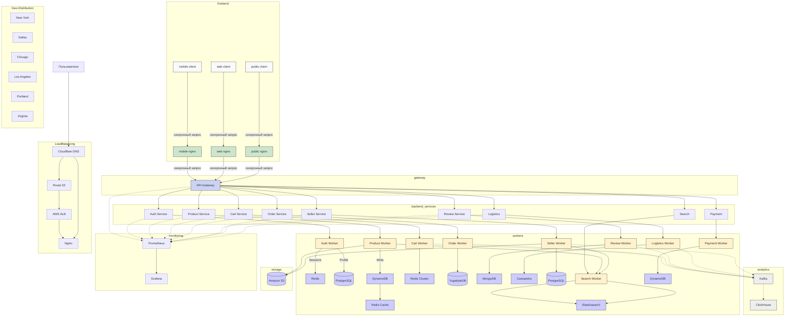

```mermaid
graph TD
  subgraph frontend
    mobile_client["mobile client"]
    web_client["web client"]
    public_client["public client"]

    mobile_nginx["mobile nginx"]
    web_nginx["web nginx"]
    public_nginx["public nginx"]

    mobile_client -->|"синхронный запрос"| mobile_nginx
    web_client -->|"синхронный запрос"| web_nginx
    public_client -->|"синхронный запрос"| public_nginx
  end

  subgraph gateway
    api_gateway["API-Gateway"]
  end

  subgraph backend_services
    AuthService["Auth Service"]
    Products["Product Service"]
    CartService["Cart Service"]
    OrderService["Order Service"]
    ReviewService["Review Service"]
    LogisticsService["Logistics"]
    SellerService["Seller Service"]
    SearchService["Search"]
    PaymentService["Payment"]
  end

  subgraph workers
    AuthWorker["Auth Worker"] -->|Sessions| RedisSessions[Redis]
    AuthWorker -->|Profile| PostgresUsers[(PostgreSQL)]

    ProductWorker["Product Worker"] -->|Write| DynamoDBProducts[DynamoDB]
    DynamoDBProducts --> RedisProductCache[Redis Cache]

    CartWorker["Cart Worker"] --> RedisCart[Redis Cluster]
    OrderWorker["Order Worker"] --> YugabyteOrders[(YugabyteDB)]
    ReviewWorker["Review Worker"] --> MongoReviews[MongoDB]
    LogisticsWorker["Logistics Worker"] --> CassandraShipments[Cassandra]
    SellerWorker["Seller Worker"] --> PostgresSellers[(PostgreSQL)]
    SearchWorker["Search Worker"] --> ElasticSearch[Elasticsearch]
    PaymentWorker["Payment Worker"] --> DynamoPayments[DynamoDB]
  end

  subgraph analytics
    Kafka[Kafka] -.-> ClickHouse[ClickHouse]
  end

  subgraph storage
    S3[(Amazon S3)]
  end

  subgraph monitoring
    Prometheus[Prometheus] --> Grafana[Grafana]
    api_gateway -.-> Prometheus
    AuthService -.-> Prometheus
    Products -.-> Prometheus
    CartService -.-> Prometheus
    OrderService -.-> Prometheus
    ReviewService -.-> Prometheus
    SellerService -.-> Prometheus
    LogisticsService -.-> Prometheus
  end

  subgraph LoadBalancing
    ALB["AWS ALB"] --> NGINX[Nginx]
    Route53["Route 53"] --> ALB
    Cloudflare["Cloudflare DNS"] --> Route53
  end

  subgraph DataCenters["Geo-Distribution"]
    NYC["New York"]
    DAL["Dallas"]
    CHI["Chicago"]
    LA["Los Angeles"]
    PDX["Portland"]
    VA["Virginia"]
  end

  mobile_nginx -->|"синхронный запрос"| api_gateway
  web_nginx -->|"синхронный запрос"| api_gateway
  public_nginx -->|"синхронный запрос"| api_gateway

  UI["Пользователи"] --> Cloudflare
  Cloudflare --> NGINX

  api_gateway --> AuthService
  api_gateway --> Products
  api_gateway --> CartService
  api_gateway --> OrderService
  api_gateway --> ReviewService
  api_gateway --> SellerService
  api_gateway --> SearchService
  api_gateway --> PaymentService
  api_gateway --> LogisticsService

  AuthService --> AuthWorker
  Products --> ProductWorker
  CartService --> CartWorker
  OrderService --> OrderWorker
  ReviewService --> ReviewWorker
  LogisticsService --> LogisticsWorker
  SellerService --> SellerWorker
  SearchService --> SearchWorker
  PaymentService --> PaymentWorker

  OrderWorker -.-> Kafka
  CartWorker -.-> Kafka
  ReviewWorker -.-> Kafka
  LogisticsWorker -.-> Kafka
  SellerWorker -.-> Kafka

  ProductWorker --> S3
  SellerWorker --> S3

  SearchWorker --> ElasticSearch
  ProductWorker --> SearchWorker
  SellerWorker --> SearchWorker

  classDef db fill:#ccf,stroke:#333,stroke-width:1px;
  classDef backend fill:#cbd3f5,stroke:#333,stroke-width:1px;
  classDef services fill:#e0d1f5,stroke:#333,stroke-width:1px;
  classDef proxy fill:#cce5cc,stroke:#333,stroke-width:1px;
  classDef client fill:#f9f9f9,stroke:#333,stroke-width:1px;
  classDef broker fill:#eeeeee,stroke:#333,stroke-width:1px;
  classDef worker fill:#fff2cc,stroke:#333,stroke-width:1px;

  class mobile_nginx,web_nginx,public_nginx proxy;
  class mobile_client,web_client,public_client client;
  class api_gateway backend;
  class Kafka,ClickHouse broker;
  class RedisSessions,RedisCart,RedisProductCache,PostgresUsers,PostgresSellers,DynamoDBProducts,YugabyteOrders,MongoReviews,CassandraShipments,DynamoPayments,ElasticSearch,S3 db;
  class AuthWorker,ProductWorker,CartWorker,OrderWorker,ReviewWorker,LogisticsWorker,SellerWorker,SearchWorker,PaymentWorker worker;
```
