## **Mermaid-схема проекта**

```mermaid
flowchart TD

subgraph clients["Clients"]
  mobile_client["Mobile Client"]
  web_client["Web Client"]
  seller_client["Seller Client"]
  logistics_client["Logistics Client"]
end

subgraph edge_proxy["Edge Layer (DNS / Proxy / CORS)"]
  Cloudflare["Cloudflare (DNS, CORS)"]
  Route53["Route53"]
  ALB["AWS ALB"]
  public_nginx["Public Nginx"]
  seller_nginx["Seller Nginx"]
  logistics_nginx["Logistics Nginx"]
end

subgraph gateway_layer["Gateways"]
  public_api_gateway["Public API Gateway"]
  seller_api_gateway["Seller API Gateway"]
  logistics_api_gateway["Logistics API Gateway"]
end

subgraph backend["Backend Services"]
  AuthService["Auth Service"]
  UserService["User Service"]
  ProductService["Product Service"]
  CartService["Cart Service"]
  OrderService["Order Service"]
  ReviewService["Review Service"]
  LogisticsService["Logistics Service"]
  SellerService["Seller Service"]
  SearchService["Search Service"]
  PaymentService["Payment Service"]
  RecommendationService["Recommendation Service"]
  ModerationService["Moderation Service"]
  OrchestratorService["Orchestrator Service"]
end

subgraph workers["Workers"]
  AuthWorker["Auth Worker"]
  UserWorker["User Worker"]
  ProductWorker["Product Worker"]
  CartWorker["Cart Worker"]
  OrderWorker["Order Worker"]
  ReviewWorker["Review Worker"]
  LogisticsWorker["Logistics Worker"]
  SellerWorker["Seller Worker"]
  SearchWorker["Search Worker"]
  PaymentWorker["Payment Worker"]
  RatingWorker["Rating Worker"]
  RecommendationWorker["Recommendation Worker"]
end

subgraph storage["Storage"]
  RedisSessions["Redis (Sessions)"]
  PostgresUsers["PostgreSQL (Users)"]
  PostgresProducts["PostgreSQL (Products)"]
  RedisProductCache["Redis Cache (Products)"]
  RedisCart["Redis (Cart)"]
  PostgresOrders["PostgreSQL (Orders)"]
  MongoReviews["MongoDB (Reviews)"]
  PostgresShipments["PostgreSQL (Shipments)"]
  PostgresSellers["PostgreSQL (Sellers)"]
  ElasticSearch["ElasticSearch (Vector Counter)"]
  RedisBaseFeed["Redis (Base Feed)"]
  MongoPayments["MongoDB (Payments)"]
  PostgresRatings["PostgreSQL (Ratings)"]
  PostgresRecommendations["PostgreSQL (Recommendations)"]
  S3["Amazon S3 (Images Optimized Upload)"]
end

subgraph queues["Message Queues"]
  Kafka["Kafka"]
end

subgraph analytics["Analytics"]
  ClickHouse["ClickHouse"]
end

subgraph monitoring["Monitoring"]
  Prometheus["Prometheus"]
  Grafana["Grafana"]
end

subgraph external["External APIs"]
  PaymentGatewayAPI["Payment Gateway API"]
  LogisticsExternalAPI["Logistics API"]
end

%% Clients to Edge
mobile_client --> Cloudflare
web_client --> Cloudflare
seller_client --> Cloudflare
logistics_client --> Cloudflare
Cloudflare --> Route53 --> ALB
ALB --> public_nginx & seller_nginx & logistics_nginx

public_nginx --> public_api_gateway
seller_nginx --> seller_api_gateway
logistics_nginx --> logistics_api_gateway

%% Public API Gateway
public_api_gateway --> AuthService
public_api_gateway --> UserService
public_api_gateway --> ProductService
public_api_gateway --> CartService
public_api_gateway --> OrderService
public_api_gateway --> ReviewService
public_api_gateway --> SearchService
public_api_gateway --> RecommendationService

%% Seller API Gateway
seller_api_gateway --> SellerService
seller_api_gateway --> ProductService
seller_api_gateway --> OrderService
seller_api_gateway --> LogisticsService

%% Logistics API Gateway
logistics_api_gateway --> LogisticsService

%% Backend Services to Workers
AuthService --> AuthWorker
UserService --> UserWorker
ProductService --> ProductWorker
CartService --> CartWorker
OrderService --> OrderWorker
ReviewService -->|async| ReviewWorker
ReviewService -->|async| RatingWorker
LogisticsService -->|async| LogisticsWorker
SellerService --> SellerWorker
SearchService --> SearchWorker
RecommendationService --> RecommendationWorker
PaymentService -->|async| PaymentWorker
ModerationService -->|async| ModerationService

%% Workers to Storage
AuthWorker --> RedisSessions & PostgresUsers
UserWorker --> PostgresUsers & RedisSessions
ProductWorker --> PostgresProducts --> RedisProductCache
ProductWorker --> S3
CartWorker --> RedisCart
OrderWorker --> PostgresOrders
ReviewWorker --> MongoReviews
LogisticsWorker --> PostgresShipments
SellerWorker --> PostgresSellers
SearchWorker --> ElasticSearch
RecommendationWorker --> PostgresRecommendations & RedisBaseFeed
PaymentWorker --> MongoPayments
RatingWorker --> PostgresRatings

%% Workers to External APIs
PaymentWorker -->|async| PaymentGatewayAPI
LogisticsWorker -->|async| LogisticsExternalAPI

%% Kafka Events
workers -->|async| Kafka
Kafka --> ModerationService
Kafka --> ClickHouse

%% Monitoring
Prometheus --> Grafana
public_api_gateway -.-> Prometheus
seller_api_gateway -.-> Prometheus
logistics_api_gateway -.-> Prometheus
AuthService -.-> Prometheus
UserService -.-> Prometheus
ProductService -.-> Prometheus
CartService -.-> Prometheus
OrderService -.-> Prometheus
ReviewService -.-> Prometheus
SearchService -.-> Prometheus
SellerService -.-> Prometheus
LogisticsService -.-> Prometheus
PaymentService -.-> Prometheus
RecommendationService -.-> Prometheus
ModerationService -.-> Prometheus
OrchestratorService -.-> Prometheus

classDef db fill:#ccf,stroke:#333,stroke-width:1px
classDef backend fill:#cbd3f5,stroke:#333,stroke-width:1px
classDef services fill:#e0d1f5,stroke:#333,stroke-width:1px
classDef proxy fill:#cce5cc,stroke:#333,stroke-width:1px
classDef client fill:#f9f9f9,stroke:#333,stroke-width:1px
classDef broker fill:#eeeeee,stroke:#333,stroke-width:1px
classDef worker fill:#fff2cc,stroke:#333,stroke-width:1px

class mobile_client,web_client,seller_client,logistics_client client
class Cloudflare,Route53,ALB,public_nginx,seller_nginx,logistics_nginx proxy
class public_api_gateway,seller_api_gateway,logistics_api_gateway backend
class AuthService,UserService,ProductService,CartService,OrderService,ReviewService,LogisticsService,SellerService,SearchService,PaymentService,RecommendationService,ModerationService,OrchestratorService services
class AuthWorker,UserWorker,ProductWorker,CartWorker,OrderWorker,ReviewWorker,LogisticsWorker,SellerWorker,SearchWorker,PaymentWorker,RatingWorker,RecommendationWorker worker
class RedisSessions,PostgresUsers,PostgresProducts,RedisProductCache,RedisCart,PostgresOrders,MongoReviews,PostgresShipments,PostgresSellers,ElasticSearch,MongoPayments,PostgresRatings,PostgresRecommendations,RedisBaseFeed,S3 db
class Kafka,ClickHouse broker
```

<a href="https://www.mermaidchart.com/raw/6fbada3b-d8fe-46de-b1b5-19cffae393d5?theme=light&version=v0.1&format=svg">ТЫК!</a>

---

## **Описание микросервисов**

### **1. User Service**

- Управление профилями пользователей: обновление, настройки, предпочтения.
- СУБД: PostgreSQL (Users)

### **2. Auth Service**

- Регистрация, авторизация, сессии.
- СУБД: PostgreSQL (Users) + Redis (Sessions)

### **3. Product Service**

- Управление карточками товаров.
- СУБД: PostgreSQL (Products), ElasticSearch (индексация), Redis (кеширование).

### **4. Cart Service**

- Работа с корзиной пользователя.
- СУБД: Redis (Cart)

### **5. Order Service**

- Управление заказами.
- СУБД: PostgreSQL (Orders)

### **6. Review Service**

- Добавление отзывов.
- СУБД: MongoDB (Reviews)
- Публикация событий в Kafka.

### **7. Logistics Service**

- Отслеживание отправлений.
- СУБД: PostgreSQL (Shipments)
- Интеграция с внешним `Logistics API`
- Асинхронная публикация событий в Kafka.

### **8. Seller Service**

- Управление продавцами.
- СУБД: PostgreSQL (Sellers)

### **9. Search Service**

- Поиск по товарам и продавцам.
- СУБД: ElasticSearch

### **10. Payment Service**

- Интеграция с внешними платежными системами через `Payment Gateway API`.
- СУБД: MongoDB (Payments)
- Асинхронная публикация событий в Kafka.

### **11. Recommendation Service**

- Персональные рекомендации.
- СУБД: PostgreSQL (Recommendations), Redis (Base Feed)

### **12. Moderation Service**

- Асинхронная модерация отзывов и товаров.
- События через Kafka (Moderation Queue)

### **13. Orchestrator Service**

- Управление сложными сагами и бизнес-процессами.
- Построен на Kafka Streams / Temporal.

---

## **Основные потоки данных**

| #   | Поток                  | Описание                                                                  | Тип           |
| --- | ---------------------- | ------------------------------------------------------------------------- | ------------- |
| 1   | Авторизация            | Gateway → Auth Service → Redis, PostgreSQL                                | Синхронный →  |
| 2   | Управление профилем    | Gateway → User Service → PostgreSQL                                       | Синхронный →  |
| 3   | Платежи                | Gateway → Payment Service → Kafka → External Payment API → MongoDB        | Асинхронный ↠ |
| 4   | Заказы                 | Gateway → Order Service → PostgreSQL                                      | Синхронный →  |
| 5   | Оформление заказа      | Order Worker ↠ Kafka (order_created)                                      | Асинхронный ↠ |
| 6   | Модерация контента     | Kafka (Moderation Queue) ↠ Moderation Service                             | Асинхронный ↠ |
| 7   | Корзина                | Gateway → Cart Service → Redis                                            | Синхронный →  |
| 8   | Добавление отзыва      | Gateway → Review Service → Kafka → MongoDB (Reviews)                      | Асинхронный ↠ |
| 9   | Логистика              | Gateway → Logistics Service → Kafka → External Logistics API → PostgreSQL | Асинхронный ↠ |
| 10  | Поиск                  | Gateway → Search Service → ElasticSearch                                  | Синхронный →  |
| 11  | Рекомендации           | Recommendation Worker → PostgreSQL, Redis Base Feed                       | Асинхронный ↠ |
| 12  | Базовая выдача товаров | SearchService → Redis Base Feed                                           | Синхронный →  |
| 13  | Мониторинг             | Все сервисы ↠ Prometheus → Grafana                                        | Асинхронный ↠ |
| 14  | Оркестрация процессов  | Orchestrator ↠ Все Workers                                                | Асинхронный ↠ |

---

## **Обновления и улучшения**

- **Разделение API:** покупательский, продавца, логистики через разные API-Gateway.
- **Асинхронность:** все события заказов, платежей, отзывов, логистики идут через Kafka.
- **Интеграция с внешними API:** оплата и логистика вынесены отдельно через асинхронные события.
- **User Service:** отдельный сервис профиля вместо Auth.
- **Оптимизация работы с S3:** загрузка картинок батчами, уменьшение проходов.
- **Базовая выдача:** Redis Base Feed для гостей и быстрого старта выдачи.
- **Orchestrator:** добавлен сервис управления распределёнными процессами.
- **Kafka Moderation Queue:** вынесена отдельная очередь для модерации.
- **CORS:** на уровне ALB/NGINX настроены разрешения для фронтенд-клиентов.

---
