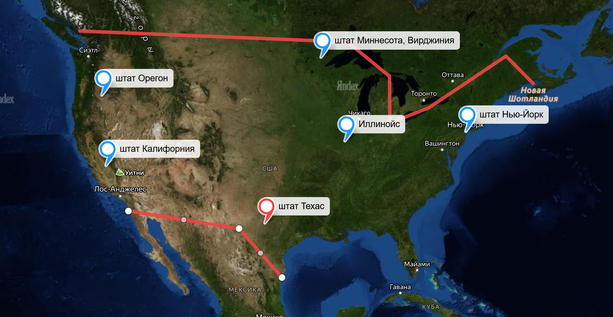
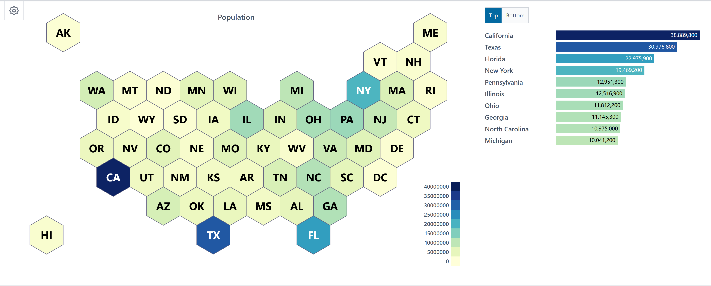
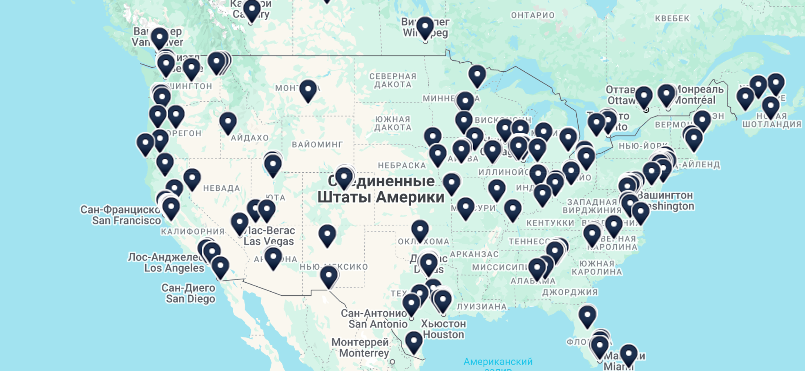
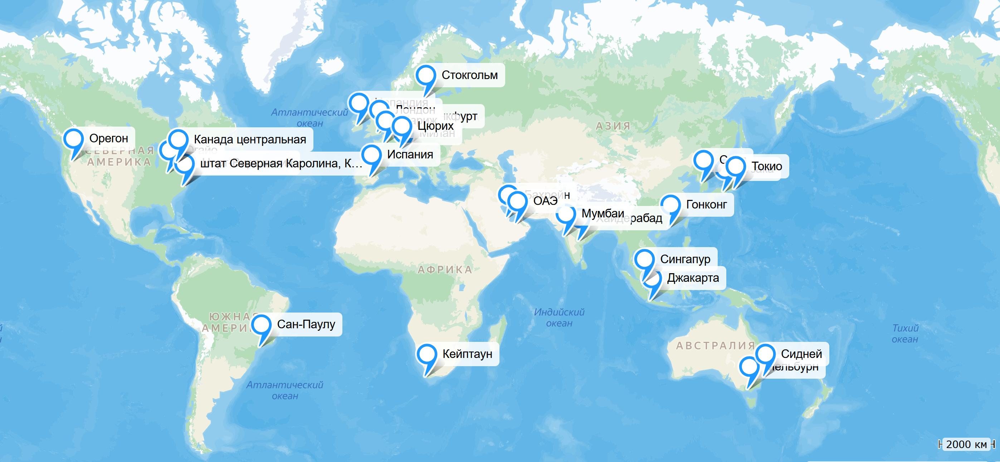
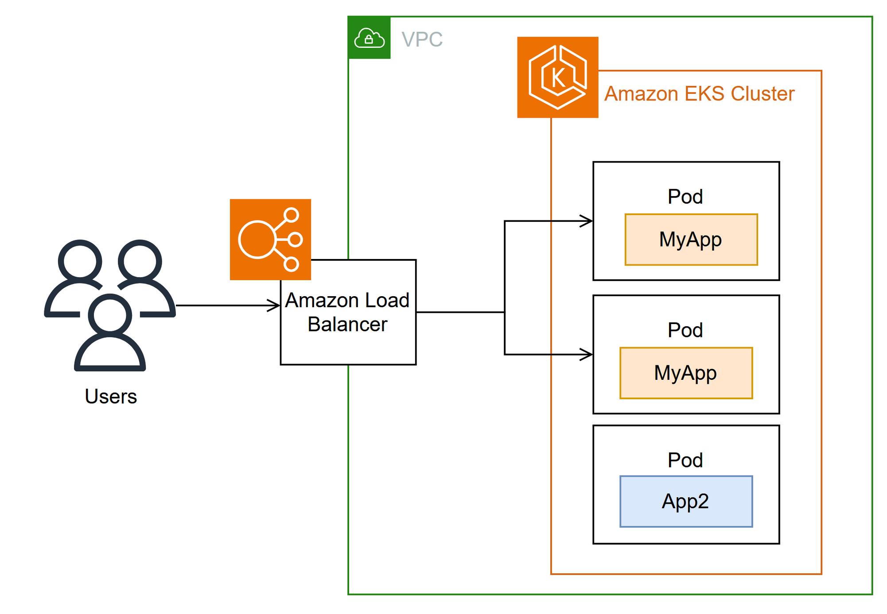
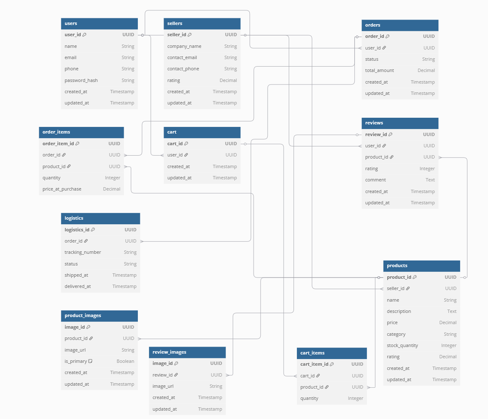
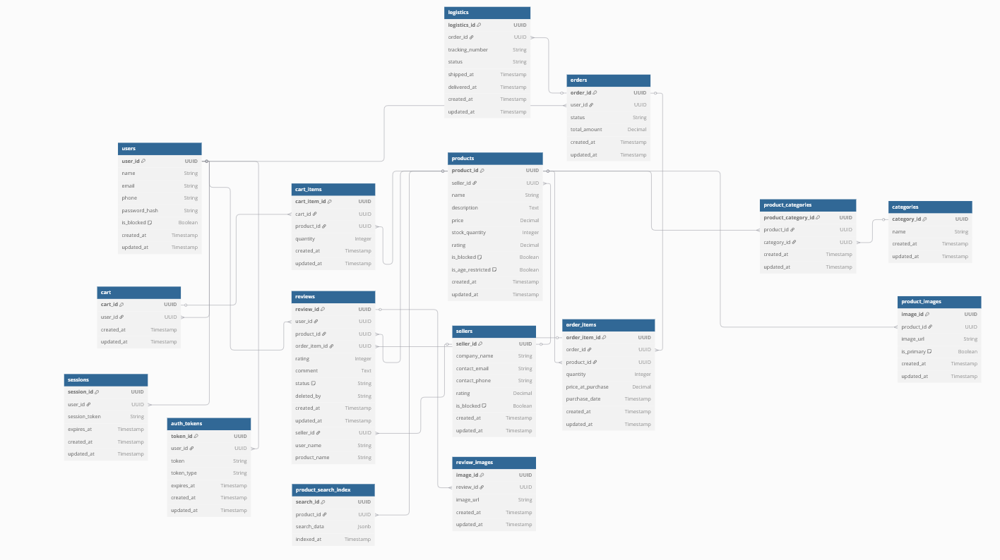

# highload-amazon

=============================

- [1. Тема и целевая аудитория](#block1)
  - [1.1 Тема](#)
  - [](#)
- [2. Расчет нагрузки](#block2)
- [3. Глобальная балансировка нагрузки](#block3)
- [4. Локальная балансировка нагрузки](#block4)
- [5. Масштабирование баз данных](#block5)
- [6. Выбор баз данных](#block6)

# **Описание онлайн-платформы Amazon (MVP)**

<a name="block1"></a>

## **1. Тема и целевая аудитория**

### **1.1 Тема**

**Amazon** – это крупнейшая в мире онлайн-платформа для электронной коммерции, предоставляющая пользователям возможность покупать и продавать товары, а также использовать широкий спектр дополнительных сервисов, включая доставку, подписки, облачные вычисления и цифровые товары.

---

### **1.2. Целевая аудитория**

- **Покупатели** – конечные пользователи, приобретающие товары
- **Продавцы** – индивидуальные предприниматели и компании
- **Логистические партнеры** – службы доставки

---

### **1.3. Анализ трафика и вовлеченности**

_(По данным SimilarWeb [1](https://www.similarweb.com/website/amazon.com/) и внутренних отчетов Amazon)_

- **Всего посещений (за месяц):** 2.5B+ [[1]](https://www.similarweb.com/website/amazon.com/)
- **Средняя продолжительность сеанса:** 10 минут [[1]](https://www.similarweb.com/website/amazon.com/)
- **Среднее количество просмотров страниц за посещение:** 8+ [[1]](https://www.similarweb.com/website/amazon.com/)
- **Процент отказов:** ~35% [[1]](https://www.similarweb.com/website/amazon.com/)
- **Количество активных продавцов:** 9M+ [[2]](https://www.marketplacepulse.com/amazon/number-of-sellers)
- **Пользователи Amazon Prime:** 200M+ [[3]](https://www.aboutamazon.com/news/company-news/amazon-prime-has-more-than-200-million-members-globally)


---

### **1.4. Функционал MVP**

#### **Пользовательский функционал**

- **Регистрация и авторизация пользователей** (e-mail, телефон, социальные сети)
- **Каталог товаров и услуг**
  - Просмотр товаров по категориям
  - Фильтрация и сортировка
- **Карточка товара**
  - Описание, фотографии, характеристики
  - Отзывы и рейтинги
- **Корзина и оформление заказа**
  - Добавление товаров
  - Выбор способа доставки
  - Оплата (карты)
- **Личный кабинет**
  - История заказов
  - Адреса доставки

#### **Функционал для продавцов (Marketplace)**

- Регистрация и верификация
- Создание карточек товаров
- Управление заказами и возвратами

#### **Функционал для логистики и доставки**

- Интеграция с Amazon Logistics и партнерами
- Отслеживание заказов
- Управление складами (**FBA — Fulfillment by Amazon**)

---

<a name="block2"></a>

## **2. Расчет нагрузки**

### **2.1 Продуктовые метрики**

- #### MAU = 310M [[7]](https://analyzify.com/statsup/amazon)
- #### DAU = 62M [[7]](https://analyzify.com/statsup/amazon)

Расчёт:
<i>DAU = 0.2×310M ≈ 62M</i>

#### Действия пользователей

| Тип пользователя | Параметр (количество на 1 пользователя в день)   | Число                                                                                                                                                                                                                              |
| ---------------- | ------------------------------------------------ | ---------------------------------------------------------------------------------------------------------------------------------------------------------------------------------------------------------------------------------- |
| Покупатель       | Регистрация, авторизация, обновление профиля     | 0.003 [V]                                                                                                                                                                                                                          |
| Покупатель       | Среднее количество просмотров страниц за сессию  | 8                                                                                                                                                                                                                                  |
| Покупатель       | Количество сессий в день                         | 2                                                                                                                                                                                                                                  |
| Покупатель       | Количество оставленных отзывов за день           | 0.13 [[8]](https://meetanshi.com/blog/amazon-seller-statistics/)[[9]](https://www.powerreviews.com/wp-content/uploads/2023/10/2023-Ratings-Reviews-Report_-Amazon-Edition-1.pdf)                                                   |
| Покупатель       | Количество добавленных товаров в корзину за день | 3 [[12]](https://shopney.co/blog/ultimate-guide-to-increase-add-to-cart-rates/)                                                                                                                                                    |
| Покупатель       | Количество покупок за день                       | 0.19 [[11]](https://amzscout.net/blog/amazon-statistics/)                                                                                                                                                                          |
| Покупатель       | Количество платежей за день                      | 0.19 [[11]](https://amzscout.net/blog/amazon-statistics/)                                                                                                                                                                          |
| Продавец         | Регистрация, верификация, обновление профиля     | 0.003 [V]                                                                                                                                                                                                                          |
| Продавец         | Создание карточек товаров в день                 | 0.7                                                                                                                                                                                                                                |
| Продавец         | Количество отправляемых посылок в день           | 0.6 [[6]](https://www.feedough.com/amazon-statistics-usage-revenue-key-facts/)                                                                                                                                                     |
| Продавец         | Количество возвращаемых посылок в день           | 0.1 [[10]](https://nichesources.com/amazon-return-rate.html#:~:text=Amazon's%20return%20rate%20for%20online,support%20can%20help%20reduce%20returns.)                                                                              |
| Логистика        | Количество перемещаемых посылок в день           | 1.76M [[6]](https://www.feedough.com/amazon-statistics-usage-revenue-key-facts/) [[10]](https://nichesources.com/amazon-return-rate.html#:~:text=Amazon's%20return%20rate%20for%20online,support%20can%20help%20reduce%20returns.) |

<br><br>
Из рассчета, что за 2023 год было продано боле 4.5 млрд товаров [[8]](https://meetanshi.com/blog/amazon-seller-statistics/), а в среднем на карточку товара приходится 40 отзывов [[9]](https://www.powerreviews.com/wp-content/uploads/2023/10/2023-Ratings-Reviews-Report_-Amazon-Edition-1.pdf), то 4.5млрд x 40 = 180млрд<br>
180млрд/(MAU x 12) = 48 - примерное количество отзывов, оставляемое одним пользователем за год

Из рассчета 1,6M - количество посылок, отправляемых в день [[6]](https://www.feedough.com/amazon-statistics-usage-revenue-key-facts/), а активных продавцов 2.3M [[6]](https://www.feedough.com/amazon-statistics-usage-revenue-key-facts/), то <br>
1.6M/2.3M = 0.6 - количество посылок, отправляемых среднестатистич. продавцом в день

Процент возвратов на Amazon варируется между 5% и 15% --> среднее значение 10%<br>
Тогда количество возвращаемых посылок в день 10% от 0.6 = 0.06 = 0.1 [[10]](https://nichesources.com/amazon-return-rate.html#:~:text=Amazon's%20return%20rate%20for%20online,support%20can%20help%20reduce%20returns.)

Из рассчета 1,6M - количество посылок, отправляемых в день [[6]](https://www.feedough.com/amazon-statistics-usage-revenue-key-facts/), а возвращаемых - 10% от этого числа [[10]](https://nichesources.com/amazon-return-rate.html#:~:text=Amazon's%20return%20rate%20for%20online,support%20can%20help%20reduce%20returns.), то <br>
1.6M + 1.6M x 0.1 = 1.76M

Будем считать, что пользователь обновляет/подтверждает свои учетные данные один раз за год.<br>
Тогда 1/356 = 0.003

Из рассчета, что на сервисе в день 62M пользователей, и в день продается 12M товаров [[11]](https://amzscout.net/blog/amazon-statistics/), то<br>
12M/62M = 0.19 - количество покупаемых товаров пользователем в день = количество платежей в день

Из рассчета, что у пользователя 2 сессии в день, за которые он просматривает по 8 страниц по 35 товаров на странице, а конверсия с просмотра составляет 8% [[12]](https://shopney.co/blog/ultimate-guide-to-increase-add-to-cart-rates/), то<br>
2 x 8 x 35 x 0.08 x 0.08 = 3 товара в день пользователь добавляет в корзину

---

#### Рост

| Тип пользователя | Параметр (количество на 1 пользователя в день) | Число                                                                           |
| ---------------- | ---------------------------------------------- | ------------------------------------------------------------------------------- |
| Продавец         | Количество продавцов, регистрирующихся в день  | 3700 [[6]](https://www.feedough.com/amazon-statistics-usage-revenue-key-facts/) |

---

#### Рассчетные параметры карточки товара

Тестовые данные [[0]](https://www.amazon.com/)
| Параметр | Число |
| --------------------------------------------- | ------ |
| Средний размер товарного описания | 100 Кб |
| Среднее количество фотографий у товара | 6 |
| Средний размер фотографии | 250 Кб |
| Среднее количество карточек на одной странице | 35 |

#### Рассчет действий среднестатистич. покупателя

Просмотр товаров в день: 2 сессии x 8 страниц x 35 товаров x (100Кб + (6 фото x 250Кб)) = 896000 Кб

---

### **2.2 Технические метрики**

#### <b style="color:Aqua">RPS</b>

| Тип пользователя | Параметр (количество на 1 пользователя в день)   | Action(число) | RPS      | RPS x3    |
| ---------------- | ------------------------------------------------ | ------------- | -------- | --------- |
| Покупатель       | Регистрация, авторизация, обновление профиля     | 0.003         | 2,15     | 6,45      |
| Покупатель       | Среднее количество просмотров страниц за сессию  | 8             | 5 740,74 | 17 222,22 |
| Покупатель       | Количество сессий в день                         | 2             | 1 435,18 | 4 305,54  |
| Покупатель       | Количество оставленных отзывов за день           | 0.13          | 93,28    | 279,84    |
| Покупатель       | Количество добавленных товаров в корзину за день | 3             | 2 152,77 | 6 458,31  |
| Покупатель       | Количество покупок за день                       | 0.19          | 136,34   | 409,02    |
| Покупатель       | Количество платежей за день                      | 0.19          | 136,34   | 409,02    |
| Продавец         | Регистрация, верификация, обновление профиля     | 0.003         | 0,07     | 0,21      |
| Продавец         | Создание карточек товаров в день                 | 0.7           | 1,86     | 5,58      |
| Продавец         | Количество отправляемых посылок в день           | 0.6           | 1,59     | 4,77      |
| Продавец         | Количество возвращаемых посылок в день           | 0.1           | 0,26     | 0,78      |
| Логистика        | Количество перемещаемых посылок в день           | 1.76M         | 20,37    | 61,11     |
| Total            |                                                  |               | 9721,58  | 29164,74  |

RPS = (Action \* DAU)/(24h x 60' x 60")<br>
DAU пользователей = 62M<br>
DAU продавцов = 2.3M<br>

---

#### Сеть

| Тип пользователя | Параметр (количество на 1 пользователя в день)   | Action(число) | RPS      | RPS x3    | Volume (Kb) | Сеть (Kb/s) | Сеть x3 (Kb/s) |
| ---------------- | ------------------------------------------------ | ------------- | -------- | --------- | ----------- | ----------- | -------------- |
| Покупатель       | Регистрация, авторизация, обновление профиля     | 0.003         | 2,15     | 6,45      | 10          | 21.5        | 64.5           |
| Покупатель       | Среднее количество просмотров страниц за сессию  | 8             | 5 740,74 | 17 222,22 | 1600        | 9 185 184   | 27 555 552     |
| Покупатель       | Количество сессий в день                         | 2             | 1 435,18 | 4 305,54  | 10          | 14 351.8    | 43 055.4       |
| Покупатель       | Количество оставленных отзывов за день           | 0.13          | 93,28    | 279,84    | 50          | 4 664       | 13 9920        |
| Покупатель       | Количество добавленных товаров в корзину за день | 3             | 2 152,77 | 6 458,31  | 20          | 43 055.4    | 129 166.2      |
| Покупатель       | Количество покупок за день                       | 0.19          | 136,34   | 409,02    | 30          | 4 090.2     | 12 270.6       |
| Покупатель       | Количество платежей за день                      | 0.19          | 136,34   | 409,02    | 30          | 4 090.2     | 12 270.6       |
| Продавец         | Регистрация, верификация, обновление профиля     | 0.003         | 0,07     | 0,21      | 10          | 0.7         | 2.1            |
| Продавец         | Создание карточек товаров в день                 | 0.7           | 1,86     | 5,58      | 1600        | 2 976       | 8 928          |
| Продавец         | Количество отправляемых посылок в день           | 0.6           | 1,59     | 4,77      | 100         | 159         | 477            |
| Продавец         | Количество возвращаемых посылок в день           | 0.1           | 0,26     | 0,78      | 100         | 26          | 78             |
| Логистика        | Количество перемещаемых посылок в день           | 1.76M         | 20,37    | 61,11     | 200         | 4 074       | 12 222         |
| Total            |                                                  |               | 9721,58  | 29164,74  |             | 9 262 692.8 | 27 788 078.4   |

Сеть total = 8.83 Гб/сек.<br>
Сеть x3 total = 26.50 Гб/сек.<br>

---

<a name="block3"></a>

## **3. Глобальная балансировка нагрузки**

### **3.1. Разделить трафик на группы по характеру нагрузки**

<h3>Группа 1: Пользовательский трафик (покупатели и продавцы)</h3>
<b>Регистрация, авторизация, обновление профиля:</b> Низкая частота запросов, но критически важная для безопасности и доступности.<br>
<b>Просмотр страниц:</b> Высокая частота запросов, большой объем данных (изображения, описания товаров).<br>
<b>Добавление товаров в корзину:</b> Средняя частота запросов, небольшой объем данных.<br>
<b>Оставление отзывов:</b> Низкая частота запросов, небольшой объем данных.<br>
<b>Покупки и платежи:</b> Низкая частота запросов, но критически важная для бизнеса (требует высокой отказоустойчивости и безопасности).<br>

<h3>Группа 2: Трафик продавцов</h3>
<b>Создание карточек товаров:</b> Средняя частота запросов, большой объем данных (изображения, описания).<br>
<b>Отправка и возврат посылок:</b> Низкая частота запросов, небольшой объем данных.<br>

<h3>Группа 3: Логистический трафик</h3>
<b>Перемещение посылок:</b> Высокая частота запросов, средний объем данных. Этот трафик менее чувствителен к задержкам, но требует высокой пропускной способности.<br>

### **3.2. Выбрать физическое расположение датацентров (базово одного)**


[https://worldpopulationreview.com/state-rankings/state-densities]
[https://www.internetexchangemap.com/]

Для маркетплейса, расположенного в США, рекомендуется использовать несколько датацентров в разных регионах для обеспечения отказоустойчивости и низкой задержки. Основные регионы для размещения датацентров:

    Восточное побережье США (например, Вирджиния, Нью-Йорк): Для обслуживания пользователей на востоке США.

    Западное побережье США (например, Калифорния, Орегон): Для обслуживания пользователей на западе США.

    Центральный регион США (например, Техас, Иллинойс): Для балансировки нагрузки между востоком и западом.

Расстояния между городами (в километрах):

| Город 1                   | Город 2                   | Расстояние (км) |
| ------------------------- | ------------------------- | --------------- |
| Вирджиния (Миннесота)     | Нью-Йорк                  | ~1,800 км       |
| Вирджиния (Миннесота)     | Калифорния (Лос-Анджелес) | ~2,500 км       |
| Вирджиния (Миннесота)     | Орегон (Портленд)         | ~2,300 км       |
| Вирджиния (Миннесота)     | Техас (Даллас)            | ~1,400 км       |
| Вирджиния (Миннесота)     | Иллинойс (Чикаго)         | ~800 км         |
| Нью-Йорк                  | Калифорния (Лос-Анджелес) | ~3,900 км       |
| Нью-Йорк                  | Орегон (Портленд)         | ~3,800 км       |
| Нью-Йорк                  | Техас (Даллас)            | ~2,200 км       |
| Нью-Йорк                  | Иллинойс (Чикаго)         | ~1,200 км       |
| Калифорния (Лос-Анджелес) | Орегон (Портленд)         | ~1,000 км       |
| Калифорния (Лос-Анджелес) | Техас (Даллас)            | ~1,900 км       |
| Калифорния (Лос-Анджелес) | Иллинойс (Чикаго)         | ~2,800 км       |
| Орегон (Портленд)         | Техас (Даллас)            | ~2,500 км       |
| Орегон (Портленд)         | Иллинойс (Чикаго)         | ~2,700 км       |
| Техас (Даллас)            | Иллинойс (Чикаго)         | ~1,300 км       |

Основной датацентр можно разместить в центральном регионе (например, Техас), так как это обеспечит баланс между задержкой для пользователей на востоке и западе.

### **3.3. Глобальная балансировка нагрузки**

- DNS-балансировка Cloudflare для распределения трафика между датацентрами (на основе геолокации пользователя)
- Amazon Route 53 latency-based DNS (на основе геолокации пользователя)
- Использование health checks для автоматического перенаправления трафика в случае сбоя одного из датацентров.

<b>Amazon Route 53</b> - Это надёжный DNS сервис, с достаточно удобным API для редактирования, добавления и удаления записей. [[13]](http://aws.amazon.com/route53/)

<b>Cloudflare</b> — это глобальная сеть доставки контента (CDN), которая предоставляет решения для повышения безопасности и производительности веб-сайтов.[[14]](https://www.cloudflare.com/ru-ru/)

### **3.4. Распределение RPS по серверам в городах**

- Нью-Йорк: ~20% от общего RPS = 5,832.95
- Вирджиния: ~15% от общего RPS = 4,374.71
- Лос-Анджелес: ~25% от общего RPS = 7,291.19
- Портленд: ~10% от общего RPS = 2,916.47
- Даллас: ~15% от общего RPS = 4,374.71
- Чикаго: ~10% от общего RPS = 2,916.47



<a name="block4"></a>

## **4. Локальная балансировка нагрузки** [[15]](https://docs.amazonaws.cn/en_us/eks/latest/userguide/aws-load-balancer-controller.html)

### Алгоритмы балансировки нагрузки

| Алгоритм                  | Плюсы                                                                   | Минусы                                             |
| ------------------------- | ----------------------------------------------------------------------- | -------------------------------------------------- |
| Round-Robin               | Равномерное распределение нагрузки, простота реализации                 | Не учитывает нагрузку на серверы                   |
| Weighted Round-Robin      | Возможность распределять нагрузку с учетом мощности серверов            | Не учитывает текущую загрузку серверов             |
| Least Connection          | Оптимально для долгих соединений, так как учитывает текущие подключения | Возможны перегрузки при резких изменениях нагрузки |
| Weighted Least Connection | Учитывает как текущие подключения, так и мощности серверов              | Сложность в настройке                              |
| IP Hash                   | Клиент всегда подключается к одному и тому же серверу                   | Неравномерное распределение нагрузки               |



### **4.1. Выбрать схемы балансировки для входящих и межсервисных запросов**

- <b>Входящий трафик:</b><br> Использование ALB для балансировки HTTP/S-запросов, а также NLB для низкоуровневого трафика (например, WebSockets или gRPC).

- <b>Межсервисные запросы:</b><br> Балансировка через Service Mesh (например, Istio) или Kubernetes Ingress.

### **4.2. Продумать схему отказоустойчивости**

- <b>Мультизональная балансировка:</b><br> Размещение инстансов в нескольких Availability Zones.

- <b>Автоматическое переключение (failover):</b><br> Использование Route 53 + Health Checks для перенаправления трафика в случае отказа.

- <b>Автошкала:</b><br> Использование HPA (Horizontal Pod Autoscaler) для подстройки количества реплик под нагрузку.

### **4.3. Рассчитать нагрузку по терминации SSL**

При терминации SSL на ALB вычислительные ресурсы распределяются следующим образом:

- <b>Средняя нагрузка на ALB:</b><br> 1000 RPS требует около 1 vCPU.

- <b>Средний размер SSL-сессии:</b><br> 3 KB на подключение.

- <b>Если сервер обрабатывает 100K RPS, </b><br>требуется 100 vCPU ALB.

---

<a name="block5"></a>

## **5. Масштабирование баз данных**

### **5.1 Описать логическую схему данных**



UUID:

    user_id, seller_id, product_id, order_id, cart_id, review_id, logistics_id, image_id.

INT:

    stock_quantity (в таблице products), quantity (в таблицах order_items, cart_items).

TIMESTAMP:

    created_at, updated_at (во всех таблицах).

DECIMAL:

    price, total_amount, rating (в таблицах products, orders, sellers, reviews).

TEXT:

    description (в таблице products), comment (в таблице reviews).

BOOLEAN:

    is_primary (в таблице product_images).

| Таблица        | Размер строки (байт) | Количество записей в сутки | Общий объем в сутки (байт) |
| -------------- | -------------------- | -------------------------- | -------------------------- |
| users          | 211                  | 200,000                    | 42,200,000                 |
| sellers        | 155                  | 3,700                      | 573,500                    |
| products       | 718                  | 200,000                    | 143,600,000                |
| product_images | 249                  | 1,200,000                  | 298,800,000                |
| orders         | 76                   | 12,000,000                 | 912,000,000                |
| order_items    | 60                   | 36,000,000                 | 2,160,000,000              |
| cart           | 48                   | 200,000                    | 9,600,000                  |
| cart_items     | 52                   | 600,000                    | 31,200,000                 |
| reviews        | 568                  | 26,000                     | 14,768,000                 |
| review_images  | 248                  | 52,000                     | 12,896,000                 |
| logistics      | 118                  | 1,760,000                  | 207,680,000                |

<b>users</b> 16 (UUID) + 50 (name) + 50 (email) + 15 (phone) + 64 (password_hash) + 8 (created_at) + 8 (updated_at) = 211

<b>sellers</b> 16 (UUID) + 50 (company_name) + 50 (contact_email) + 15 (contact_phone) + 8 (rating) + 8 (created_at) + 8 (updated_at) = 155

<b>products</b> 16 (UUID) + 16 (seller_id) + 100 (name) + 500 (description) + 8 (price) + 50 (category) + 4 (stock_quantity) + 8 (rating) + 8 (created_at) + 8 (updated_at) = 718

<b>product_images</b> 16 (UUID) + 16 (product_id) + 200 (image_url) + 1 (is_primary) + 8 (created_at) + 8 (updated_at) = 249

<b>orders</b> 16 (UUID) + 16 (user_id) + 20 (status) + 8 (total_amount) + 8 (created_at) + 8 (updated_at) = 76

<b>order_items</b> 16 (UUID) + 16 (order_id) + 16 (product_id) + 4 (quantity) + 8 (price_at_purchase) = 60

<b>cart</b> 16 (UUID) + 16 (user_id) + 8 (created_at) + 8 (updated_at) = 48

<b>cart_items</b> 16 (UUID) + 16 (cart_id) + 16 (product_id) + 4 (quantity) = 52

<b>reviews</b> 16 (UUID) + 16 (user_id) + 16 (product_id) + 4 (rating) + 500 (comment) + 8 (created_at) + 8 (updated_at) = 568

<b>review_images</b> 16 (UUID) + 16 (review_id) + 200 (image_url) + 8 (created_at) + 8 (updated_at) = 248

<b>logistics</b> 16 (UUID) + 16 (order_id) + 50 (tracking_number) + 20 (status) + 8 (shipped_at) + 8 (delivered_at) = 118

---

<a name="block6"></a>

## **6. Выбор баз данных**



### Описание таблиц базы данных

#### Таблица **users**

| Поле          | Тип данных     | Описание                                           | Размер данных (в байтах) |
| ------------- | -------------- | -------------------------------------------------- | ------------------------ |
| user_id       | UUID, pk       | Уникальный идентификатор пользователя.             | 16                       |
| name          | String         | Имя пользователя.                                  | 50                       |
| email         | String, unique | Электронная почта пользователя.                    | 50                       |
| phone         | String, unique | Номер телефона пользователя.                       | 15                       |
| password_hash | String         | Хешированный пароль пользователя.                  | 64                       |
| is_blocked    | Boolean        | Флаг блокировки пользователя (по умолчанию false). | 1                        |
| created_at    | Timestamp      | Дата и время создания записи.                      | 8                        |
| updated_at    | Timestamp      | Дата и время последнего обновления записи.         | 8                        |
| **Итого**     |                |                                                    | **211 байт**             |

---

#### Таблица **sellers**

| Поле          | Тип данных | Описание                                       | Размер данных (в байтах) |
| ------------- | ---------- | ---------------------------------------------- | ------------------------ |
| seller_id     | UUID, pk   | Уникальный идентификатор продавца.             | 16                       |
| company_name  | String     | Название компании продавца.                    | 50                       |
| contact_email | String     | Контактная электронная почта продавца.         | 50                       |
| contact_phone | String     | Контактный номер телефона продавца.            | 15                       |
| rating        | Decimal    | Рейтинг продавца.                              | 8                        |
| is_blocked    | Boolean    | Флаг блокировки продавца (по умолчанию false). | 1                        |
| created_at    | Timestamp  | Дата и время создания записи.                  | 8                        |
| updated_at    | Timestamp  | Дата и время последнего обновления записи.     | 8                        |
| **Итого**     |            |                                                | **155 байт**             |

---

#### Таблица **categories**

| Поле        | Тип данных     | Описание                                   | Размер данных (в байтах) |
| ----------- | -------------- | ------------------------------------------ | ------------------------ |
| category_id | UUID, pk       | Уникальный идентификатор категории.        | 16                       |
| name        | String, unique | Название категории.                        | 50                       |
| created_at  | Timestamp      | Дата и время создания записи.              | 8                        |
| updated_at  | Timestamp      | Дата и время последнего обновления записи. | 8                        |
| **Итого**   |                |                                            | **82 байта**             |

---

#### Таблица **products**

| Поле              | Тип данных | Описание                                           | Размер данных (в байтах) |
| ----------------- | ---------- | -------------------------------------------------- | ------------------------ |
| product_id        | UUID, pk   | Уникальный идентификатор товара.                   | 16                       |
| seller_id         | UUID, fk   | Связь с таблицей sellers через seller_id.          | 16                       |
| name              | String     | Название товара.                                   | 100                      |
| description       | Text       | Описание товара.                                   | 500                      |
| price             | Decimal    | Цена товара.                                       | 8                        |
| stock_quantity    | Integer    | Количество товара на складе.                       | 4                        |
| rating            | Decimal    | Рейтинг товара.                                    | 8                        |
| is_blocked        | Boolean    | Флаг блокировки товара (по умолчанию false).       | 1                        |
| is_age_restricted | Boolean    | Флаг возрастного ограничения (по умолчанию false). | 1                        |
| created_at        | Timestamp  | Дата и время создания записи.                      | 8                        |
| updated_at        | Timestamp  | Дата и время последнего обновления записи.         | 8                        |
| **Итого**         |            |                                                    | **718 байт**             |

---

#### Таблица **product_categories**

| Поле                | Тип данных | Описание                                           | Размер данных (в байтах) |
| ------------------- | ---------- | -------------------------------------------------- | ------------------------ |
| product_category_id | UUID, pk   | Уникальный идентификатор связи товара и категории. | 16                       |
| product_id          | UUID, fk   | Связь с таблицей products через product_id.        | 16                       |
| category_id         | UUID, fk   | Связь с таблицей categories через category_id.     | 16                       |
| created_at          | Timestamp  | Дата и время создания записи.                      | 8                        |
| updated_at          | Timestamp  | Дата и время последнего обновления записи.         | 8                        |
| **Итого**           |            |                                                    | **64 байта**             |

---

#### Таблица **product_images**

| Поле       | Тип данных | Описание                                         | Размер данных (в байтах) |
| ---------- | ---------- | ------------------------------------------------ | ------------------------ |
| image_id   | UUID, pk   | Уникальный идентификатор изображения товара.     | 16                       |
| product_id | UUID, fk   | Связь с таблицей products через product_id.      | 16                       |
| image_url  | String     | Ссылка на изображение товара.                    | 200                      |
| is_primary | Boolean    | Флаг основного изображения (по умолчанию false). | 1                        |
| created_at | Timestamp  | Дата и время создания записи.                    | 8                        |
| updated_at | Timestamp  | Дата и время последнего обновления записи.       | 8                        |
| **Итого**  |            |                                                  | **249 байт**             |

---

#### Таблица **orders**

| Поле         | Тип данных | Описание                                   | Размер данных (в байтах) |
| ------------ | ---------- | ------------------------------------------ | ------------------------ |
| order_id     | UUID, pk   | Уникальный идентификатор заказа.           | 16                       |
| user_id      | UUID, fk   | Связь с таблицей users через user_id.      | 16                       |
| status       | String     | Статус заказа.                             | 20                       |
| total_amount | Decimal    | Общая сумма заказа.                        | 8                        |
| created_at   | Timestamp  | Дата и время создания записи.              | 8                        |
| updated_at   | Timestamp  | Дата и время последнего обновления записи. | 8                        |
| **Итого**    |            |                                            | **76 байт**              |

---

#### Таблица **order_items**

| Поле              | Тип данных | Описание                                    | Размер данных (в байтах) |
| ----------------- | ---------- | ------------------------------------------- | ------------------------ |
| order_item_id     | UUID, pk   | Уникальный идентификатор элемента заказа.   | 16                       |
| order_id          | UUID, fk   | Связь с таблицей orders через order_id.     | 16                       |
| product_id        | UUID, fk   | Связь с таблицей products через product_id. | 16                       |
| quantity          | Integer    | Количество товара в заказе.                 | 4                        |
| price_at_purchase | Decimal    | Цена товара на момент покупки.              | 8                        |
| purchase_date     | Timestamp  | Дата покупки товара.                        | 8                        |
| created_at        | Timestamp  | Дата и время создания записи.               | 8                        |
| updated_at        | Timestamp  | Дата и время последнего обновления записи.  | 8                        |
| **Итого**         |            |                                             | **60 байт**              |

---

#### Таблица **cart**

| Поле       | Тип данных | Описание                                   | Размер данных (в байтах) |
| ---------- | ---------- | ------------------------------------------ | ------------------------ |
| cart_id    | UUID, pk   | Уникальный идентификатор корзины.          | 16                       |
| user_id    | UUID, fk   | Связь с таблицей users через user_id.      | 16                       |
| created_at | Timestamp  | Дата и время создания записи.              | 8                        |
| updated_at | Timestamp  | Дата и время последнего обновления записи. | 8                        |
| **Итого**  |            |                                            | **48 байт**              |

---

#### Таблица **cart_items**

| Поле         | Тип данных | Описание                                    | Размер данных (в байтах) |
| ------------ | ---------- | ------------------------------------------- | ------------------------ |
| cart_item_id | UUID, pk   | Уникальный идентификатор элемента корзины.  | 16                       |
| cart_id      | UUID, fk   | Связь с таблицей cart через cart_id.        | 16                       |
| product_id   | UUID, fk   | Связь с таблицей products через product_id. | 16                       |
| quantity     | Integer    | Количество товара в корзине.                | 4                        |
| created_at   | Timestamp  | Дата и время создания записи.               | 8                        |
| updated_at   | Timestamp  | Дата и время последнего обновления записи.  | 8                        |
| **Итого**    |            |                                             | **52 байта**             |

---

#### Таблица **reviews**

| Поле          | Тип данных | Описание                                                       | Размер данных (в байтах) |
| ------------- | ---------- | -------------------------------------------------------------- | ------------------------ |
| review_id     | UUID, pk   | Уникальный идентификатор отзыва.                               | 16                       |
| user_id       | UUID, fk   | Связь с таблицей users через user_id.                          | 16                       |
| product_id    | UUID, fk   | Связь с таблицей products через product_id.                    | 16                       |
| order_item_id | UUID, fk   | Связь с таблицей order_items через order_item_id.              | 16                       |
| rating        | Integer    | Рейтинг отзыва.                                                | 4                        |
| comment       | Text       | Текст отзыва.                                                  | 500                      |
| status        | String     | Статус отзыва (по умолчанию "pending").                        | 20                       |
| deleted_by    | String     | Идентификатор пользователя, удалившего отзыв (если применимо). | 50                       |
| created_at    | Timestamp  | Дата и время создания записи.                                  | 8                        |
| updated_at    | Timestamp  | Дата и время последнего обновления записи.                     | 8                        |
| seller_id     | UUID, fk   | Связь с таблицей sellers через seller_id.                      | 16                       |
| user_name     | String     | Имя пользователя (избыточное поле для упрощения запросов).     | 50                       |
| product_name  | String     | Название товара (избыточное поле для упрощения запросов).      | 100                      |
| **Итого**     |            |                                                                | **568 байт**             |

---

#### Таблица **review_images**

| Поле       | Тип данных | Описание                                     | Размер данных (в байтах) |
| ---------- | ---------- | -------------------------------------------- | ------------------------ |
| image_id   | UUID, pk   | Уникальный идентификатор изображения отзыва. | 16                       |
| review_id  | UUID, fk   | Связь с таблицей reviews через review_id.    | 16                       |
| image_url  | String     | Ссылка на изображение отзыва.                | 200                      |
| created_at | Timestamp  | Дата и время создания записи.                | 8                        |
| updated_at | Timestamp  | Дата и время последнего обновления записи.   | 8                        |
| **Итого**  |            |                                              | **248 байт**             |

---

#### Таблица **logistics**

| Поле            | Тип данных | Описание                                       | Размер данных (в байтах) |
| --------------- | ---------- | ---------------------------------------------- | ------------------------ |
| logistics_id    | UUID, pk   | Уникальный идентификатор логистической записи. | 16                       |
| order_id        | UUID, fk   | Связь с таблицей orders через order_id.        | 16                       |
| tracking_number | String     | Номер отслеживания посылки.                    | 50                       |
| status          | String     | Статус доставки.                               | 20                       |
| shipped_at      | Timestamp  | Дата и время отправки посылки.                 | 8                        |
| delivered_at    | Timestamp  | Дата и время доставки посылки.                 | 8                        |
| created_at      | Timestamp  | Дата и время создания записи.                  | 8                        |
| updated_at      | Timestamp  | Дата и время последнего обновления записи.     | 8                        |
| **Итого**       |            |                                                | **118 байт**             |

---

#### Таблица **sessions**

| Поле          | Тип данных     | Описание                                   | Размер данных (в байтах) |
| ------------- | -------------- | ------------------------------------------ | ------------------------ |
| session_id    | UUID, pk       | Уникальный идентификатор сессии.           | 16                       |
| user_id       | UUID, fk       | Связь с таблицей users через user_id.      | 16                       |
| session_token | String, unique | Токен сессии.                              | 64                       |
| expires_at    | Timestamp      | Дата и время истечения сессии.             | 8                        |
| created_at    | Timestamp      | Дата и время создания записи.              | 8                        |
| updated_at    | Timestamp      | Дата и время последнего обновления записи. | 8                        |
| **Итого**     |                |                                            | **112 байт**             |

---

#### Таблица **auth_tokens**

| Поле       | Тип данных     | Описание                                   | Размер данных (в байтах) |
| ---------- | -------------- | ------------------------------------------ | ------------------------ |
| token_id   | UUID, pk       | Уникальный идентификатор токена.           | 16                       |
| user_id    | UUID, fk       | Связь с таблицей users через user_id.      | 16                       |
| token      | String, unique | Токен аутентификации.                      | 64                       |
| token_type | String         | Тип токена (например, access, refresh).    | 20                       |
| expires_at | Timestamp      | Дата и время истечения токена.             | 8                        |
| created_at | Timestamp      | Дата и время создания записи.              | 8                        |
| updated_at | Timestamp      | Дата и время последнего обновления записи. | 8                        |
| **Итого**  |                |                                            | **132 байта**            |

---

#### Таблица **product_search_index**

| Поле        | Тип данных | Описание                                                 | Размер данных (в байтах) |
| ----------- | ---------- | -------------------------------------------------------- | ------------------------ |
| search_id   | UUID, pk   | Уникальный идентификатор записи поискового индекса.      | 16                       |
| product_id  | UUID, fk   | Связь с таблицей products через product_id.              | 16                       |
| search_data | Jsonb      | Данные для поиска (например, ключевые слова, категории). | 200                      |
| indexed_at  | Timestamp  | Дата и время индексации.                                 | 8                        |
| **Итого**   |            |                                                          | **240 байт**             |

---

Это описание таблиц базы данных с указанием типов данных, размеров и назначения полей.

### 6.1 Описание физической схемы данных

#### Индексы

Для оптимизации запросов и повышения производительности базы данных Amazon необходимо создать следующие индексы:

1. **users.email** — уникальный индекс для быстрой аутентификации и поиска пользователей по email.
2. **orders.created_at**, **orders.status** — индексы для ускорения фильтрации заказов по дате создания и статусу.
3. **products.name** — индекс для ускорения поиска товаров по названию.
4. **categories.name** — индекс для быстрого поиска и фильтрации по категориям.
5. **reviews.product_id**, **reviews.user_id** — индексы для ускорения поиска отзывов по товарам и пользователям.
6. **sessions.session_token** — уникальный индекс для быстрого поиска активных сессий по токену.
7. **logistics.tracking_number** — индекс для быстрого поиска посылок по номеру отслеживания.

#### Выбор СУБД (потаблично)

Для каждой таблицы выбирается наиболее подходящая СУБД с учетом характера данных и нагрузки:

| Таблица                  | Описание                                                              | Выбор СУБД    |
| ------------------------ | --------------------------------------------------------------------- | ------------- |
| **users**                | Содержит информацию о пользователях: email, имя, пароль и т.д.        | PostgreSQL    |
| **sellers**              | Хранит данные о продавцах: название компании, контакты, рейтинг.      | PostgreSQL    |
| **categories**           | Иерархическая структура категорий товаров.                            | PostgreSQL    |
| **products**             | Информация о товарах: название, описание, цена, количество на складе. | PostgreSQL    |
| **product_categories**   | Связь между товарами и категориями для фильтрации.                    | PostgreSQL    |
| **product_images**       | Хранит ссылки на изображения товаров.                                 | PostgreSQL    |
| **orders**               | Содержит информацию о заказах: статус, сумма, дата создания.          | PostgreSQL    |
| **order_items**          | Связь между заказами и товарами.                                      | PostgreSQL    |
| **cart**                 | Хранит данные о корзинах пользователей.                               | PostgreSQL    |
| **cart_items**           | Связь между корзинами и товарами.                                     | PostgreSQL    |
| **reviews**              | Хранит отзывы пользователей о товарах.                                | MongoDB       |
| **review_images**        | Ссылки на изображения в отзывах.                                      | PostgreSQL    |
| **logistics**            | Информация о логистике: статус доставки, номер отслеживания.          | PostgreSQL    |
| **sessions**             | Хранит данные о сессиях пользователей: токен, время истечения.        | Redis         |
| **auth_tokens**          | Хранит токены аутентификации пользователей.                           | Redis         |
| **product_search_index** | Данные для полнотекстового поиска по товарам.                         | Elasticsearch |
| **product_media**        | Связь между товарами и медиафайлами (изображения, видео).             | AWS S3        |

#### Шардирование и резервирование СУБД (потаблично)

Для обеспечения отказоустойчивости и масштабируемости применяются следующие стратегии:

1. **users, orders, products, categories, product_categories, product_images, order_items, cart, cart_items, review_images, logistics**:

   - **Шардирование**: Горизонтальное шардирование по `user_id` или `region` для равномерного распределения нагрузки.
   - **Резервирование**: Использование primary-replica репликации в PostgreSQL. Мастер-сервер принимает запросы на запись, реплики — на чтение.

2. **reviews**:

   - **Шардирование**: Шардирование по `product_id` для равномерного распределения данных.
   - **Резервирование**: Репликация через MongoDB Replica Sets для автоматического failover.

3. **sessions, auth_tokens**:

   - **Шардирование**: Redis шардирует данные по `session_id` или `user_id`.
   - **Резервирование**: Использование Redis Cluster для отказоустойчивости.

4. **product_search_index**:

   - **Шардирование**: Шардирование по `product_id` или категориям.
   - **Резервирование**: Репликация в Elasticsearch для обеспечения отказоустойчивости.

5. **product_media**:
   - **Шардирование**: Хранение медиафайлов в AWS S3 с распределением по регионам.
   - **Резервирование**: Использование S3 Cross-Region Replication для резервирования данных.

#### Клиентские библиотеки / интеграции

Для работы с выбранными СУБД используются следующие библиотеки и инструменты:

- **PostgreSQL**: `psycopg2` (Python), `Sequelize` (Node.js), `SQLAlchemy` (Python).
- **MongoDB**: `pymongo` (Python), `Mongoose` (Node.js).
- **Redis**: `redis-py` (Python), `ioredis` (Node.js).
- **Elasticsearch**: `elasticsearch-py` (Python), `@elastic/elasticsearch` (Node.js).
- **AWS S3**: `boto3` (Python), `aws-sdk` (Node.js).

#### Балансировка запросов / мультиплексирование подключений

Для балансировки нагрузки и оптимизации подключений используются:

1. **PgBouncer** для PostgreSQL: пул соединений для балансировки запросов между несколькими инстансами базы данных.
2. **NGINX**: Балансировка запросов на уровне веб-серверов, распределение нагрузки между инстансами баз данных.
3. **Redis Cluster**: Балансировка запросов между шардами Redis.

#### Схема резервного копирования

Для обеспечения надежности и восстановления данных применяются следующие стратегии:

1. **PostgreSQL**:

   - Использование `pg_dump` для создания бэкапов.
   - Хранение бэкапов на внешних серверах или в облачном хранилище (AWS S3).
   - Ротация бэкапов: ежедневные (за последнюю неделю), еженедельные (за последний месяц), ежемесячные (за последний год).

2. **MongoDB**:

   - Использование `mongodump` для создания бэкапов.
   - Хранение бэкапов в облачном хранилище (AWS S3).
   - Регулярная ротация бэкапов.

3. **Redis**:

   - Использование `RDB` и `AOF` для создания бэкапов.
   - Хранение бэкапов в облачном хранилище (AWS S3).

4. **Elasticsearch**:

   - Использование Snapshot API для создания бэкапов.
   - Хранение бэкапов в облачном хранилище (AWS S3).

5. **AWS S3**:
   - Включение версионирования объектов для защиты от случайного удаления.
   - Использование S3 Lifecycle Policies для автоматического перехода данных на холодное хранение (Glacier).

#### Горячие и холодные копии

- **Горячие копии**: Используются для быстрого восстановления в случае сбоя (например, реплики PostgreSQL, Redis).
- **Холодные копии**: Используются для долгосрочного хранения (например, бэкапы в AWS S3 Glacier).

---

### **6.2 Убедиться что выбранные хранилища держит нагрузку и обеспечивают надежность**

#### Нагрузка

- **PostgreSQL**: Способен обрабатывать до 100K RPS при правильной настройке индексов и шардировании.
- **MongoDB**: Оптимизирован для высоких нагрузок на запись и чтение, поддерживает до 50K RPS.
- **Redis**: Способен обрабатывать до 1M RPS благодаря высокой производительности и низкой задержке.
- **Elasticsearch**: Оптимизирован для сложных поисковых запросов, поддерживает до 10K RPS.
- **AWS S3**: Обеспечивает высокую пропускную способность для хранения и доступа к медиафайлам.

#### Надежность

- **Репликация**: Все СУБД поддерживают репликацию для обеспечения отказоустойчивости.
- **Автоматический failover**: MongoDB Replica Sets и Redis Cluster обеспечивают автоматическое переключение в случае сбоя.
- **Резервное копирование**: Регулярное создание бэкапов и их хранение в облачном хранилище.
- **Мониторинг**: Использование инструментов мониторинга (Prometheus, Grafana) для отслеживания состояния баз данных и своевременного реагирования на сбои.
<!--

````mermaid
erDiagram
    users ||--o{ orders : "1:N"
    users ||--o{ cart : "1:1"
    users ||--o{ reviews : "1:N"
    users ||--o{ sessions : "1:N"
    users ||--o{ auth_tokens : "1:N"

    sellers ||--o{ products : "1:N"
    sellers ||--o{ reviews : "1:N"

    products ||--o{ product_categories : "1:N"
    products ||--o{ product_images : "1:N"
    products ||--o{ order_items : "1:N"
    products ||--o{ cart_items : "1:N"
    products ||--o{ reviews : "1:N"
    products ||--|| product_search_index : "1:1"

    categories ||--o{ product_categories : "1:N"

    orders ||--o{ order_items : "1:N"
    orders ||--|| logistics : "1:1"

    cart ||--o{ cart_items : "1:N"

    reviews ||--o{ review_images : "1:N"
    reviews }|--|| order_items : "N:1"

    users {
        UUID user_id PK
        String name
        String email UK
        String phone UK
        String password_hash
        Boolean is_blocked "default: false"
        Timestamp created_at
        Timestamp updated_at
    }

    sellers {
        UUID seller_id PK
        String company_name
        String contact_email
        String contact_phone
        Decimal rating
        Boolean is_blocked "default: false"
        Timestamp created_at
        Timestamp updated_at
    }

    categories {
        UUID category_id PK
        String name UK
        Timestamp created_at
        Timestamp updated_at
    }

    products {
        UUID product_id PK
        UUID seller_id FK
        String name
        Text description
        Decimal price
        Integer stock_quantity
        Decimal rating
        Boolean is_blocked "default: false"
        Boolean is_age_restricted "default: false"
        Timestamp created_at
        Timestamp updated_at
    }

    product_categories {
        UUID product_category_id PK
        UUID product_id FK
        UUID category_id FK
        Timestamp created_at
        Timestamp updated_at
    }

    product_images {
        UUID image_id PK
        UUID product_id FK
        String image_url
        Boolean is_primary "default: false"
        Timestamp created_at
        Timestamp updated_at
    }

    orders {
        UUID order_id PK
        UUID user_id FK
        String status
        Decimal total_amount
        Timestamp created_at
        Timestamp updated_at
    }

    order_items {
        UUID order_item_id PK
        UUID order_id FK
        UUID product_id FK
        Integer quantity
        Decimal price_at_purchase
        Timestamp purchase_date
        Timestamp created_at
        Timestamp updated_at
    }

    cart {
        UUID cart_id PK
        UUID user_id FK
        Timestamp created_at
        Timestamp updated_at
    }

    cart_items {
        UUID cart_item_id PK
        UUID cart_id FK
        UUID product_id FK
        Integer quantity
        Timestamp created_at
        Timestamp updated_at
    }

    reviews {
        UUID review_id PK
        UUID user_id FK
        UUID product_id FK
        UUID order_item_id FK
        UUID seller_id FK
        Integer rating
        Text comment
        String status "default: 'pending'"
        String deleted_by "null"
        String user_name
        String product_name
        Timestamp created_at
        Timestamp updated_at
    }

    review_images {
        UUID image_id PK
        UUID review_id FK
        String image_url
        Timestamp created_at
        Timestamp updated_at
    }

    logistics {
        UUID logistics_id PK
        UUID order_id FK
        String tracking_number
        String status
        Timestamp shipped_at
        Timestamp delivered_at
        Timestamp created_at
        Timestamp updated_at
    }

    sessions {
        UUID session_id PK
        UUID user_id FK
        String session_token UK
        Timestamp expires_at
        Timestamp created_at
        Timestamp updated_at
    }

    auth_tokens {
        UUID token_id PK
        UUID user_id FK
        String token UK
        String token_type
        Timestamp expires_at
        Timestamp created_at
        Timestamp updated_at
    }

    product_search_index {
        UUID search_id PK
        UUID product_id FK
        Jsonb search_data
        Timestamp indexed_at
    }
``` -->

---

---

Спецификация СУБД:
Компонент СУБД Обоснование
Основные данные PostgreSQL Транзакционные данные, ACID требования
Сессии/токены Redis Быстрый доступ, временные данные
Поиск товаров Elasticsearch Полнотекстовый поиск, фасетная навигация
Медиафайлы S3 + CDN Хранение и быстрая доставка бинарных данных
Заказы DynamoDB Высокая доступность, масштабируемость
Корзины Redis Временные данные, высокая частота обновлений
Отзывы MongoDB Гибкая схема, простота агрегаций
Логистика Cassandra Высокая запись, временные ряды
Кэш рекомендаций Redis Персонализированные данные, быстрый доступ
Аналитика Redshift OLAP-обработка, большие объемы данных

````

mermaid
erDiagram
users ||--o{ orders : "places"
users ||--o{ cart : "owns"
users ||--o{ reviews : "writes"
users ||--o{ addresses : "has"
users ||--o{ payment_methods : "has"

    sellers ||--o{ products : "sells"
    sellers ||--o{ reviews : "receives"

    products ||--o{ product_categories : "categorized"
    products ||--o{ order_items : "ordered"
    products ||--o{ cart_items : "in_cart"
    products ||--o{ reviews : "reviewed"
    products ||--o{ product_attributes : "has"

    categories ||--o{ product_categories : "contains"

    orders ||--o{ order_items : "contains"
    orders ||--o{ shipments : "has"
    orders ||--o{ payments : "has"

    cart ||--o{ cart_items : "contains"

    products }|--|| inventory : "stock"

    users {
        UUID user_id PK
        String name
        String email UK
        String phone UK
        String password_hash
        Boolean is_blocked
        Timestamp created_at
        Timestamp updated_at
        Jsonb metadata
    }

    sellers {
        UUID seller_id PK
        String company_name
        String contact_email
        String contact_phone
        Decimal rating
        Integer total_products
        Boolean is_verified
        Timestamp created_at
        Timestamp updated_at
    }

    products {
        UUID product_id PK
        UUID seller_id FK
        String name
        String description_short
        Text description_full
        Decimal price
        Decimal discount_price
        String main_image_url
        String[] gallery_image_urls
        Decimal rating
        Integer review_count
        Boolean is_age_restricted
        Timestamp created_at
        Timestamp updated_at
    }

    product_details {
        UUID product_id PK,FK
        Jsonb specifications
        Jsonb features
        Text warranty_info
        Text shipping_info
        String[] tags
    }

    inventory {
        UUID inventory_id PK
        UUID product_id FK
        Integer warehouse_qty
        Integer reserved_qty
        Integer in_transit_qty
        Timestamp last_restock
    }

    categories {
        UUID category_id PK
        String name
        String path
        UUID parent_id FK
        Integer product_count
    }

    orders {
        UUID order_id PK
        UUID user_id FK
        String status
        Decimal subtotal
        Decimal tax
        Decimal shipping_cost
        Decimal total
        Timestamp created_at
        Timestamp updated_at
    }

    order_items {
        UUID order_item_id PK
        UUID order_id FK
        UUID product_id FK
        String product_name
        String product_image
        Decimal unit_price
        Integer quantity
        Decimal total_price
    }

    cart {
        UUID cart_id PK
        UUID user_id FK
        Timestamp updated_at
    }

    cart_items {
        UUID cart_item_id PK
        UUID cart_id FK
        UUID product_id FK
        Integer quantity
        Timestamp added_at
    }

    reviews {
        UUID review_id PK
        UUID user_id FK
        UUID product_id FK
        UUID order_id FK
        Integer rating
        String title
        Text comment
        String[] images
        Boolean is_verified
        Timestamp created_at
    }

    addresses {
        UUID address_id PK
        UUID user_id FK
        String type
        String recipient
        String line1
        String line2
        String city
        String state
        String postal_code
        String country
        String phone
        Boolean is_default
    }

    payment_methods {
        UUID payment_method_id PK
        UUID user_id FK
        String type
        Jsonb details
        Boolean is_default
        Timestamp added_at
    }

    shipments {
        UUID shipment_id PK
        UUID order_id FK
        String carrier
        String tracking_number
        String status
        Timestamp shipped_at
        Timestamp estimated_delivery
        Timestamp delivered_at
    }

    search_index {
        UUID product_id PK,FK
        String search_vector
        String[] suggest_terms
        Jsonb facets
    }

```

---

## **Список источников:**

0. https://www.amazon.com/
1. https://www.similarweb.com/website/amazon.com/
2. https://www.marketplacepulse.com/amazon/number-of-sellers
3. https://www.aboutamazon.com/news/company-news/amazon-prime-has-more-than-200-million-members-globally
4. https://amzscout.net/blog/amazon-statistics/#:~:text=It%20is%20estimated%20that%20the%20marketplace%20has%20over%20310%20million%20active%20users%20worldwide
5. https://www.demandsage.com/amazon-statistics/
6. https://www.feedough.com/amazon-statistics-usage-revenue-key-facts/
7. https://analyzify.com/statsup/amazon
8. https://meetanshi.com/blog/amazon-seller-statistics/
9. https://www.powerreviews.com/wp-content/uploads/2023/10/2023-Ratings-Reviews-Report_-Amazon-Edition-1.pdf
10. https://nichesources.com/amazon-return-rate.html#:~:text=Amazon's%20return%20rate%20for%20online,support%20can%20help%20reduce%20returns.
11. https://amzscout.net/blog/amazon-statistics/
12. https://shopney.co/blog/ultimate-guide-to-increase-add-to-cart-rates/
13. http://aws.amazon.com/route53/
14. https://www.cloudflare.com/ru-ru/
15. https://docs.amazonaws.cn/en_us/eks/latest/userguide/aws-load-balancer-controller.html
```
