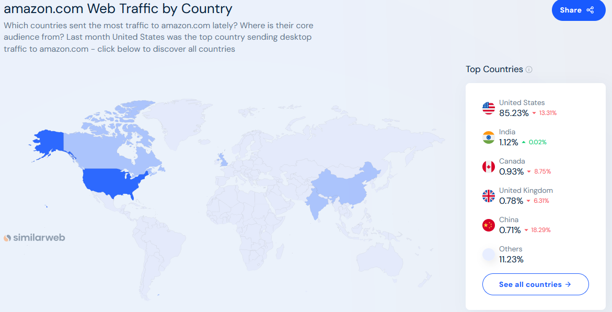
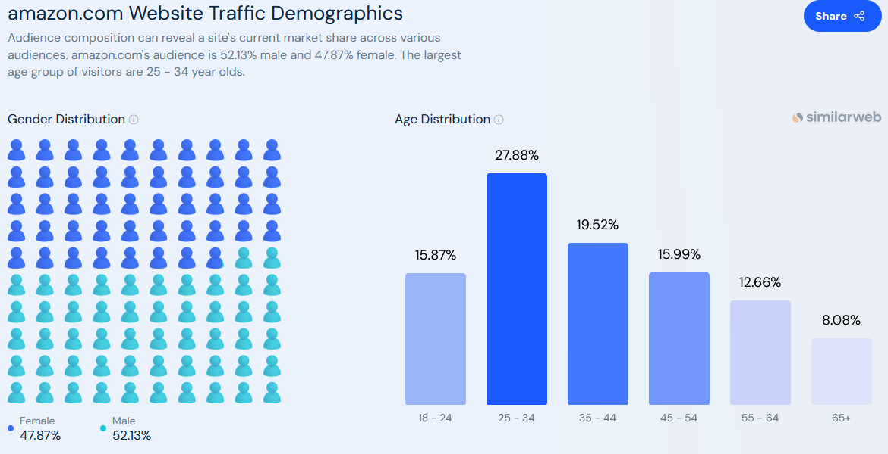

# highload-amazon
# **Описание онлайн-платформы Amazon (MVP)**  

## **1. Тема и целевая аудитория**  

## **1.1 Тема**
**Amazon** – это крупнейшая в мире онлайн-платформа для электронной коммерции, предоставляющая пользователям возможность покупать и продавать товары, а также использовать широкий спектр дополнительных сервисов, включая доставку, подписки, облачные вычисления и цифровые товары.

---

## **1.2. Целевая аудитория**  
- **Покупатели** – конечные пользователи, приобретающие товары  
- **Продавцы** – индивидуальные предприниматели и компании  
- **Логистические партнеры** – службы доставки  

---

## **1.3. Анализ трафика и вовлеченности**  
*(По данным SimilarWeb [1](https://www.similarweb.com/website/amazon.com/)  и внутренних отчетов Amazon)*  
- **Всего посещений (за месяц):** 2.5B+ [[1]](https://www.similarweb.com/website/amazon.com/)  
- **Средняя продолжительность сеанса:** 10 минут [[1]](https://www.similarweb.com/website/amazon.com/)  
- **Среднее количество просмотров страниц за посещение:** 8+ [[1]](https://www.similarweb.com/website/amazon.com/)  
- **Процент отказов:** ~35% [[1]](https://www.similarweb.com/website/amazon.com/)  
- **Количество активных продавцов:** 9M+ [[2]](https://www.marketplacepulse.com/amazon/number-of-sellers)  
- **Пользователи Amazon Prime:** 200M+ [[3]](https://www.aboutamazon.com/news/company-news/amazon-prime-has-more-than-200-million-members-globally)  

---

## **1.4. Функционал MVP**  

### **Пользовательский функционал**  
- **Регистрация и авторизация пользователей** (e-mail, телефон, социальные сети)  
- **Каталог товаров и услуг**  
  - Просмотр товаров по категориям  
  - Фильтрация и сортировка    
- **Карточка товара**  
  - Описание, фотографии, характеристики  
  - Отзывы и рейтинги    
- **Корзина и оформление заказа**  
  - Добавление товаров  
  - Выбор способа доставки  
  - Оплата (карты)  
- **Личный кабинет**  
  - История заказов  
  - Адреса доставки  

### **Функционал для продавцов (Marketplace)**  
- Регистрация и верификация  
- Создание карточек товаров  
- Управление заказами и возвратами  

### **Функционал для логистики и доставки**  
- Интеграция с Amazon Logistics и партнерами  
- Отслеживание заказов  
- Управление складами (**FBA — Fulfillment by Amazon**)  

---

## **2. Расчет нагрузки**

## **2.1 Продуктовые метрики**
- #### MAU = 310
- #### DAU  = 62M

Обычно соотношение DAU/MAU для крупных платформ варьируется в пределах 10–30%. Принимаем ориентировочно 20%.

Расчёт:
<i>DAU = 0.2×310M ≈ 62M</i>

### Действия пользователей
Тип пользователя|Параметр          | Число
-------------|-------------| -------------
Покупатель  |<b>Количество покупателей</b>                   | 310M   
Покупатель  |Среднее количество просмотров страниц за сессию | 8
Покупатель  |Количество сессий в день                        | 2
Покупатель  |Количество просмотренных страниц за день        | 16
Покупатель  |Конверсия покупок                               | 3%
Продавец    |<b>Количество активных продавцов</b>            | 9M 
Продавец    |Создание карточек товаров в день                | 0,7 
Продавец    |Количество отправляемых посылок в день [[6]](https://www.feedough.com/amazon-statistics-usage-revenue-key-facts/)          | 1,6M
Продавец    |Количество продавцов, регистрирующихся в день [[6]](https://www.feedough.com/amazon-statistics-usage-revenue-key-facts/)          | 3700
Сторонние веб пользователи            |Количество веб-сайтов, использующих Amazon[[7]](https://trends.builtwith.com/websitelist/Amazon/Historical) | 65M

### Рассчетные параметры карточки товара
Параметр          | Число
     -------------| -------------
Средний размер товарного описания| 100 Кб
Среднее количество фотографий у товара| 6 
Средний размер фотографии             | 250 Кб

## **2.2 Технические метрики**

|Параметр          | Число
-------------      |-------------
Количество сессий в месяц                        | 25млрд
Среднее количество просмотров страниц за сессию  | 8
Среднее количество HTTP-запросов на страницу     | 10
Среднее количество запросов за сессию            | 80 
Общее число запросов в месяц                     | 200млрд

### Расчёт среднего RPS
<b> Количество секунд в 30 днях:</b>
<i>30x24x3600 ≈ 2'592'000 сек</i>

​<b>Среднее RPS:</b>
<i>200млрд/2'592'000 ≈ 77160 запросов/сек</i>

---

**Список источников:**
1. https://www.similarweb.com/website/amazon.com/
2. https://www.marketplacepulse.com/amazon/number-of-sellers
3. https://www.aboutamazon.com/news/company-news/amazon-prime-has-more-than-200-million-members-globally
4. https://amzscout.net/blog/amazon-statistics/#:~:text=It%20is%20estimated%20that%20the%20marketplace%20has%20over%20310%20million%20active%20users%20worldwide
5. https://www.demandsage.com/amazon-statistics/
6. https://www.feedough.com/amazon-statistics-usage-revenue-key-facts/
7. https://trends.builtwith.com/websitelist/Amazon/Historical

