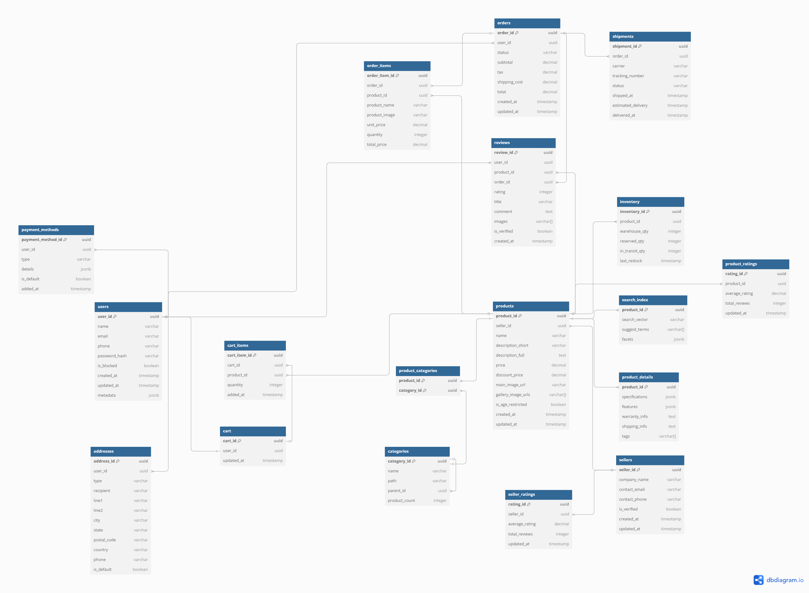
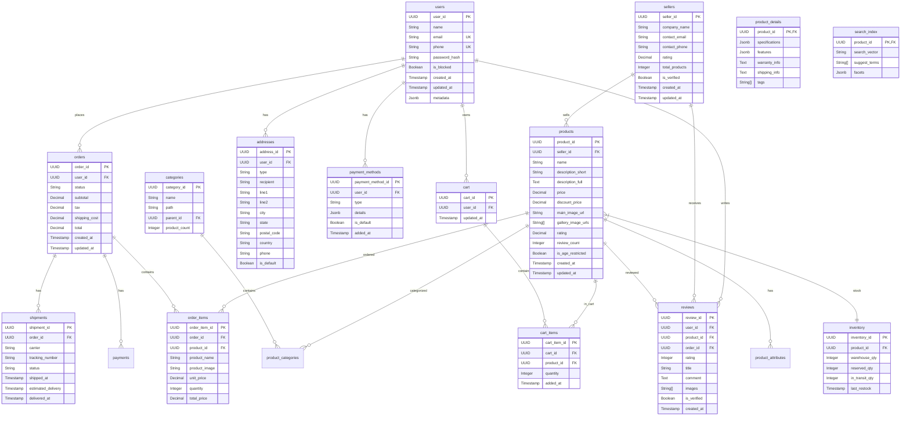

# highload-amazon

=============================

- [1. Тема и целевая аудитория](#block1)
  - [1.1 Тема](#)
  - [](#)
- [2. Расчет нагрузки](#block2)
- [3. Глобальная балансировка нагрузки](#block3)
- [4. Локальная балансировка нагрузки](#block4)
- [5. Масштабирование баз данных](#block5)
- [6. Выбор баз данных](#block6)
- [7. Алгоритмы](#block7)

# **Описание онлайн-платформы Amazon (MVP)**

<a name="block1"></a>

## **1. Тема и целевая аудитория**

### **1.1 Тема**

**Amazon** – это крупнейшая в мире онлайн-платформа для электронной коммерции, предоставляющая пользователям возможность покупать и продавать товары, а также использовать широкий спектр дополнительных сервисов, включая доставку, подписки, облачные вычисления и цифровые товары.

---

### **1.2. Целевая аудитория**

- **Покупатели** – конечные пользователи, приобретающие товары
- **Продавцы** – индивидуальные предприниматели и компании
- **Логистические партнеры** – службы доставки

---

### **1.3. Анализ трафика и вовлеченности**

_(По данным SimilarWeb [1](https://www.similarweb.com/website/amazon.com/) и внутренних отчетов Amazon)_

- **Всего посещений (за месяц):** 2.5B+ [[1]](https://www.similarweb.com/website/amazon.com/)
- **Средняя продолжительность сеанса:** 10 минут [[1]](https://www.similarweb.com/website/amazon.com/)
- **Среднее количество просмотров страниц за посещение:** 8+ [[1]](https://www.similarweb.com/website/amazon.com/)
- **Процент отказов:** ~35% [[1]](https://www.similarweb.com/website/amazon.com/)
- **Количество активных продавцов:** 9M+ [[2]](https://www.marketplacepulse.com/amazon/number-of-sellers)
- **Пользователи Amazon Prime:** 200M+ [[3]](https://www.aboutamazon.com/news/company-news/amazon-prime-has-more-than-200-million-members-globally)


---

### **1.4. Функционал MVP**

#### **Пользовательский функционал**

- **Регистрация и авторизация пользователей** (e-mail, телефон, социальные сети)
- **Каталог товаров и услуг**
  - Просмотр товаров по категориям
  - Фильтрация и сортировка
- **Карточка товара**
  - Описание, фотографии, характеристики
  - Отзывы и рейтинги
- **Корзина и оформление заказа**
  - Добавление товаров
  - Выбор способа доставки
  - Оплата (карты)
- **Личный кабинет**
  - История заказов
  - Адреса доставки

#### **Функционал для продавцов (Marketplace)**

- Регистрация и верификация
- Создание карточек товаров
- Управление заказами и возвратами

#### **Функционал для логистики и доставки**

- Интеграция с Amazon Logistics и партнерами
- Отслеживание заказов
- Управление складами (**FBA — Fulfillment by Amazon**)

---

<a name="block2"></a>

## **2. Расчет нагрузки**

### **2.1 Продуктовые метрики**

- #### MAU = 310M [[7]](https://analyzify.com/statsup/amazon)
- #### DAU = 62M [[7]](https://analyzify.com/statsup/amazon)

Расчёт:
<i>DAU = 0.2×310M ≈ 62M</i>

#### Действия пользователей

| Тип пользователя | Параметр (количество на 1 пользователя в день)   | Число                                                                                                                                                                                                                              |
| ---------------- | ------------------------------------------------ | ---------------------------------------------------------------------------------------------------------------------------------------------------------------------------------------------------------------------------------- |
| Покупатель       | Регистрация, авторизация, обновление профиля     | 0.003 [V]                                                                                                                                                                                                                          |
| Покупатель       | Среднее количество просмотров страниц за сессию  | 8                                                                                                                                                                                                                                  |
| Покупатель       | Количество сессий в день                         | 2                                                                                                                                                                                                                                  |
| Покупатель       | Количество оставленных отзывов за день           | 0.13 [[8]](https://meetanshi.com/blog/amazon-seller-statistics/)[[9]](https://www.powerreviews.com/wp-content/uploads/2023/10/2023-Ratings-Reviews-Report_-Amazon-Edition-1.pdf)                                                   |
| Покупатель       | Количество добавленных товаров в корзину за день | 3 [[12]](https://shopney.co/blog/ultimate-guide-to-increase-add-to-cart-rates/)                                                                                                                                                    |
| Покупатель       | Количество покупок за день                       | 0.19 [[11]](https://amzscout.net/blog/amazon-statistics/)                                                                                                                                                                          |
| Покупатель       | Количество платежей за день                      | 0.19 [[11]](https://amzscout.net/blog/amazon-statistics/)                                                                                                                                                                          |
| Продавец         | Регистрация, верификация, обновление профиля     | 0.003 [V]                                                                                                                                                                                                                          |
| Продавец         | Создание карточек товаров в день                 | 0.7                                                                                                                                                                                                                                |
| Продавец         | Количество отправляемых посылок в день           | 0.6 [[6]](https://www.feedough.com/amazon-statistics-usage-revenue-key-facts/)                                                                                                                                                     |
| Продавец         | Количество возвращаемых посылок в день           | 0.1 [[10]](https://nichesources.com/amazon-return-rate.html#:~:text=Amazon's%20return%20rate%20for%20online,support%20can%20help%20reduce%20returns.)                                                                              |
| Логистика        | Количество перемещаемых посылок в день           | 1.76M [[6]](https://www.feedough.com/amazon-statistics-usage-revenue-key-facts/) [[10]](https://nichesources.com/amazon-return-rate.html#:~:text=Amazon's%20return%20rate%20for%20online,support%20can%20help%20reduce%20returns.) |

<br><br>
Из рассчета, что за 2023 год было продано боле 4.5 млрд товаров [[8]](https://meetanshi.com/blog/amazon-seller-statistics/), а в среднем на карточку товара приходится 40 отзывов [[9]](https://www.powerreviews.com/wp-content/uploads/2023/10/2023-Ratings-Reviews-Report_-Amazon-Edition-1.pdf), то 4.5млрд x 40 = 180млрд<br>
180млрд/(MAU x 12) = 48 - примерное количество отзывов, оставляемое одним пользователем за год

Из рассчета 1,6M - количество посылок, отправляемых в день [[6]](https://www.feedough.com/amazon-statistics-usage-revenue-key-facts/), а активных продавцов 2.3M [[6]](https://www.feedough.com/amazon-statistics-usage-revenue-key-facts/), то <br>
1.6M/2.3M = 0.6 - количество посылок, отправляемых среднестатистич. продавцом в день

Процент возвратов на Amazon варируется между 5% и 15% --> среднее значение 10%<br>
Тогда количество возвращаемых посылок в день 10% от 0.6 = 0.06 = 0.1 [[10]](https://nichesources.com/amazon-return-rate.html#:~:text=Amazon's%20return%20rate%20for%20online,support%20can%20help%20reduce%20returns.)

Из рассчета 1,6M - количество посылок, отправляемых в день [[6]](https://www.feedough.com/amazon-statistics-usage-revenue-key-facts/), а возвращаемых - 10% от этого числа [[10]](https://nichesources.com/amazon-return-rate.html#:~:text=Amazon's%20return%20rate%20for%20online,support%20can%20help%20reduce%20returns.), то <br>
1.6M + 1.6M x 0.1 = 1.76M

Будем считать, что пользователь обновляет/подтверждает свои учетные данные один раз за год.<br>
Тогда 1/356 = 0.003

Из рассчета, что на сервисе в день 62M пользователей, и в день продается 12M товаров [[11]](https://amzscout.net/blog/amazon-statistics/), то<br>
12M/62M = 0.19 - количество покупаемых товаров пользователем в день = количество платежей в день

Из рассчета, что у пользователя 2 сессии в день, за которые он просматривает по 8 страниц по 35 товаров на странице, а конверсия с просмотра составляет 8% [[12]](https://shopney.co/blog/ultimate-guide-to-increase-add-to-cart-rates/), то<br>
2 x 8 x 35 x 0.08 x 0.08 = 3 товара в день пользователь добавляет в корзину

---

#### Рост

| Тип пользователя | Параметр (количество на 1 пользователя в день) | Число                                                                           |
| ---------------- | ---------------------------------------------- | ------------------------------------------------------------------------------- |
| Продавец         | Количество продавцов, регистрирующихся в день  | 3700 [[6]](https://www.feedough.com/amazon-statistics-usage-revenue-key-facts/) |

---

#### Рассчетные параметры карточки товара

Тестовые данные [[0]](https://www.amazon.com/)
| Параметр | Число |
| --------------------------------------------- | ------ |
| Средний размер товарного описания | 100 Кб |
| Среднее количество фотографий у товара | 6 |
| Средний размер фотографии | 250 Кб |
| Среднее количество карточек на одной странице | 35 |

#### Рассчет действий среднестатистич. покупателя

Просмотр товаров в день: 2 сессии x 8 страниц x 35 товаров x (100Кб + (6 фото x 250Кб)) = 896000 Кб

---

### **2.2 Технические метрики**

#### <b style="color:Aqua">RPS</b>

| Тип пользователя | Параметр (количество на 1 пользователя в день)   | Action(число) | RPS      | RPS x3    |
| ---------------- | ------------------------------------------------ | ------------- | -------- | --------- |
| Покупатель       | Регистрация, авторизация, обновление профиля     | 0.003         | 2,15     | 6,45      |
| Покупатель       | Среднее количество просмотров страниц за сессию  | 8             | 5 740,74 | 17 222,22 |
| Покупатель       | Количество сессий в день                         | 2             | 1 435,18 | 4 305,54  |
| Покупатель       | Количество оставленных отзывов за день           | 0.13          | 93,28    | 279,84    |
| Покупатель       | Количество добавленных товаров в корзину за день | 3             | 2 152,77 | 6 458,31  |
| Покупатель       | Количество покупок за день                       | 0.19          | 136,34   | 409,02    |
| Покупатель       | Количество платежей за день                      | 0.19          | 136,34   | 409,02    |
| Продавец         | Регистрация, верификация, обновление профиля     | 0.003         | 0,07     | 0,21      |
| Продавец         | Создание карточек товаров в день                 | 0.7           | 1,86     | 5,58      |
| Продавец         | Количество отправляемых посылок в день           | 0.6           | 1,59     | 4,77      |
| Продавец         | Количество возвращаемых посылок в день           | 0.1           | 0,26     | 0,78      |
| Логистика        | Количество перемещаемых посылок в день           | 1.76M         | 20,37    | 61,11     |
| Total            |                                                  |               | 9721,58  | 29164,74  |

RPS = (Action \* DAU)/(24h x 60' x 60")<br>
DAU пользователей = 62M<br>
DAU продавцов = 2.3M<br>

---

#### Сеть

| Тип пользователя | Параметр (количество на 1 пользователя в день)   | Action(число) | RPS      | RPS x3    | Volume (Kb) | Сеть (Kb/s) | Сеть x3 (Kb/s) |
| ---------------- | ------------------------------------------------ | ------------- | -------- | --------- | ----------- | ----------- | -------------- |
| Покупатель       | Регистрация, авторизация, обновление профиля     | 0.003         | 2,15     | 6,45      | 10          | 21.5        | 64.5           |
| Покупатель       | Среднее количество просмотров страниц за сессию  | 8             | 5 740,74 | 17 222,22 | 1600        | 9 185 184   | 27 555 552     |
| Покупатель       | Количество сессий в день                         | 2             | 1 435,18 | 4 305,54  | 10          | 14 351.8    | 43 055.4       |
| Покупатель       | Количество оставленных отзывов за день           | 0.13          | 93,28    | 279,84    | 50          | 4 664       | 13 9920        |
| Покупатель       | Количество добавленных товаров в корзину за день | 3             | 2 152,77 | 6 458,31  | 20          | 43 055.4    | 129 166.2      |
| Покупатель       | Количество покупок за день                       | 0.19          | 136,34   | 409,02    | 30          | 4 090.2     | 12 270.6       |
| Покупатель       | Количество платежей за день                      | 0.19          | 136,34   | 409,02    | 30          | 4 090.2     | 12 270.6       |
| Продавец         | Регистрация, верификация, обновление профиля     | 0.003         | 0,07     | 0,21      | 10          | 0.7         | 2.1            |
| Продавец         | Создание карточек товаров в день                 | 0.7           | 1,86     | 5,58      | 1600        | 2 976       | 8 928          |
| Продавец         | Количество отправляемых посылок в день           | 0.6           | 1,59     | 4,77      | 100         | 159         | 477            |
| Продавец         | Количество возвращаемых посылок в день           | 0.1           | 0,26     | 0,78      | 100         | 26          | 78             |
| Логистика        | Количество перемещаемых посылок в день           | 1.76M         | 20,37    | 61,11     | 200         | 4 074       | 12 222         |
| Total            |                                                  |               | 9721,58  | 29164,74  |             | 9 262 692.8 | 27 788 078.4   |

Сеть total = 8.83 Гб/сек.<br>
Сеть x3 total = 26.50 Гб/сек.<br>

---

<a name="block3"></a>

## **3. Глобальная балансировка нагрузки**

### **3.1. Разделить трафик на группы по характеру нагрузки**

<h3>Группа 1: Пользовательский трафик (покупатели и продавцы)</h3>
<b>Регистрация, авторизация, обновление профиля:</b> Низкая частота запросов, но критически важная для безопасности и доступности.<br>
<b>Просмотр страниц:</b> Высокая частота запросов, большой объем данных (изображения, описания товаров).<br>
<b>Добавление товаров в корзину:</b> Средняя частота запросов, небольшой объем данных.<br>
<b>Оставление отзывов:</b> Низкая частота запросов, небольшой объем данных.<br>
<b>Покупки и платежи:</b> Низкая частота запросов, но критически важная для бизнеса (требует высокой отказоустойчивости и безопасности).<br>

<h3>Группа 2: Трафик продавцов</h3>
<b>Создание карточек товаров:</b> Средняя частота запросов, большой объем данных (изображения, описания).<br>
<b>Отправка и возврат посылок:</b> Низкая частота запросов, небольшой объем данных.<br>

<h3>Группа 3: Логистический трафик</h3>
<b>Перемещение посылок:</b> Высокая частота запросов, средний объем данных. Этот трафик менее чувствителен к задержкам, но требует высокой пропускной способности.<br>

### **3.2. Выбрать физическое расположение датацентров (базово одного)**


[https://worldpopulationreview.com/state-rankings/state-densities]
[https://www.internetexchangemap.com/]

Для маркетплейса, расположенного в США, рекомендуется использовать несколько датацентров в разных регионах для обеспечения отказоустойчивости и низкой задержки. Основные регионы для размещения датацентров:

    Восточное побережье США (например, Вирджиния, Нью-Йорк): Для обслуживания пользователей на востоке США.

    Западное побережье США (например, Калифорния, Орегон): Для обслуживания пользователей на западе США.

    Центральный регион США (например, Техас, Иллинойс): Для балансировки нагрузки между востоком и западом.

Расстояния между городами (в километрах):

| Город 1                   | Город 2                   | Расстояние (км) |
| ------------------------- | ------------------------- | --------------- |
| Вирджиния (Миннесота)     | Нью-Йорк                  | ~1,800 км       |
| Вирджиния (Миннесота)     | Калифорния (Лос-Анджелес) | ~2,500 км       |
| Вирджиния (Миннесота)     | Орегон (Портленд)         | ~2,300 км       |
| Вирджиния (Миннесота)     | Техас (Даллас)            | ~1,400 км       |
| Вирджиния (Миннесота)     | Иллинойс (Чикаго)         | ~800 км         |
| Нью-Йорк                  | Калифорния (Лос-Анджелес) | ~3,900 км       |
| Нью-Йорк                  | Орегон (Портленд)         | ~3,800 км       |
| Нью-Йорк                  | Техас (Даллас)            | ~2,200 км       |
| Нью-Йорк                  | Иллинойс (Чикаго)         | ~1,200 км       |
| Калифорния (Лос-Анджелес) | Орегон (Портленд)         | ~1,000 км       |
| Калифорния (Лос-Анджелес) | Техас (Даллас)            | ~1,900 км       |
| Калифорния (Лос-Анджелес) | Иллинойс (Чикаго)         | ~2,800 км       |
| Орегон (Портленд)         | Техас (Даллас)            | ~2,500 км       |
| Орегон (Портленд)         | Иллинойс (Чикаго)         | ~2,700 км       |
| Техас (Даллас)            | Иллинойс (Чикаго)         | ~1,300 км       |

Основной датацентр можно разместить в центральном регионе (например, Техас), так как это обеспечит баланс между задержкой для пользователей на востоке и западе.

### **3.3. Глобальная балансировка нагрузки**

- DNS-балансировка Cloudflare для распределения трафика между датацентрами (на основе геолокации пользователя)
- Amazon Route 53 latency-based DNS (на основе геолокации пользователя)
- Использование health checks для автоматического перенаправления трафика в случае сбоя одного из датацентров.

<b>Amazon Route 53</b> - Это надёжный DNS сервис, с достаточно удобным API для редактирования, добавления и удаления записей. [[13]](http://aws.amazon.com/route53/)

<b>Cloudflare</b> — это глобальная сеть доставки контента (CDN), которая предоставляет решения для повышения безопасности и производительности веб-сайтов.[[14]](https://www.cloudflare.com/ru-ru/)

### **3.4. Распределение RPS по серверам в городах**

- Нью-Йорк: ~20% от общего RPS = 5,832.95
- Вирджиния: ~15% от общего RPS = 4,374.71
- Лос-Анджелес: ~25% от общего RPS = 7,291.19
- Портленд: ~10% от общего RPS = 2,916.47
- Даллас: ~15% от общего RPS = 4,374.71
- Чикаго: ~10% от общего RPS = 2,916.47


<a name="block4"></a>

## **4. Локальная балансировка нагрузки** [[15]](https://docs.amazonaws.cn/en_us/eks/latest/userguide/aws-load-balancer-controller.html)

### Алгоритмы балансировки нагрузки

| Алгоритм                  | Плюсы                                                                   | Минусы                                             |
| ------------------------- | ----------------------------------------------------------------------- | -------------------------------------------------- |
| Round-Robin               | Равномерное распределение нагрузки, простота реализации                 | Не учитывает нагрузку на серверы                   |
| Weighted Round-Robin      | Возможность распределять нагрузку с учетом мощности серверов            | Не учитывает текущую загрузку серверов             |
| Least Connection          | Оптимально для долгих соединений, так как учитывает текущие подключения | Возможны перегрузки при резких изменениях нагрузки |
| Weighted Least Connection | Учитывает как текущие подключения, так и мощности серверов              | Сложность в настройке                              |
| IP Hash                   | Клиент всегда подключается к одному и тому же серверу                   | Неравномерное распределение нагрузки               |


### **4.1. Выбрать схемы балансировки для входящих и межсервисных запросов**

- <b>Входящий трафик:</b><br> Использование ALB для балансировки HTTP/S-запросов, а также NLB для низкоуровневого трафика (например, WebSockets или gRPC).

- <b>Межсервисные запросы:</b><br> Балансировка через Service Mesh (например, Istio) или Kubernetes Ingress.

### **4.2. Продумать схему отказоустойчивости**

- <b>Мультизональная балансировка:</b><br> Размещение инстансов в нескольких Availability Zones.

- <b>Автоматическое переключение (failover):</b><br> Использование Route 53 + Health Checks для перенаправления трафика в случае отказа.

- <b>Автошкала:</b><br> Использование HPA (Horizontal Pod Autoscaler) для подстройки количества реплик под нагрузку.

### **4.3. Рассчитать нагрузку по терминации SSL**

При терминации SSL на ALB вычислительные ресурсы распределяются следующим образом:

- <b>Средняя нагрузка на ALB:</b><br> 1000 RPS требует около 1 vCPU.

- <b>Средний размер SSL-сессии:</b><br> 3 KB на подключение.

- <b>Если сервер обрабатывает 100K RPS, </b><br>требуется 100 vCPU ALB.

---

<a name="block5"></a>

## **5. Масштабирование баз данных**

### **5.1 Описать логическую схему данных**


UUID:

    user_id, seller_id, product_id, order_id, cart_id, review_id, logistics_id, image_id.

INT:

    stock_quantity (в таблице products), quantity (в таблицах order_items, cart_items).

TIMESTAMP:

    created_at, updated_at (во всех таблицах).

DECIMAL:

    price, total_amount, rating (в таблицах products, orders, sellers, reviews).

TEXT:

    description (в таблице products), comment (в таблице reviews).

BOOLEAN:

    is_primary (в таблице product_images).

| Таблица        | Размер строки (байт) | Количество записей в сутки | Общий объем в сутки (байт) |
| -------------- | -------------------- | -------------------------- | -------------------------- |
| users          | 211                  | 200,000                    | 42,200,000                 |
| sellers        | 155                  | 3,700                      | 573,500                    |
| products       | 718                  | 200,000                    | 143,600,000                |
| product_images | 249                  | 1,200,000                  | 298,800,000                |
| orders         | 76                   | 12,000,000                 | 912,000,000                |
| order_items    | 60                   | 36,000,000                 | 2,160,000,000              |
| cart           | 48                   | 200,000                    | 9,600,000                  |
| cart_items     | 52                   | 600,000                    | 31,200,000                 |
| reviews        | 568                  | 26,000                     | 14,768,000                 |
| review_images  | 248                  | 52,000                     | 12,896,000                 |
| logistics      | 118                  | 1,760,000                  | 207,680,000                |

<b>users</b> 16 (UUID) + 50 (name) + 50 (email) + 15 (phone) + 64 (password_hash) + 8 (created_at) + 8 (updated_at) = 211

<b>sellers</b> 16 (UUID) + 50 (company_name) + 50 (contact_email) + 15 (contact_phone) + 8 (rating) + 8 (created_at) + 8 (updated_at) = 155

<b>products</b> 16 (UUID) + 16 (seller_id) + 100 (name) + 500 (description) + 8 (price) + 50 (category) + 4 (stock_quantity) + 8 (rating) + 8 (created_at) + 8 (updated_at) = 718

<b>product_images</b> 16 (UUID) + 16 (product_id) + 200 (image_url) + 1 (is_primary) + 8 (created_at) + 8 (updated_at) = 249

<b>orders</b> 16 (UUID) + 16 (user_id) + 20 (status) + 8 (total_amount) + 8 (created_at) + 8 (updated_at) = 76

<b>order_items</b> 16 (UUID) + 16 (order_id) + 16 (product_id) + 4 (quantity) + 8 (price_at_purchase) = 60

<b>cart</b> 16 (UUID) + 16 (user_id) + 8 (created_at) + 8 (updated_at) = 48

<b>cart_items</b> 16 (UUID) + 16 (cart_id) + 16 (product_id) + 4 (quantity) = 52

<b>reviews</b> 16 (UUID) + 16 (user_id) + 16 (product_id) + 4 (rating) + 500 (comment) + 8 (created_at) + 8 (updated_at) = 568

<b>review_images</b> 16 (UUID) + 16 (review_id) + 200 (image_url) + 8 (created_at) + 8 (updated_at) = 248

<b>logistics</b> 16 (UUID) + 16 (order_id) + 50 (tracking_number) + 20 (status) + 8 (shipped_at) + 8 (delivered_at) = 118

---

<a name="block6"></a>

## **6. Выбор баз данных**

<!--


### Описание таблиц базы данных

#### Таблица **users**

| Поле          | Тип данных     | Описание                                           | Размер данных (в байтах) |
| ------------- | -------------- | -------------------------------------------------- | ------------------------ |
| user_id       | UUID, pk       | Уникальный идентификатор пользователя.             | 16                       |
| name          | String         | Имя пользователя.                                  | 50                       |
| email         | String, unique | Электронная почта пользователя.                    | 50                       |
| phone         | String, unique | Номер телефона пользователя.                       | 15                       |
| password_hash | String         | Хешированный пароль пользователя.                  | 64                       |
| is_blocked    | Boolean        | Флаг блокировки пользователя (по умолчанию false). | 1                        |
| created_at    | Timestamp      | Дата и время создания записи.                      | 8                        |
| updated_at    | Timestamp      | Дата и время последнего обновления записи.         | 8                        |
| **Итого**     |                |                                                    | **211 байт**             |

---

#### Таблица **sellers**

| Поле          | Тип данных | Описание                                       | Размер данных (в байтах) |
| ------------- | ---------- | ---------------------------------------------- | ------------------------ |
| seller_id     | UUID, pk   | Уникальный идентификатор продавца.             | 16                       |
| company_name  | String     | Название компании продавца.                    | 50                       |
| contact_email | String     | Контактная электронная почта продавца.         | 50                       |
| contact_phone | String     | Контактный номер телефона продавца.            | 15                       |
| rating        | Decimal    | Рейтинг продавца.                              | 8                        |
| is_blocked    | Boolean    | Флаг блокировки продавца (по умолчанию false). | 1                        |
| created_at    | Timestamp  | Дата и время создания записи.                  | 8                        |
| updated_at    | Timestamp  | Дата и время последнего обновления записи.     | 8                        |
| **Итого**     |            |                                                | **155 байт**             |

---

#### Таблица **categories**

| Поле        | Тип данных     | Описание                                   | Размер данных (в байтах) |
| ----------- | -------------- | ------------------------------------------ | ------------------------ |
| category_id | UUID, pk       | Уникальный идентификатор категории.        | 16                       |
| name        | String, unique | Название категории.                        | 50                       |
| created_at  | Timestamp      | Дата и время создания записи.              | 8                        |
| updated_at  | Timestamp      | Дата и время последнего обновления записи. | 8                        |
| **Итого**   |                |                                            | **82 байта**             |

---

#### Таблица **products**

| Поле              | Тип данных | Описание                                           | Размер данных (в байтах) |
| ----------------- | ---------- | -------------------------------------------------- | ------------------------ |
| product_id        | UUID, pk   | Уникальный идентификатор товара.                   | 16                       |
| seller_id         | UUID, fk   | Связь с таблицей sellers через seller_id.          | 16                       |
| name              | String     | Название товара.                                   | 100                      |
| description       | Text       | Описание товара.                                   | 500                      |
| price             | Decimal    | Цена товара.                                       | 8                        |
| stock_quantity    | Integer    | Количество товара на складе.                       | 4                        |
| rating            | Decimal    | Рейтинг товара.                                    | 8                        |
| is_blocked        | Boolean    | Флаг блокировки товара (по умолчанию false).       | 1                        |
| is_age_restricted | Boolean    | Флаг возрастного ограничения (по умолчанию false). | 1                        |
| created_at        | Timestamp  | Дата и время создания записи.                      | 8                        |
| updated_at        | Timestamp  | Дата и время последнего обновления записи.         | 8                        |
| **Итого**         |            |                                                    | **718 байт**             |

---

#### Таблица **product_categories**

| Поле                | Тип данных | Описание                                           | Размер данных (в байтах) |
| ------------------- | ---------- | -------------------------------------------------- | ------------------------ |
| product_category_id | UUID, pk   | Уникальный идентификатор связи товара и категории. | 16                       |
| product_id          | UUID, fk   | Связь с таблицей products через product_id.        | 16                       |
| category_id         | UUID, fk   | Связь с таблицей categories через category_id.     | 16                       |
| created_at          | Timestamp  | Дата и время создания записи.                      | 8                        |
| updated_at          | Timestamp  | Дата и время последнего обновления записи.         | 8                        |
| **Итого**           |            |                                                    | **64 байта**             |

---

#### Таблица **product_images**

| Поле       | Тип данных | Описание                                         | Размер данных (в байтах) |
| ---------- | ---------- | ------------------------------------------------ | ------------------------ |
| image_id   | UUID, pk   | Уникальный идентификатор изображения товара.     | 16                       |
| product_id | UUID, fk   | Связь с таблицей products через product_id.      | 16                       |
| image_url  | String     | Ссылка на изображение товара.                    | 200                      |
| is_primary | Boolean    | Флаг основного изображения (по умолчанию false). | 1                        |
| created_at | Timestamp  | Дата и время создания записи.                    | 8                        |
| updated_at | Timestamp  | Дата и время последнего обновления записи.       | 8                        |
| **Итого**  |            |                                                  | **249 байт**             |

---

#### Таблица **orders**

| Поле         | Тип данных | Описание                                   | Размер данных (в байтах) |
| ------------ | ---------- | ------------------------------------------ | ------------------------ |
| order_id     | UUID, pk   | Уникальный идентификатор заказа.           | 16                       |
| user_id      | UUID, fk   | Связь с таблицей users через user_id.      | 16                       |
| status       | String     | Статус заказа.                             | 20                       |
| total_amount | Decimal    | Общая сумма заказа.                        | 8                        |
| created_at   | Timestamp  | Дата и время создания записи.              | 8                        |
| updated_at   | Timestamp  | Дата и время последнего обновления записи. | 8                        |
| **Итого**    |            |                                            | **76 байт**              |

---

#### Таблица **order_items**

| Поле              | Тип данных | Описание                                    | Размер данных (в байтах) |
| ----------------- | ---------- | ------------------------------------------- | ------------------------ |
| order_item_id     | UUID, pk   | Уникальный идентификатор элемента заказа.   | 16                       |
| order_id          | UUID, fk   | Связь с таблицей orders через order_id.     | 16                       |
| product_id        | UUID, fk   | Связь с таблицей products через product_id. | 16                       |
| quantity          | Integer    | Количество товара в заказе.                 | 4                        |
| price_at_purchase | Decimal    | Цена товара на момент покупки.              | 8                        |
| purchase_date     | Timestamp  | Дата покупки товара.                        | 8                        |
| created_at        | Timestamp  | Дата и время создания записи.               | 8                        |
| updated_at        | Timestamp  | Дата и время последнего обновления записи.  | 8                        |
| **Итого**         |            |                                             | **60 байт**              |

---

#### Таблица **cart**

| Поле       | Тип данных | Описание                                   | Размер данных (в байтах) |
| ---------- | ---------- | ------------------------------------------ | ------------------------ |
| cart_id    | UUID, pk   | Уникальный идентификатор корзины.          | 16                       |
| user_id    | UUID, fk   | Связь с таблицей users через user_id.      | 16                       |
| created_at | Timestamp  | Дата и время создания записи.              | 8                        |
| updated_at | Timestamp  | Дата и время последнего обновления записи. | 8                        |
| **Итого**  |            |                                            | **48 байт**              |

---

#### Таблица **cart_items**

| Поле         | Тип данных | Описание                                    | Размер данных (в байтах) |
| ------------ | ---------- | ------------------------------------------- | ------------------------ |
| cart_item_id | UUID, pk   | Уникальный идентификатор элемента корзины.  | 16                       |
| cart_id      | UUID, fk   | Связь с таблицей cart через cart_id.        | 16                       |
| product_id   | UUID, fk   | Связь с таблицей products через product_id. | 16                       |
| quantity     | Integer    | Количество товара в корзине.                | 4                        |
| created_at   | Timestamp  | Дата и время создания записи.               | 8                        |
| updated_at   | Timestamp  | Дата и время последнего обновления записи.  | 8                        |
| **Итого**    |            |                                             | **52 байта**             |

---

#### Таблица **reviews**

| Поле          | Тип данных | Описание                                                       | Размер данных (в байтах) |
| ------------- | ---------- | -------------------------------------------------------------- | ------------------------ |
| review_id     | UUID, pk   | Уникальный идентификатор отзыва.                               | 16                       |
| user_id       | UUID, fk   | Связь с таблицей users через user_id.                          | 16                       |
| product_id    | UUID, fk   | Связь с таблицей products через product_id.                    | 16                       |
| order_item_id | UUID, fk   | Связь с таблицей order_items через order_item_id.              | 16                       |
| rating        | Integer    | Рейтинг отзыва.                                                | 4                        |
| comment       | Text       | Текст отзыва.                                                  | 500                      |
| status        | String     | Статус отзыва (по умолчанию "pending").                        | 20                       |
| deleted_by    | String     | Идентификатор пользователя, удалившего отзыв (если применимо). | 50                       |
| created_at    | Timestamp  | Дата и время создания записи.                                  | 8                        |
| updated_at    | Timestamp  | Дата и время последнего обновления записи.                     | 8                        |
| seller_id     | UUID, fk   | Связь с таблицей sellers через seller_id.                      | 16                       |
| user_name     | String     | Имя пользователя (избыточное поле для упрощения запросов).     | 50                       |
| product_name  | String     | Название товара (избыточное поле для упрощения запросов).      | 100                      |
| **Итого**     |            |                                                                | **568 байт**             |

---

#### Таблица **review_images**

| Поле       | Тип данных | Описание                                     | Размер данных (в байтах) |
| ---------- | ---------- | -------------------------------------------- | ------------------------ |
| image_id   | UUID, pk   | Уникальный идентификатор изображения отзыва. | 16                       |
| review_id  | UUID, fk   | Связь с таблицей reviews через review_id.    | 16                       |
| image_url  | String     | Ссылка на изображение отзыва.                | 200                      |
| created_at | Timestamp  | Дата и время создания записи.                | 8                        |
| updated_at | Timestamp  | Дата и время последнего обновления записи.   | 8                        |
| **Итого**  |            |                                              | **248 байт**             |

---

#### Таблица **logistics**

| Поле            | Тип данных | Описание                                       | Размер данных (в байтах) |
| --------------- | ---------- | ---------------------------------------------- | ------------------------ |
| logistics_id    | UUID, pk   | Уникальный идентификатор логистической записи. | 16                       |
| order_id        | UUID, fk   | Связь с таблицей orders через order_id.        | 16                       |
| tracking_number | String     | Номер отслеживания посылки.                    | 50                       |
| status          | String     | Статус доставки.                               | 20                       |
| shipped_at      | Timestamp  | Дата и время отправки посылки.                 | 8                        |
| delivered_at    | Timestamp  | Дата и время доставки посылки.                 | 8                        |
| created_at      | Timestamp  | Дата и время создания записи.                  | 8                        |
| updated_at      | Timestamp  | Дата и время последнего обновления записи.     | 8                        |
| **Итого**       |            |                                                | **118 байт**             |

---

#### Таблица **sessions**

| Поле          | Тип данных     | Описание                                   | Размер данных (в байтах) |
| ------------- | -------------- | ------------------------------------------ | ------------------------ |
| session_id    | UUID, pk       | Уникальный идентификатор сессии.           | 16                       |
| user_id       | UUID, fk       | Связь с таблицей users через user_id.      | 16                       |
| session_token | String, unique | Токен сессии.                              | 64                       |
| expires_at    | Timestamp      | Дата и время истечения сессии.             | 8                        |
| created_at    | Timestamp      | Дата и время создания записи.              | 8                        |
| updated_at    | Timestamp      | Дата и время последнего обновления записи. | 8                        |
| **Итого**     |                |                                            | **112 байт**             |

---

#### Таблица **auth_tokens**

| Поле       | Тип данных     | Описание                                   | Размер данных (в байтах) |
| ---------- | -------------- | ------------------------------------------ | ------------------------ |
| token_id   | UUID, pk       | Уникальный идентификатор токена.           | 16                       |
| user_id    | UUID, fk       | Связь с таблицей users через user_id.      | 16                       |
| token      | String, unique | Токен аутентификации.                      | 64                       |
| token_type | String         | Тип токена (например, access, refresh).    | 20                       |
| expires_at | Timestamp      | Дата и время истечения токена.             | 8                        |
| created_at | Timestamp      | Дата и время создания записи.              | 8                        |
| updated_at | Timestamp      | Дата и время последнего обновления записи. | 8                        |
| **Итого**  |                |                                            | **132 байта**            |

---

#### Таблица **product_search_index**

| Поле        | Тип данных | Описание                                                 | Размер данных (в байтах) |
| ----------- | ---------- | -------------------------------------------------------- | ------------------------ |
| search_id   | UUID, pk   | Уникальный идентификатор записи поискового индекса.      | 16                       |
| product_id  | UUID, fk   | Связь с таблицей products через product_id.              | 16                       |
| search_data | Jsonb      | Данные для поиска (например, ключевые слова, категории). | 200                      |
| indexed_at  | Timestamp  | Дата и время индексации.                                 | 8                        |
| **Итого**   |            |                                                          | **240 байт**             |

---

Это описание таблиц базы данных с указанием типов данных, размеров и назначения полей.

### 6.1 Описание физической схемы данных

#### Индексы -->

<!--
Для оптимизации запросов и повышения производительности базы данных Amazon необходимо создать следующие индексы:

1. **users.email** — уникальный индекс для быстрой аутентификации и поиска пользователей по email.
2. **orders.created_at**, **orders.status** — индексы для ускорения фильтрации заказов по дате создания и статусу.
3. **products.name** — индекс для ускорения поиска товаров по названию.
4. **categories.name** — индекс для быстрого поиска и фильтрации по категориям.
5. **reviews.product_id**, **reviews.user_id** — индексы для ускорения поиска отзывов по товарам и пользователям.
6. **sessions.session_token** — уникальный индекс для быстрого поиска активных сессий по токену.
7. **logistics.tracking_number** — индекс для быстрого поиска посылок по номеру отслеживания. -->
<!--

#### Выбор СУБД (потаблично)

Для каждой таблицы выбирается наиболее подходящая СУБД с учетом характера данных и нагрузки:

| Таблица                  | Описание                                                              | Выбор СУБД    |
| ------------------------ | --------------------------------------------------------------------- | ------------- | --- |
| **users**                | Содержит информацию о пользователях: email, имя, пароль и т.д.        | PostgreSQL    |
| **sellers**              | Хранит данные о продавцах: название компании, контакты, рейтинг.      | PostgreSQL    |
| **categories**           | Иерархическая структура категорий товаров.                            | PostgreSQL    |
| **products**             | Информация о товарах: название, описание, цена, количество на складе. | PostgreSQL    |
| **product_categories**   | Связь между товарами и категориями для фильтрации.                    | PostgreSQL    |
| **product_images**       | Хранит ссылки на изображения товаров.                                 | PostgreSQL    |
| **orders**               | Содержит информацию о заказах: статус, сумма, дата создания.          | PostgreSQL    |
| **order_items**          | Связь между заказами и товарами.                                      | PostgreSQL    |
| **cart**                 | Хранит данные о корзинах пользователей.                               | PostgreSQL    |
| **cart_items**           | Связь между корзинами и товарами.                                     | PostgreSQL    |
| **reviews**              | Хранит отзывы пользователей о товарах.                                | MongoDB       |
| **review_images**        | Ссылки на изображения в отзывах.                                      | PostgreSQL    |
| **logistics**            | Информация о логистике: статус доставки, номер отслеживания.          | PostgreSQL    |
| **sessions**             | Хранит данные о сессиях пользователей: токен, время истечения.        | Redis         |
| **auth_tokens**          | Хранит токены аутентификации пользователей.                           | Redis         |
| **product_search_index** | Данные для полнотекстового поиска по товарам.                         | Elasticsearch |
| **product_media**        | Связь между товарами и медиафайлами (изображения, видео).             | AWS S3        | --> |

<!--
#### Шардирование и резервирование СУБД (потаблично)

Для обеспечения отказоустойчивости и масштабируемости применяются следующие стратегии:

1. **users, orders, products, categories, product_categories, product_images, order_items, cart, cart_items, review_images, logistics**:

   - **Шардирование**: Горизонтальное шардирование по `user_id` или `region` для равномерного распределения нагрузки.
   - **Резервирование**: Использование primary-replica репликации в PostgreSQL. Мастер-сервер принимает запросы на запись, реплики — на чтение.

2. **reviews**:

   - **Шардирование**: Шардирование по `product_id` для равномерного распределения данных.
   - **Резервирование**: Репликация через MongoDB Replica Sets для автоматического failover.

3. **sessions, auth_tokens**:

   - **Шардирование**: Redis шардирует данные по `session_id` или `user_id`.
   - **Резервирование**: Использование Redis Cluster для отказоустойчивости.

4. **product_search_index**:

   - **Шардирование**: Шардирование по `product_id` или категориям.
   - **Резервирование**: Репликация в Elasticsearch для обеспечения отказоустойчивости.

5. **product_media**:
   - **Шардирование**: Хранение медиафайлов в AWS S3 с распределением по регионам.
   - **Резервирование**: Использование S3 Cross-Region Replication для резервирования данных. -->

<!-- #### Клиентские библиотеки / интеграции

Для работы с выбранными СУБД используются следующие библиотеки и инструменты:

- **PostgreSQL**: `psycopg2` (Python), `Sequelize` (Node.js), `SQLAlchemy` (Python).
- **MongoDB**: `pymongo` (Python), `Mongoose` (Node.js).
- **Redis**: `redis-py` (Python), `ioredis` (Node.js).
- **Elasticsearch**: `elasticsearch-py` (Python), `@elastic/elasticsearch` (Node.js).
- **AWS S3**: `boto3` (Python), `aws-sdk` (Node.js).

#### Балансировка запросов / мультиплексирование подключений

Для балансировки нагрузки и оптимизации подключений используются:

1. **PgBouncer** для PostgreSQL: пул соединений для балансировки запросов между несколькими инстансами базы данных.
2. **NGINX**: Балансировка запросов на уровне веб-серверов, распределение нагрузки между инстансами баз данных.
3. **Redis Cluster**: Балансировка запросов между шардами Redis.

#### Схема резервного копирования

Для обеспечения надежности и восстановления данных применяются следующие стратегии:

1. **PostgreSQL**:

   - Использование `pg_dump` для создания бэкапов.
   - Хранение бэкапов на внешних серверах или в облачном хранилище (AWS S3).
   - Ротация бэкапов: ежедневные (за последнюю неделю), еженедельные (за последний месяц), ежемесячные (за последний год).

2. **MongoDB**:

   - Использование `mongodump` для создания бэкапов.
   - Хранение бэкапов в облачном хранилище (AWS S3).
   - Регулярная ротация бэкапов.

3. **Redis**:

   - Использование `RDB` и `AOF` для создания бэкапов.
   - Хранение бэкапов в облачном хранилище (AWS S3).

4. **Elasticsearch**:

   - Использование Snapshot API для создания бэкапов.
   - Хранение бэкапов в облачном хранилище (AWS S3).

5. **AWS S3**:
   - Включение версионирования объектов для защиты от случайного удаления.
   - Использование S3 Lifecycle Policies для автоматического перехода данных на холодное хранение (Glacier).

#### Горячие и холодные копии

- **Горячие копии**: Используются для быстрого восстановления в случае сбоя (например, реплики PostgreSQL, Redis).
- **Холодные копии**: Используются для долгосрочного хранения (например, бэкапы в AWS S3 Glacier).

---

### **6.2 Убедиться что выбранные хранилища держит нагрузку и обеспечивают надежность**

#### Нагрузка

- **PostgreSQL**: Способен обрабатывать до 100K RPS при правильной настройке индексов и шардировании.
- **MongoDB**: Оптимизирован для высоких нагрузок на запись и чтение, поддерживает до 50K RPS.
- **Redis**: Способен обрабатывать до 1M RPS благодаря высокой производительности и низкой задержке.
- **Elasticsearch**: Оптимизирован для сложных поисковых запросов, поддерживает до 10K RPS.
- **AWS S3**: Обеспечивает высокую пропускную способность для хранения и доступа к медиафайлам.

#### Надежность

- **Репликация**: Все СУБД поддерживают репликацию для обеспечения отказоустойчивости.
- **Автоматический failover**: MongoDB Replica Sets и Redis Cluster обеспечивают автоматическое переключение в случае сбоя.
- **Резервное копирование**: Регулярное создание бэкапов и их хранение в облачном хранилище.
- **Мониторинг**: Использование инструментов мониторинга (Prometheus, Grafana) для отслеживания состояния баз данных и своевременного реагирования на сбои. -->

---



---

| Таблица            | СУБД                       | Обоснование                                                  | Оптимизации для нагрузки                     |
| ------------------ | -------------------------- | ------------------------------------------------------------ | -------------------------------------------- |
| users              | PostgreSQL (шардированный) | ACID требования, частые обновления профиля                   | Шардирование по user_id                      |
| sellers            | PostgreSQL                 | Транзакционные данные, средняя частота обновлений            | Реплика для чтения                           |
| products           | Cassandra                  | Высокая доступность, частые чтения, глобальное распределение | Шардирование по category_id + seller_id      |
| product_details    | Cassandra                  | Часто читаются вместе с products                             | Colocated с products                         |
| inventory          | DynamoDB                   | Высокая частота обновлений, необходимость атомарных операций | Глобальные вторичные индексы                 |
| categories         | PostgreSQL                 | Редкие обновления, иерархические запросы                     | Materialized Path для иерархий               |
| product_categories | Cassandra                  | Только для поиска по категориям                              | Денормализовано в products                   |
| orders             | DynamoDB                   | Высокая запись, глобальное распределение                     | Шардирование по user_id + временной диапазон |
| order_items        | DynamoDB                   | Colocated с orders                                           | Дублирование product_name/image              |
| cart               | Redis                      | Временные данные, высокая частота обновлений                 | TTL 30 дней                                  |
| cart_items         | Redis                      | Частые обновления                                            | Хранение как хэш-карта                       |
| reviews            | MongoDB (шардированный)    | Гибкая схема, частые агрегации                               | Шардирование по product_id                   |
| addresses          | MongoDB                    | Средняя частота обновлений                                   | Встроенная поддержка геоиндексов (2dsphere)  |
| payment_methods    | PostgreSQL (encrypted)     | Требования безопасности                                      | Шифрование на уровне СУБД                    |
| shipments          | Cassandra                  | Высокая частота обновлений статусов                          | Time-series оптимизация                      |
| search_index       | Elasticsearch              | Полнотекстовый поиск и фасеты                                | 3 реплики на кластер                         |
| seller_ratings	   | Redis	                    | Колокация с sellers                                          | автоматическое обновление при новых отзывах  |
| product_ratings	   | Cassandra	                 | Колокация с products                                         | материализованное представление              | 

#### Шардирование и резервирование СУБД (потаблично)

1. **Таблицы в PostgreSQL (ACID-транзакции, часто обновляемые данные)**

   - **users (пользователи)**

     - Шардирование: **user_id**
     - Резервирование: **3 реплики** (1 мастер + 2 реплики для чтения).

   - **sellers (продавцы)**

     - Шардирование: **seller_id**
     - Резервирование: **2 реплики** (1 мастер + 1 реплика).

   - **categories (категории товаров)**

     - Шардирование: **Не шардируется** (мало записей, часто кэшируются).
     - Резервирование: **2 реплики** (1 мастер + 1 реплика).

   - **addresses (адреса пользователей)**

     - Шардирование: **user_id**
     - Резервирование: **2 реплики**.

   - **payment_methods (платежные методы)**
     - Шардирование: **user_id**
     - Резервирование: **3 реплики** (из-за важности данных).

2. **Таблицы в Cassandra (высокая запись, глобальное распределение)**

   - **products (товары)**

     - Шардирование: **product_id** (партицирование по хэшу).
     - Резервирование: **3 копии** (RF=3) в разных дата-центрах.

   - **product_details (детали товаров)**

     - Шардирование: **product_id** (colocated с products)
     - Резервирование: **3 копии**.

   - **shipments (доставка)**
     - Шардирование: **order_id** (чтобы JOIN с orders был быстрым)
     - Резервирование: **3 копии**.

3. **Таблицы в DynamoDB (масштабируемость, высокая нагрузка)**

   - **orders (заказы)**

     - Шардирование:
       - Partition Key: **user_id** (для быстрого доступа по пользователю).
       - Sort Key: **order_date** (для временных запросов).
     - Резервирование: **Автоматически** (3 AZ).

   - **order_items (позиции заказа)**

     - Шардирование:
       - Partition Key: **order_id** (чтобы все товары заказа были в одном шарде).
       - Sort Key: **product_id**.
     - Резервирование: **Автоматически** (3 AZ).

   - **inventory (остатки товаров)**
     - Шардирование: **product_id** (чтобы обновления были атомарными).
     - Резервирование: **Автоматически** (3 AZ).

4. **Redis (кэш, временные данные)**

   - **cart (корзины)**

     - Шардирование: **user_id**.

   - **sessions (сессии пользователей)**
     - Шардирование: **session_id**
     - Резервирование: **Каждый шард имеет 1 реплику**.

5. **MongoDB (гибкие данные, отзывы)**

   - **reviews (отзывы)**
     - Шардирование: **product_id** (чтобы все отзывы товара были в одном шарде).
     - Резервирование: **3 реплики** (1 мастер + 2 реплики).

### **Список необходимых индексов по таблицам**

#### **1. PostgreSQL (Users, Sellers, Categories, Addresses, Payment Methods)**

| Таблица             | Поле                    | Тип индекса                | Обоснование                           |
| ------------------- | ----------------------- | -------------------------- | ------------------------------------- |
| **users**           | `email`                 | `UNIQUE`                   | Быстрый поиск пользователей           |
| **users**           | `phone`                 | `UNIQUE`                   | Проверка уникальности телефона        |
| **users**           | `is_blocked`            | `BTREE`                    | Фильтрация заблокированных            |
| **sellers**         | `company_name`          | `BTREE`                    | Поиск по названию компании            |
| **sellers**         | `contact_email`         | `UNIQUE`                   | Уникальность email продавца           |
| **categories**      | `name`                  | `UNIQUE`                   | Уникальность категорий                |
| **categories**      | `path`                  | `GIN` (для поиска по пути) | Иерархические запросы                 |
| **addresses**       | `user_id`               | `BTREE`                    | Быстрый доступ к адресам пользователя |
| **addresses**       | `(user_id, is_default)` | `BTREE`                    | Поиск адреса по умолчанию             |
| **payment_methods** | `user_id`               | `BTREE`                    | Поиск методов оплаты пользователя     |
| **payment_methods** | `(user_id, is_default)` | `BTREE`                    | Основной способ оплаты                |

---

#### **2. Cassandra (Products, Product Details, Shipments)**

| Таблица             | Поле              | Тип индекса         | Обоснование              |
| ------------------- | ----------------- | ------------------- | ------------------------ |
| **products**        | `seller_id`       | `Secondary Index`   | Поиск товаров продавца   |
| **products**        | `category_names`  | `SASI (LIKE-поиск)` | Фильтрация по категориям |
| **product_details** | `tags`            | `Secondary Index`   | Поиск по тегам           |
| **shipments**       | `tracking_number` | `Secondary Index`   | Отслеживание доставки    |
| **shipments**       | `order_id`        | `Partition Key`     | Основной ключ            |

---

#### **3. DynamoDB (Orders, Order Items, Inventory)**

| Таблица         | Поле              | Тип индекса                    | Обоснование                     |
| --------------- | ----------------- | ------------------------------ | ------------------------------- |
| **orders**      | `user_id` (PK)    | `Global Secondary Index (GSI)` | Поиск заказов пользователя      |
| **orders**      | `status` (SK)     | `LSI (Local Secondary Index)`  | Фильтрация по статусу           |
| **order_items** | `order_id` (PK)   | `-` (Partition Key)            | Все товары заказа в одном шарде |
| **order_items** | `product_id`      | `GSI`                          | Поиск заказов по товару         |
| **inventory**   | `product_id` (PK) | `-` (Partition Key)            | Быстрый доступ к остаткам       |

---

#### **4. MongoDB (Reviews)**

| Поле         | Тип индекса                                | Обоснование                  |
| ------------ | ------------------------------------------ | ---------------------------- |
| `product_id` | `HASHED`                                   | Быстрый поиск отзывов товара |
| `user_id`    | `HASHED`                                   | Поиск отзывов пользователя   |
| `rating`     | `BTREE`                                    | Сортировка по рейтингу       |
| `created_at` | `TTL` (если нужно автоматическое удаление) | Очистка старых отзывов       |

---

#### **5. Redis (Cart, Sessions)**

| Данные                    | Структура                      | Обоснование              |
| ------------------------- | ------------------------------ | ------------------------ |
| **cart:{user_id}**        | `HASH` (product_id → quantity) | Быстрый доступ к корзине |
| **sessions:{session_id}** | `STRING` (JSON)                | Быстрый доступ к сессии  |

---

### Полный список таблиц базы данных с описанием

#### 1. Таблица `users` (Пользователи)

**Назначение:** Хранение данных зарегистрированных пользователей
**СУБД:** PostgreSQL (шардированная)
**Индексы:**

- PRIMARY KEY (`user_id`)
- UNIQUE (`email`)
- UNIQUE (`phone`)
- INDEX (`is_blocked`)

| Поле          | Тип       | Описание                      | Размер (байт) |
| ------------- | --------- | ----------------------------- | ------------- |
| user_id       | UUID (PK) | Уникальный идентификатор      | 16            |
| name          | VARCHAR   | Полное имя                    | 50            |
| email         | VARCHAR   | Электронная почта (уникальн.) | 50            |
| phone         | VARCHAR   | Телефон (уникальный)          | 15            |
| password_hash | VARCHAR   | Хеш пароля                    | 64            |
| is_blocked    | BOOLEAN   | Статус блокировки             | 1             |
| created_at    | TIMESTAMP | Дата создания                 | 8             |
| updated_at    | TIMESTAMP | Дата обновления               | 8             |
| metadata      | JSONB     | Доп. метаданные               | 100           |

**Итого:** 312 байт на запись

#### 2. Таблица `sellers` (Продавцы)

**Назначение:** Информация о продавцах/поставщиках
**СУБД:** PostgreSQL
**Индексы:**

- PRIMARY KEY (`seller_id`)
- INDEX (`company_name`)
- INDEX (`is_verified`)

| Поле           | Тип       | Описание               | Размер (байт) |
| -------------- | --------- | ---------------------- | ------------- |
| seller_id      | UUID (PK) | Уникальный ID продавца | 16            |
| company_name   | VARCHAR   | Название компании      | 50            |
| contact_email  | VARCHAR   | Контактный email       | 50            |
| contact_phone  | VARCHAR   | Контактный телефон     | 15            |
| rating         | DECIMAL   | Рейтинг (0.0-5.0)      | 8             |
| total_products | INTEGER   | Количество товаров     | 4             |
| is_verified    | BOOLEAN   | Статус верификации     | 1             |
| created_at     | TIMESTAMP | Дата создания          | 8             |
| updated_at     | TIMESTAMP | Дата обновления        | 8             |

**Итого:** 160 байт на запись

#### 3. Таблица `products` (Товары)

**Назначение:** Основная информация о товарах
**СУБД:** Cassandra
**Индексы:**

- PRIMARY KEY (`product_id`)
- SECONDARY INDEX (`seller_id`)
- SASI INDEX (`category_names`)

| Поле               | Тип        | Описание                 | Размер (байт) |
| ------------------ | ---------- | ------------------------ | ------------- |
| product_id         | UUID (PK)  | Уникальный ID товара     | 16            |
| seller_id          | UUID       | ID продавца              | 16            |
| name               | VARCHAR    | Название товара          | 100           |
| description_short  | VARCHAR    | Краткое описание         | 200           |
| description_full   | TEXT       | Полное описание          | 500           |
| price              | DECIMAL    | Базовая цена             | 8             |
| discount_price     | DECIMAL    | Цена со скидкой          | 8             |
| main_image_url     | VARCHAR    | URL главного изображения | 200           |
| gallery_image_urls | LIST<TEXT> | Доп. изображения         | 400           |
| rating             | DECIMAL    | Средний рейтинг          | 8             |
| review_count       | INT        | Количество отзывов       | 4             |
| is_age_restricted  | BOOLEAN    | Возрастное ограничение   | 1             |
| created_at         | TIMESTAMP  | Дата создания            | 8             |
| updated_at         | TIMESTAMP  | Дата обновления          | 8             |

**Итого:** ~1.4 КБ на запись

#### 4. Таблица `product_details` (Детали товаров)

**Назначение:** Дополнительные технические характеристики
**СУБД:** Cassandra (colocated с products)
**Индексы:**

- PRIMARY KEY (`product_id`)

| Поле           | Тип   | Описание              | Размер (байт) |
| -------------- | ----- | --------------------- | ------------- |
| product_id     | UUID  | Ссылка на товар (PK)  | 16            |
| specifications | JSONB | Технические параметры | 500           |
| features       | JSONB | Ключевые особенности  | 300           |
| warranty_info  | TEXT  | Условия гарантии      | 200           |
| shipping_info  | TEXT  | Условия доставки      | 200           |
| tags           | LIST  | Теги товара           | 200           |

**Итого:** ~1.4 КБ на запись

#### 5. Таблица `inventory` (Остатки)

**Назначение:** Учет товарных остатков
**СУБД:** DynamoDB
**Индексы:**

- PRIMARY KEY (`product_id`)
- GSI (`warehouse_id`)

| Поле           | Тип       | Описание             | Размер (байт) |
| -------------- | --------- | -------------------- | ------------- |
| inventory_id   | UUID (PK) | Уникальный ID        | 16            |
| product_id     | UUID      | Ссылка на товар      | 16            |
| warehouse_qty  | INTEGER   | Доступное количество | 4             |
| reserved_qty   | INTEGER   | В резерве            | 4             |
| in_transit_qty | INTEGER   | В пути               | 4             |
| last_restock   | TIMESTAMP | Последнее пополнение | 8             |

**Итого:** 52 байта на запись

#### 6. Таблица `categories` (Категории)

**Назначение:** Иерархия категорий товаров
**СУБД:** PostgreSQL
**Индексы:**

- PRIMARY KEY (`category_id`)
- UNIQUE (`name`)
- GIN (`path`)

| Поле          | Тип       | Описание                                    | Размер (байт) |
| ------------- | --------- | ------------------------------------------- | ------------- |
| category_id   | UUID (PK) | Уникальный ID                               | 16            |
| name          | VARCHAR   | Название категории                          | 50            |
| path          | VARCHAR   | Полный путь (e.g. "Электроника/Телевизоры") | 100           |
| parent_id     | UUID      | Родительская категория                      | 16            |
| product_count | INTEGER   | Количество товаров                          | 4             |

**Итого:** 186 байт на запись

#### 7. Таблица `product_categories` (Связь товаров и категорий)

**Назначение:** Многие-ко-многим между товарами и категориями
**СУБД:** Cassandra
**Индексы:**

- PRIMARY KEY (`product_id`, `category_id`)

| Поле        | Тип  | Описание          | Размер (байт) |
| ----------- | ---- | ----------------- | ------------- |
| product_id  | UUID | ID товара (PK)    | 16            |
| category_id | UUID | ID категории (PK) | 16            |

**Итого:** 32 байта на запись

#### 8. Таблица `orders` (Заказы)

**Назначение:** Информация о заказах
**СУБД:** DynamoDB
**Индексы:**

- PRIMARY KEY (`order_id`)
- GSI (`user_id`)
- LSI (`status`)

| Поле          | Тип       | Описание           | Размер (байт) |
| ------------- | --------- | ------------------ | ------------- |
| order_id      | UUID (PK) | Уникальный ID      | 16            |
| user_id       | UUID      | ID покупателя      | 16            |
| status        | VARCHAR   | Статус заказа      | 20            |
| subtotal      | DECIMAL   | Сумма без доставки | 8             |
| tax           | DECIMAL   | Налоги             | 8             |
| shipping_cost | DECIMAL   | Стоимость доставки | 8             |
| total         | DECIMAL   | Итоговая сумма     | 8             |
| created_at    | TIMESTAMP | Дата создания      | 8             |
| updated_at    | TIMESTAMP | Дата обновления    | 8             |

**Итого:** 100 байт на запись

#### 9. Таблица `order_items` (Позиции заказа)

**Назначение:** Состав заказов
**СУБД:** DynamoDB (colocated с orders)
**Индексы:**

- PRIMARY KEY (`order_id`, `product_id`)

| Поле          | Тип       | Описание                     | Размер (байт) |
| ------------- | --------- | ---------------------------- | ------------- |
| order_item_id | UUID (PK) | Уникальный ID позиции        | 16            |
| order_id      | UUID      | ID заказа                    | 16            |
| product_id    | UUID      | ID товара                    | 16            |
| product_name  | VARCHAR   | Название на момент заказа    | 100           |
| product_image | VARCHAR   | Изображение на момент заказа | 200           |
| unit_price    | DECIMAL   | Цена за единицу              | 8             |
| quantity      | INTEGER   | Количество                   | 4             |
| total_price   | DECIMAL   | Общая стоимость позиции      | 8             |

**Итого:** 368 байт на запись

#### 10. Таблица `cart` (Корзины)

**Назначение:** Временные корзины пользователей
**СУБД:** Redis
**Структура:** Hash (user_id → JSON)
**TTL:** 30 дней

| Поле       | Тип       | Описание        | Размер (байт) |
| ---------- | --------- | --------------- | ------------- |
| cart_id    | UUID (PK) | Уникальный ID   | 16            |
| user_id    | UUID      | ID пользователя | 16            |
| updated_at | TIMESTAMP | Дата обновления | 8             |

**Итого:** 40 байт + товары

#### 11. Таблица `cart_items` (Товары в корзине)

**Назначение:** Состав корзин
**СУБД:** Redis
**Структура:** Hash (cart_id:product_id → quantity)

| Поле       | Тип       | Описание        | Размер (байт) |
| ---------- | --------- | --------------- | ------------- |
| cart_id    | UUID      | ID корзины      | 16            |
| product_id | UUID      | ID товара       | 16            |
| quantity   | INTEGER   | Количество      | 4             |
| added_at   | TIMESTAMP | Дата добавления | 8             |

**Итого:** 44 байта на позицию

#### 12. Таблица `reviews` (Отзывы)

**Назначение:** Пользовательские отзывы о товарах
**СУБД:** MongoDB (шардированная)
**Индексы:**

- HASHED (`product_id`)
- HASHED (`user_id`)
- BTREE (`rating`)

| Поле        | Тип       | Описание               | Размер (байт) |
| ----------- | --------- | ---------------------- | ------------- |
| review_id   | UUID (PK) | Уникальный ID отзыва   | 16            |
| user_id     | UUID      | ID автора              | 16            |
| product_id  | UUID      | ID товара              | 16            |
| order_id    | UUID      | ID заказа              | 16            |
| rating      | INTEGER   | Оценка (1-5)           | 4             |
| title       | VARCHAR   | Заголовок отзыва       | 100           |
| comment     | TEXT      | Текст отзыва           | 500           |
| images      | ARRAY     | Ссылки на изображения  | 200           |
| is_verified | BOOLEAN   | Подтвержденная покупка | 1             |
| created_at  | TIMESTAMP | Дата создания          | 8             |

**Итого:** ~877 байт на запись

#### 13. Таблица `addresses` (Адреса)

**Назначение:** Адресная книга пользователей
**СУБД:** PostgreSQL
**Индексы:**

- PRIMARY KEY (`address_id`)
- INDEX (`user_id`)
- INDEX (`is_default`)

| Поле        | Тип       | Описание           | Размер (байт) |
| ----------- | --------- | ------------------ | ------------- |
| address_id  | UUID (PK) | Уникальный ID      | 16            |
| user_id     | UUID      | ID пользователя    | 16            |
| type        | VARCHAR   | Тип (дом/работа)   | 10            |
| recipient   | VARCHAR   | Получатель         | 50            |
| line1       | VARCHAR   | Адрес строка 1     | 100           |
| line2       | VARCHAR   | Адрес строка 2     | 100           |
| city        | VARCHAR   | Город              | 30            |
| state       | VARCHAR   | Область/штат       | 30            |
| postal_code | VARCHAR   | Почтовый индекс    | 10            |
| country     | VARCHAR   | Страна             | 30            |
| phone       | VARCHAR   | Контактный телефон | 15            |
| is_default  | BOOLEAN   | Адрес по умолчанию | 1             |

**Итого:** 398 байт на запись

#### 14. Таблица `payment_methods` (Способы оплаты)

**Назначение:** Платежные данные пользователей
**СУБД:** PostgreSQL (encrypted)
**Индексы:**

- PRIMARY KEY (`payment_method_id`)
- INDEX (`user_id`)
- INDEX (`is_default`)

| Поле              | Тип       | Описание             | Размер (байт) |
| ----------------- | --------- | -------------------- | ------------- |
| payment_method_id | UUID (PK) | Уникальный ID        | 16            |
| user_id           | UUID      | ID пользователя      | 16            |
| type              | VARCHAR   | Тип (card/paypal)    | 10            |
| details           | JSONB     | Зашифрованные данные | 200           |
| is_default        | BOOLEAN   | Способ по умолчанию  | 1             |
| added_at          | TIMESTAMP | Дата добавления      | 8             |

**Итого:** 251 байт на запись

#### 15. Таблица `shipments` (Доставка)

**Назначение:** Информация о доставке заказов
**СУБД:** Cassandra
**Индексы:**

- PRIMARY KEY (`shipment_id`)
- SECONDARY INDEX (`tracking_number`)

| Поле               | Тип       | Описание                | Размер (байт) |
| ------------------ | --------- | ----------------------- | ------------- |
| shipment_id        | UUID (PK) | Уникальный ID           | 16            |
| order_id           | UUID      | ID заказа               | 16            |
| carrier            | VARCHAR   | Перевозчик              | 20            |
| tracking_number    | VARCHAR   | Трек-номер              | 50            |
| status             | VARCHAR   | Текущий статус          | 20            |
| shipped_at         | TIMESTAMP | Дата отправки           | 8             |
| estimated_delivery | TIMESTAMP | Предполагаемая доставка | 8             |
| delivered_at       | TIMESTAMP | Фактическая доставка    | 8             |

**Итого:** 146 байт на запись

#### 16. Таблица `search_index` (Поисковый индекс)

**Назначение:** Оптимизация поиска товаров
**СУБД:** Elasticsearch
**Индексы:**

- PRIMARY KEY (`product_id`)
- FULLTEXT (`search_vector`)

| Поле          | Тип       | Описание             | Размер (байт) |
| ------------- | --------- | -------------------- | ------------- |
| product_id    | UUID (PK) | ID товара            | 16            |
| search_vector | TEXT      | Поисковый вектор     | 500           |
| suggest_terms | ARRAY     | Варианты подсказок   | 200           |
| facets        | JSONB     | Фильтруемые атрибуты | 300           |

**Итого:** ~1 КБ на запись

### Общие характеристики базы данных:

1. **Общий объем:** ~50-100 млн записей основных таблиц
2. **Средний размер записи:** 200-1500 байт
3. **Ежедневный прирост:**

   - Заказы: ~100,000
   - Отзывы: ~50,000
   - Операции с корзиной: ~1,000,000

4. **Шардирование:**

   - Пользователи: по `user_id`
   - Товары: по `category_id`
   - Отзывы: по `product_id`

5. **Репликация:**
   - PostgreSQL: 1 мастер + 2 реплики
   - Cassandra: RF=3 (3 копии)
   - Redis: Каждый шард имеет реплику

---

### Клиентские библиотеки / интеграции

Для работы с выбранными СУБД используются следующие проверенные библиотеки и инструменты:

#### **PostgreSQL**

- **Python**:
  - `psycopg2` (основной драйвер)
  - `SQLAlchemy` (ORM)
  - `asyncpg` (асинхронный доступ)
- **Node.js**:
  - `Sequelize` (ORM)
  - `pg` (основной драйвер)
- **Java**:
  - `Hibernate` (ORM)
  - `PostgreSQL JDBC Driver`

#### **Cassandra**

- **Python**:
  - `cassandra-driver` (официальный драйвер)
  - `Datastax Python Driver`
- **Node.js**:
  - `cassandra-driver` (официальный драйвер)
- **Java**:
  - `DataStax Java Driver`

#### **DynamoDB**

- **Python**:
  - `boto3` (AWS SDK)
- **Node.js**:
  - `aws-sdk` (официальный SDK)
- **Java**:
  - `AWS SDK for Java 2.x`

#### **MongoDB**

- **Python**:
  - `pymongo` (официальный драйвер)
  - `Motor` (асинхронный драйвер)
- **Node.js**:
  - `mongoose` (ORM)
  - `mongodb` (официальный драйвер)
- **Java**:
  - `MongoDB Java Driver`

#### **Redis**

- **Python**:
  - `redis-py` (официальный клиент)
  - `aioredis` (асинхронный клиент)
- **Node.js**:
  - `ioredis` (расширенный клиент)
- **Java**:
  - `Jedis`
  - `Lettuce` (реактивный клиент)

#### **Elasticsearch**

- **Python**:
  - `elasticsearch-py` (официальный клиент)
  - `elasticsearch-dsl` (высокоуровневый API)
- **Node.js**:
  - `@elastic/elasticsearch` (официальный клиент)
- **Java**:
  - `Elasticsearch Java High Level REST Client`

#### **AWS S3**

- **Python**:
  - `boto3` (официальный SDK)
- **Node.js**:
  - `aws-sdk` (официальный SDK)
- **Java**:
  - `AWS SDK for Java`

---

### Балансировка запросов / мультиплексирование подключений

Для обеспечения высокой доступности и распределения нагрузки используются следующие решения:

#### **PostgreSQL**

- **PgBouncer**:
  - Пул соединений для минимизации накладных расходов
  - Поддержка до 10,000 соединений на инстанс
- **HAProxy**:
  - Балансировка read-запросов между репликами
  - Автоматическое исключение нерабочих нод

#### **Cassandra**

- **Native Driver Balancing**:
  - Round-robin балансировка между нодами
  - Token-aware routing для оптимального распределения
- **DataStax Load Balancer**:
  - Интеллектуальное распределение запросов
  - Мониторинг задержек

#### **DynamoDB**

- **AWS ALB**:
  - Балансировка API-запросов
  - Поддержка автоматического масштабирования
- **DAX** (DynamoDB Accelerator):
  - Кэширование часто запрашиваемых данных
  - Снижение нагрузки на основную БД

#### **MongoDB**

- **MongoDB Connector**:
  - Встроенная балансировка в драйверах
  - Read Preference (primary/secondary/nearest)
- **MongoS Router**:
  - Запросы к шардированным кластерам
  - Агрегация результатов

#### **Redis**

- **Redis Cluster Proxy**:
  - Единая точка входа для кластера
  - Автоматическое перенаправление запросов
- **Twemproxy (nutcracker)**:
  - Поддержка шардирования
  - Пул соединений

#### **Elasticsearch**

- **Coordinating Nodes**:
  - Распределение поисковых запросов
  - Агрегация результатов
- **NGINX**:
  - Балансировка HTTP-запросов
  - Терминирование SSL

#### **Общая инфраструктура**

- **NGINX Plus**:
  - L7 балансировка для API
  - Rate limiting (10,000 RPS на ноду)
  - Health checks каждые 5 сек
- **Envoy Proxy**:
  - Service mesh для микросервисов
  - Circuit breaking
- **Amazon ALB**:
  - Балансировка между AZ
  - Поддержка gRPC/HTTP2

---

**Оптимизации:**

1. Keep-alive соединения для всех СУБД
2. Экспоненциальный backoff при переподключении
3. Локальные кэши драйверов (TTL 1-5 сек)
4. Circuit breakers на уровне приложения

Эта конфигурация обеспечивает:

- 99.99% доступности для критических путей
- Задержки <50ms для 95% запросов
- Автоматическое восстановление при сбоях
<!--



-->

---

<a name="block7"></a>

## **7. Алгоритмы**

# Алгоритмы для высоконагруженной системы Amazon-подобного маркетплейса

## 1. Этап Retrieval (Поиск и извлечение товаров)

### 1.1. Text Preprocessing (Предобработка текста)
- **Нормализация запроса**: приведение к нижнему регистру, удаление стоп-слов, стемминг
- **Извлечение сущностей**: бренды, категории, атрибуты с помощью NLP-моделей
- **Генерация синонимов**: расширение запроса через синонимизатор на основе Word2Vec/GloVe

### 1.2. Кэширование результатов (Redis)
- **Многоуровневое кэширование**:
  - L1: Local cache (Guava/Caffeine) - 5ms TTL
  - L2: Redis Cluster - 1 час TTL для популярных запросов
  - L3: Elasticsearch - актуальные данные
- **Ключи кэша**: хэш MD5 от нормализованного запроса + геолокация + языковая модель

### 1.3. Поиск в Elasticsearch
- **Индексация**:
  - Основные поля: title^3, description^2, brand^4, category^3
  - Nested-поля для атрибутов (color, size и т.д.)
  - Suggesters для автодополнения
- **Поисковые алгоритмы**:
  - **BM25** - основной алгоритм релевантности
  - **Learning to Rank (LTR)** - ML-модель для улучшения ранжирования
  - **Vector Search** - поиск по семантической близости через dense embeddings

### 1.4. Персонализация (ClickHouse + ML)
- **Сбор данных**:
  ```sql
  CREATE TABLE user_behavior (
    user_id UUID,
    product_id UUID,
    event_type Enum('view', 'cart', 'purchase'),
    event_time DateTime,
    -- Дополнительные контекстные данные
    INDEX idx_user_product (user_id, product_id) TYPE bloom_filter
  ) ENGINE = ReplacingMergeTree
  ORDER BY (user_id, event_time)
  ```
- **ML-модель** (TensorFlow/PyTorch):
  - Input: история просмотров + текущий запрос
  - Архитектура: Two-Tower (User Tower + Item Tower)
  - Обучение: онлайн-обучение с подкреплением

## 2. Этап Ranking (Ранжирование товаров)

```python
def rank_products(products, user_context):
    # Базовые факторы
    relevance_score = bm25_score(query, product)
    popularity_score = log(product.views + 1)
    
    # Коммерческие факторы
    conversion_rate = product.purchases / product.views
    profit_margin = product.price - product.cost
    
    # Персонализация
    personalization_score = model.predict(user_id, product_id)
    
    # Итоговый score
    final_score = (
        0.4 * relevance_score +
        0.2 * popularity_score +
        0.15 * conversion_rate +
        0.1 * profit_margin +
        0.15 * personalization_score
    )
    return final_score
```


## 3. Алгоритмы рекомендаций

### 3.1. **Похожие товары** (Item-to-Item CF):
   - Косинусная близость по co-view/co-purchase
   - ANN (Approximate Nearest Neighbors) через FAISS

### 3.2. **Персональные рекомендации**:
   - Matrix Factorization (ALS)
   - Deep Learning (Wide & Deep модель)

### 3.3. **Сезонные/трендовые**:
   - Анализ временных рядов (Prophet)
   - Тренд-детекция через Spark Streaming


## 4. Алгоритмы инвентаризации

- **Методы**:
  - ARIMA для стабильных товаров
  - LSTM для товаров с нерегулярным спросом
  - Ensemble-модели для новых товаров


## 5. Алгоритмы ценообразования

- **Факторы**:
  - Спрос/предложение в реальном времени
  - Цены конкурентов (web scraping)
  - Остаток срока действия акции


## 6. Алгоритмы фрод-детекции

- **Правила**: velocity checks, geolocation mismatch
- **ML-модели**:
  - GBM (Gradient Boosting) для статического анализа
  - LSTM для анализа последовательностей действий


## 7. Оптимизации для высокой нагрузки

### 7.1. Read/Write оптимизации
- **CQRS**: отдельные модели для чтения и записи
- **Event Sourcing**: все изменения как последовательность событий
- **Materialized Views**: предрассчитанные агрегаты в ClickHouse

### 7.2. Горизонтальное масштабирование
- **Sharding**:
  - Пользователи: по user_id
  - Товары: по category_id
- **Репликация**: Multi-AZ deployment с quorum reads


```


---

## **Список источников:**

0. https://www.amazon.com/
1. https://www.similarweb.com/website/amazon.com/
2. https://www.marketplacepulse.com/amazon/number-of-sellers
3. https://www.aboutamazon.com/news/company-news/amazon-prime-has-more-than-200-million-members-globally
4. https://amzscout.net/blog/amazon-statistics/#:~:text=It%20is%20estimated%20that%20the%20marketplace%20has%20over%20310%20million%20active%20users%20worldwide
5. https://www.demandsage.com/amazon-statistics/
6. https://www.feedough.com/amazon-statistics-usage-revenue-key-facts/
7. https://analyzify.com/statsup/amazon
8. https://meetanshi.com/blog/amazon-seller-statistics/
9. https://www.powerreviews.com/wp-content/uploads/2023/10/2023-Ratings-Reviews-Report_-Amazon-Edition-1.pdf
10. https://nichesources.com/amazon-return-rate.html#:~:text=Amazon's%20return%20rate%20for%20online,support%20can%20help%20reduce%20returns.
11. https://amzscout.net/blog/amazon-statistics/
12. https://shopney.co/blog/ultimate-guide-to-increase-add-to-cart-rates/
13. http://aws.amazon.com/route53/
14. https://www.cloudflare.com/ru-ru/
15. https://docs.amazonaws.cn/en_us/eks/latest/userguide/aws-load-balancer-controller.html

```

```
