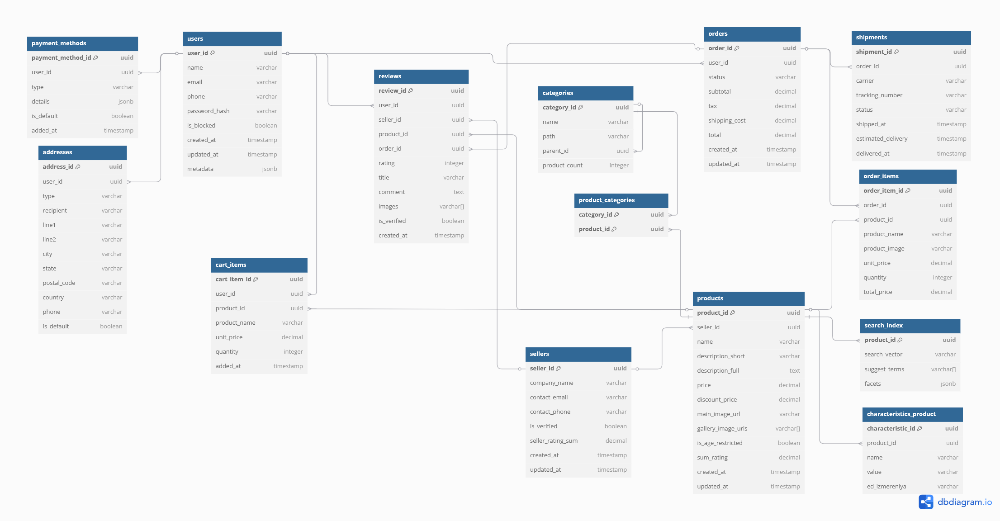
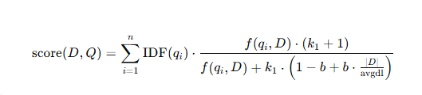

# highload-amazon

=============================

- [1. Тема и целевая аудитория](#block1)
  <!-- - [1.1 Тема](#)
  - [](#) -->
- [2. Расчет нагрузки](#block2)
- [3. Глобальная балансировка нагрузки](#block3)
- [4. Локальная балансировка нагрузки](#block4)
- [5. Масштабирование баз данных](#block5)
- [6. Выбор баз данных](#block6)
- [7. Алгоритмы](#block7)
- [8. Технологии](#block8)
- [0. Источники](#block0)

# **Описание онлайн-платформы Amazon (MVP)**

<a name="block1"></a>

## **1. Тема и целевая аудитория**

### **1.1 Тема**

**Amazon** – это крупнейшая в мире онлайн-платформа для электронной коммерции, предоставляющая пользователям возможность покупать и продавать товары, а также использовать широкий спектр дополнительных сервисов, включая доставку, подписки, облачные вычисления и цифровые товары.

---

### **1.2. Целевая аудитория**

- **Покупатели** – конечные пользователи, приобретающие товары
- **Продавцы** – индивидуальные предприниматели и компании
- **Логистические партнеры** – службы доставки

---

### **1.3. Анализ трафика и вовлеченности**

_(По данным SimilarWeb [1](https://www.similarweb.com/website/amazon.com/) и внутренних отчетов Amazon)_

- **Всего посещений (за месяц):** 2.5B+ [[1]](https://www.similarweb.com/website/amazon.com/)
- **Средняя продолжительность сеанса:** 10 минут [[1]](https://www.similarweb.com/website/amazon.com/)
- **Среднее количество просмотров страниц за посещение:** 8+ [[1]](https://www.similarweb.com/website/amazon.com/)
- **Процент отказов:** ~35% [[1]](https://www.similarweb.com/website/amazon.com/)
- **Количество активных продавцов:** 9M+ [[2]](https://www.marketplacepulse.com/amazon/number-of-sellers)
- **Пользователи Amazon Prime:** 200M+ [[3]](https://www.aboutamazon.com/news/company-news/amazon-prime-has-more-than-200-million-members-globally)


---

### **1.4. Функционал MVP**

#### **Пользовательский функционал**

- **Регистрация и авторизация пользователей** (e-mail, телефон, социальные сети)
- **Каталог товаров и услуг**
  - Просмотр товаров по категориям
  - Фильтрация и сортировка
- **Карточка товара**
  - Описание, фотографии, характеристики
  - Отзывы и рейтинги
- **Корзина и оформление заказа**
  - Добавление товаров
  - Выбор способа доставки
  - Оплата (карты)
- **Личный кабинет**
  - История заказов
  - Адреса доставки

#### **Функционал для продавцов (Marketplace)**

- Регистрация и верификация
- Создание карточек товаров
- Управление заказами и возвратами

#### **Функционал для логистики и доставки**

- Интеграция с Amazon Logistics и партнерами
- Отслеживание заказов
- Управление складами (**FBA — Fulfillment by Amazon**)

---

<a name="block2"></a>

## **2. Расчет нагрузки**

### **2.1 Продуктовые метрики**

- #### MAU = 310M [[7]](https://analyzify.com/statsup/amazon)
- #### DAU = 62M [[7]](https://analyzify.com/statsup/amazon)

Расчёт:
<i>DAU = 0.2×310M ≈ 62M</i>

#### Действия пользователей

| Тип пользователя | Параметр (количество на 1 пользователя в день)   | Число                                                                                                                                                                                                                              |
| ---------------- | ------------------------------------------------ | ---------------------------------------------------------------------------------------------------------------------------------------------------------------------------------------------------------------------------------- |
| Покупатель       | Регистрация, авторизация, обновление профиля     | 0.003 [V]                                                                                                                                                                                                                          |
| Покупатель       | Среднее количество просмотров страниц за сессию  | 8                                                                                                                                                                                                                                  |
| Покупатель       | Количество сессий в день                         | 2                                                                                                                                                                                                                                  |
| Покупатель       | Количество оставленных отзывов за день           | 0.13 [[8]](https://meetanshi.com/blog/amazon-seller-statistics/)[[9]](https://www.powerreviews.com/wp-content/uploads/2023/10/2023-Ratings-Reviews-Report_-Amazon-Edition-1.pdf)                                                   |
| Покупатель       | Количество добавленных товаров в корзину за день | 3 [[12]](https://shopney.co/blog/ultimate-guide-to-increase-add-to-cart-rates/)                                                                                                                                                    |
| Покупатель       | Количество покупок за день                       | 0.19 [[11]](https://amzscout.net/blog/amazon-statistics/)                                                                                                                                                                          |
| Покупатель       | Количество платежей за день                      | 0.19 [[11]](https://amzscout.net/blog/amazon-statistics/)                                                                                                                                                                          |
| Продавец         | Регистрация, верификация, обновление профиля     | 0.003 [V]                                                                                                                                                                                                                          |
| Продавец         | Создание карточек товаров в день                 | 0.7                                                                                                                                                                                                                                |
| Продавец         | Количество отправляемых посылок в день           | 0.6 [[6]](https://www.feedough.com/amazon-statistics-usage-revenue-key-facts/)                                                                                                                                                     |
| Продавец         | Количество возвращаемых посылок в день           | 0.1 [[10]](https://nichesources.com/amazon-return-rate.html#:~:text=Amazon's%20return%20rate%20for%20online,support%20can%20help%20reduce%20returns.)                                                                              |
| Логистика        | Количество перемещаемых посылок в день           | 1.76M [[6]](https://www.feedough.com/amazon-statistics-usage-revenue-key-facts/) [[10]](https://nichesources.com/amazon-return-rate.html#:~:text=Amazon's%20return%20rate%20for%20online,support%20can%20help%20reduce%20returns.) |

<br><br>
Из рассчета, что за 2023 год было продано боле 4.5 млрд товаров [[8]](https://meetanshi.com/blog/amazon-seller-statistics/), а в среднем на карточку товара приходится 40 отзывов [[9]](https://www.powerreviews.com/wp-content/uploads/2023/10/2023-Ratings-Reviews-Report_-Amazon-Edition-1.pdf), то 4.5млрд x 40 = 180млрд<br>
180млрд/(MAU x 12) = 48 - примерное количество отзывов, оставляемое одним пользователем за год

Из рассчета 1,6M - количество посылок, отправляемых в день [[6]](https://www.feedough.com/amazon-statistics-usage-revenue-key-facts/), а активных продавцов 2.3M [[6]](https://www.feedough.com/amazon-statistics-usage-revenue-key-facts/), то <br>
1.6M/2.3M = 0.6 - количество посылок, отправляемых среднестатистич. продавцом в день

Процент возвратов на Amazon варируется между 5% и 15% --> среднее значение 10%<br>
Тогда количество возвращаемых посылок в день 10% от 0.6 = 0.06 = 0.1 [[10]](https://nichesources.com/amazon-return-rate.html#:~:text=Amazon's%20return%20rate%20for%20online,support%20can%20help%20reduce%20returns.)

Из рассчета 1,6M - количество посылок, отправляемых в день [[6]](https://www.feedough.com/amazon-statistics-usage-revenue-key-facts/), а возвращаемых - 10% от этого числа [[10]](https://nichesources.com/amazon-return-rate.html#:~:text=Amazon's%20return%20rate%20for%20online,support%20can%20help%20reduce%20returns.), то <br>
1.6M + 1.6M x 0.1 = 1.76M

Будем считать, что пользователь обновляет/подтверждает свои учетные данные один раз за год.<br>
Тогда 1/356 = 0.003

Из рассчета, что на сервисе в день 62M пользователей, и в день продается 12M товаров [[11]](https://amzscout.net/blog/amazon-statistics/), то<br>
12M/62M = 0.19 - количество покупаемых товаров пользователем в день = количество платежей в день

Из рассчета, что у пользователя 2 сессии в день, за которые он просматривает по 8 страниц по 35 товаров на странице, а конверсия с просмотра составляет 8% [[12]](https://shopney.co/blog/ultimate-guide-to-increase-add-to-cart-rates/), то<br>
2 x 8 x 35 x 0.08 x 0.08 = 3 товара в день пользователь добавляет в корзину

---

#### Рост

| Тип пользователя | Параметр (количество на 1 пользователя в день) | Число                                                                           |
| ---------------- | ---------------------------------------------- | ------------------------------------------------------------------------------- |
| Продавец         | Количество продавцов, регистрирующихся в день  | 3700 [[6]](https://www.feedough.com/amazon-statistics-usage-revenue-key-facts/) |

---

#### Рассчетные параметры карточки товара

Тестовые данные [[0]](https://www.amazon.com/)
| Параметр | Число |
| --------------------------------------------- | ------ |
| Средний размер товарного описания | 100 Кб |
| Среднее количество фотографий у товара | 6 |
| Средний размер фотографии | 250 Кб |
| Среднее количество карточек на одной странице | 35 |

#### Рассчет действий среднестатистич. покупателя

Просмотр товаров в день: 2 сессии x 8 страниц x 35 товаров x (100Кб + (6 фото x 250Кб)) = 896000 Кб

---

### **2.2 Технические метрики**

#### <b style="color:Aqua">RPS</b>

| Тип пользователя | Параметр (количество на 1 пользователя в день)   | Action(число) | RPS      | RPS x3    |
| ---------------- | ------------------------------------------------ | ------------- | -------- | --------- |
| Покупатель       | Регистрация, авторизация, обновление профиля     | 0.003         | 2,15     | 6,45      |
| Покупатель       | Среднее количество просмотров страниц за сессию  | 8             | 5 740,74 | 17 222,22 |
| Покупатель       | Количество сессий в день                         | 2             | 1 435,18 | 4 305,54  |
| Покупатель       | Количество оставленных отзывов за день           | 0.13          | 93,28    | 279,84    |
| Покупатель       | Количество добавленных товаров в корзину за день | 3             | 2 152,77 | 6 458,31  |
| Покупатель       | Количество покупок за день                       | 0.19          | 136,34   | 409,02    |
| Покупатель       | Количество платежей за день                      | 0.19          | 136,34   | 409,02    |
| Продавец         | Регистрация, верификация, обновление профиля     | 0.003         | 0,07     | 0,21      |
| Продавец         | Создание карточек товаров в день                 | 0.7           | 1,86     | 5,58      |
| Продавец         | Количество отправляемых посылок в день           | 0.6           | 1,59     | 4,77      |
| Продавец         | Количество возвращаемых посылок в день           | 0.1           | 0,26     | 0,78      |
| Логистика        | Количество перемещаемых посылок в день           | 1.76M         | 20,37    | 61,11     |
| Total            |                                                  |               | 9721,58  | 29164,74  |

RPS = (Action \* DAU)/(24h x 60' x 60")<br>
DAU пользователей = 62M<br>
DAU продавцов = 2.3M<br>

---

#### Сеть

| Тип пользователя | Параметр (количество на 1 пользователя в день)   | Action(число) | RPS      | RPS x3    | Volume (Kb) | Сеть (Kb/s) | Сеть x3 (Kb/s) |
| ---------------- | ------------------------------------------------ | ------------- | -------- | --------- | ----------- | ----------- | -------------- |
| Покупатель       | Регистрация, авторизация, обновление профиля     | 0.003         | 2,15     | 6,45      | 10          | 21.5        | 64.5           |
| Покупатель       | Среднее количество просмотров страниц за сессию  | 8             | 5 740,74 | 17 222,22 | 1600        | 9 185 184   | 27 555 552     |
| Покупатель       | Количество сессий в день                         | 2             | 1 435,18 | 4 305,54  | 10          | 14 351.8    | 43 055.4       |
| Покупатель       | Количество оставленных отзывов за день           | 0.13          | 93,28    | 279,84    | 50          | 4 664       | 13 9920        |
| Покупатель       | Количество добавленных товаров в корзину за день | 3             | 2 152,77 | 6 458,31  | 20          | 43 055.4    | 129 166.2      |
| Покупатель       | Количество покупок за день                       | 0.19          | 136,34   | 409,02    | 30          | 4 090.2     | 12 270.6       |
| Покупатель       | Количество платежей за день                      | 0.19          | 136,34   | 409,02    | 30          | 4 090.2     | 12 270.6       |
| Продавец         | Регистрация, верификация, обновление профиля     | 0.003         | 0,07     | 0,21      | 10          | 0.7         | 2.1            |
| Продавец         | Создание карточек товаров в день                 | 0.7           | 1,86     | 5,58      | 1600        | 2 976       | 8 928          |
| Продавец         | Количество отправляемых посылок в день           | 0.6           | 1,59     | 4,77      | 100         | 159         | 477            |
| Продавец         | Количество возвращаемых посылок в день           | 0.1           | 0,26     | 0,78      | 100         | 26          | 78             |
| Логистика        | Количество перемещаемых посылок в день           | 1.76M         | 20,37    | 61,11     | 200         | 4 074       | 12 222         |
| Total            |                                                  |               | 9721,58  | 29164,74  |             | 9 262 692.8 | 27 788 078.4   |

Сеть total = 8.83 Гб/сек.<br>
Сеть x3 total = 26.50 Гб/сек.<br>

---

<a name="block3"></a>

## **3. Глобальная балансировка нагрузки**

### **3.1. Разделить трафик на группы по характеру нагрузки**

<h3>Группа 1: Пользовательский трафик (покупатели и продавцы)</h3>
<b>Регистрация, авторизация, обновление профиля:</b> Низкая частота запросов, но критически важная для безопасности и доступности.<br>
<b>Просмотр страниц:</b> Высокая частота запросов, большой объем данных (изображения, описания товаров).<br>
<b>Добавление товаров в корзину:</b> Средняя частота запросов, небольшой объем данных.<br>
<b>Оставление отзывов:</b> Низкая частота запросов, небольшой объем данных.<br>
<b>Покупки и платежи:</b> Низкая частота запросов, но критически важная для бизнеса (требует высокой отказоустойчивости и безопасности).<br>

<h3>Группа 2: Трафик продавцов</h3>
<b>Создание карточек товаров:</b> Средняя частота запросов, большой объем данных (изображения, описания).<br>
<b>Отправка и возврат посылок:</b> Низкая частота запросов, небольшой объем данных.<br>

<h3>Группа 3: Логистический трафик</h3>
<b>Перемещение посылок:</b> Высокая частота запросов, средний объем данных. Этот трафик менее чувствителен к задержкам, но требует высокой пропускной способности.<br>

### **3.2. Выбрать физическое расположение датацентров (базово одного)**


[https://worldpopulationreview.com/state-rankings/state-densities]
[https://www.internetexchangemap.com/]

Для маркетплейса, расположенного в США, рекомендуется использовать несколько датацентров в разных регионах для обеспечения отказоустойчивости и низкой задержки. Основные регионы для размещения датацентров:

    Восточное побережье США (например, Вирджиния, Нью-Йорк): Для обслуживания пользователей на востоке США.

    Западное побережье США (например, Калифорния, Орегон): Для обслуживания пользователей на западе США.

    Центральный регион США (например, Техас, Иллинойс): Для балансировки нагрузки между востоком и западом.

Расстояния между городами (в километрах):

| Город 1                   | Город 2                   | Расстояние (км) |
| ------------------------- | ------------------------- | --------------- |
| Вирджиния (Миннесота)     | Нью-Йорк                  | ~1,800 км       |
| Вирджиния (Миннесота)     | Калифорния (Лос-Анджелес) | ~2,500 км       |
| Вирджиния (Миннесота)     | Орегон (Портленд)         | ~2,300 км       |
| Вирджиния (Миннесота)     | Техас (Даллас)            | ~1,400 км       |
| Вирджиния (Миннесота)     | Иллинойс (Чикаго)         | ~800 км         |
| Нью-Йорк                  | Калифорния (Лос-Анджелес) | ~3,900 км       |
| Нью-Йорк                  | Орегон (Портленд)         | ~3,800 км       |
| Нью-Йорк                  | Техас (Даллас)            | ~2,200 км       |
| Нью-Йорк                  | Иллинойс (Чикаго)         | ~1,200 км       |
| Калифорния (Лос-Анджелес) | Орегон (Портленд)         | ~1,000 км       |
| Калифорния (Лос-Анджелес) | Техас (Даллас)            | ~1,900 км       |
| Калифорния (Лос-Анджелес) | Иллинойс (Чикаго)         | ~2,800 км       |
| Орегон (Портленд)         | Техас (Даллас)            | ~2,500 км       |
| Орегон (Портленд)         | Иллинойс (Чикаго)         | ~2,700 км       |
| Техас (Даллас)            | Иллинойс (Чикаго)         | ~1,300 км       |

Основной датацентр можно разместить в центральном регионе (например, Техас), так как это обеспечит баланс между задержкой для пользователей на востоке и западе.

### **3.3. Глобальная балансировка нагрузки**

- DNS-балансировка Cloudflare для распределения трафика между датацентрами (на основе геолокации пользователя)
- Amazon Route 53 latency-based DNS (на основе геолокации пользователя)
- Использование health checks для автоматического перенаправления трафика в случае сбоя одного из датацентров.

<b>Amazon Route 53</b> - Это надёжный DNS сервис, с достаточно удобным API для редактирования, добавления и удаления записей. [[13]](http://aws.amazon.com/route53/)

<b>Cloudflare</b> — это глобальная сеть доставки контента (CDN), которая предоставляет решения для повышения безопасности и производительности веб-сайтов.[[14]](https://www.cloudflare.com/ru-ru/)

### **3.4. Распределение RPS по серверам в городах**

- Нью-Йорк: ~20% от общего RPS = 5,832.95
- Вирджиния: ~15% от общего RPS = 4,374.71
- Лос-Анджелес: ~25% от общего RPS = 7,291.19
- Портленд: ~10% от общего RPS = 2,916.47
- Даллас: ~15% от общего RPS = 4,374.71
- Чикаго: ~10% от общего RPS = 2,916.47


<a name="block4"></a>

## **4. Локальная балансировка нагрузки** [[15]](https://docs.amazonaws.cn/en_us/eks/latest/userguide/aws-load-balancer-controller.html)

### Алгоритмы балансировки нагрузки

| Алгоритм                  | Плюсы                                                                   | Минусы                                             |
| ------------------------- | ----------------------------------------------------------------------- | -------------------------------------------------- |
| Round-Robin               | Равномерное распределение нагрузки, простота реализации                 | Не учитывает нагрузку на серверы                   |
| Weighted Round-Robin      | Возможность распределять нагрузку с учетом мощности серверов            | Не учитывает текущую загрузку серверов             |
| Least Connection          | Оптимально для долгих соединений, так как учитывает текущие подключения | Возможны перегрузки при резких изменениях нагрузки |
| Weighted Least Connection | Учитывает как текущие подключения, так и мощности серверов              | Сложность в настройке                              |
| IP Hash                   | Клиент всегда подключается к одному и тому же серверу                   | Неравномерное распределение нагрузки               |


### **4.1. Выбрать схемы балансировки для входящих и межсервисных запросов**

- <b>Входящий трафик:</b><br> Использование ALB для балансировки HTTP/S-запросов, а также NLB для низкоуровневого трафика (например, WebSockets или gRPC).

- <b>Межсервисные запросы:</b><br> Балансировка через Service Mesh (например, Istio) или Kubernetes Ingress.

### **4.2. Продумать схему отказоустойчивости**

- <b>Мультизональная балансировка:</b><br> Размещение инстансов в нескольких Availability Zones.

- <b>Автоматическое переключение (failover):</b><br> Использование Route 53 + Health Checks для перенаправления трафика в случае отказа.

- <b>Автошкала:</b><br> Использование HPA (Horizontal Pod Autoscaler) для подстройки количества реплик под нагрузку.

### **4.3. Рассчитать нагрузку по терминации SSL**

При терминации SSL на ALB вычислительные ресурсы распределяются следующим образом:

- <b>Средняя нагрузка на ALB:</b><br> 1000 RPS требует около 1 vCPU.

- <b>Средний размер SSL-сессии:</b><br> 3 KB на подключение.

- <b>Если сервер обрабатывает 100K RPS, </b><br>требуется 100 vCPU ALB.

---

<a name="block5"></a>

## **5. Масштабирование баз данных**

### **5.1 Описать логическую схему данных**


UUID:

    user_id, seller_id, product_id, order_id, cart_id, review_id, logistics_id, image_id.

INT:

    stock_quantity (в таблице products), quantity (в таблицах order_items, cart_items).

TIMESTAMP:

    created_at, updated_at (во всех таблицах).

DECIMAL:

    price, total_amount, rating (в таблицах products, orders, sellers, reviews).

TEXT:

    description (в таблице products), comment (в таблице reviews).

BOOLEAN:

    is_primary (в таблице product_images).

| Таблица        | Размер строки (байт) | Количество записей в сутки | Общий объем в сутки (байт) |
| -------------- | -------------------- | -------------------------- | -------------------------- |
| users          | 211                  | 200,000                    | 42,200,000                 |
| sellers        | 155                  | 3,700                      | 573,500                    |
| products       | 718                  | 200,000                    | 143,600,000                |
| product_images | 249                  | 1,200,000                  | 298,800,000                |
| orders         | 76                   | 12,000,000                 | 912,000,000                |
| order_items    | 60                   | 36,000,000                 | 2,160,000,000              |
| cart           | 48                   | 200,000                    | 9,600,000                  |
| cart_items     | 52                   | 600,000                    | 31,200,000                 |
| reviews        | 568                  | 26,000                     | 14,768,000                 |
| review_images  | 248                  | 52,000                     | 12,896,000                 |
| logistics      | 118                  | 1,760,000                  | 207,680,000                |

<b>users</b> 16 (UUID) + 50 (name) + 50 (email) + 15 (phone) + 64 (password_hash) + 8 (created_at) + 8 (updated_at) = 211

<b>sellers</b> 16 (UUID) + 50 (company_name) + 50 (contact_email) + 15 (contact_phone) + 8 (rating) + 8 (created_at) + 8 (updated_at) = 155

<b>products</b> 16 (UUID) + 16 (seller_id) + 100 (name) + 500 (description) + 8 (price) + 50 (category) + 4 (stock_quantity) + 8 (rating) + 8 (created_at) + 8 (updated_at) = 718

<b>product_images</b> 16 (UUID) + 16 (product_id) + 200 (image_url) + 1 (is_primary) + 8 (created_at) + 8 (updated_at) = 249

<b>orders</b> 16 (UUID) + 16 (user_id) + 20 (status) + 8 (total_amount) + 8 (created_at) + 8 (updated_at) = 76

<b>order_items</b> 16 (UUID) + 16 (order_id) + 16 (product_id) + 4 (quantity) + 8 (price_at_purchase) = 60

<b>cart</b> 16 (UUID) + 16 (user_id) + 8 (created_at) + 8 (updated_at) = 48

<b>cart_items</b> 16 (UUID) + 16 (cart_id) + 16 (product_id) + 4 (quantity) = 52

<b>reviews</b> 16 (UUID) + 16 (user_id) + 16 (product_id) + 4 (rating) + 500 (comment) + 8 (created_at) + 8 (updated_at) = 568

<b>review_images</b> 16 (UUID) + 16 (review_id) + 200 (image_url) + 8 (created_at) + 8 (updated_at) = 248

<b>logistics</b> 16 (UUID) + 16 (order_id) + 50 (tracking_number) + 20 (status) + 8 (shipped_at) + 8 (delivered_at) = 118

---

<a name="block6"></a>

## **6. Выбор баз данных**


<!--  -->



| Таблица                    | Рекомендуемые СУБД                    | Обоснование                                                                |
|---------------------------|----------------------------------------|----------------------------------------------------------------------------|
| users                     | PostgreSQL                             | Авторизация, уникальные индексы, критичность транзакций                    |
| sellers                   | PostgreSQL                             | Связи, отчётность, высокая точность                                        |
| products                  | DynamoDB + Redis (кэш)                 | Горизонтальное масштабирование каталога, быстрая отдача из кэша            |
| categories, product_categories | DynamoDB                          | Простые связи и дерево категорий, нечастые изменения                       |
| characteristics_product   | MongoDB                                | Гибкие JSON-документы, высокая write-throughput                            |
| cart_items                | Redis Cluster                          | Высокочастотные чтения, сессионные данные, TTL                             |
| orders, order_items       | YugabyteDB                             | Шардируемая транзакционная СУБД, высокая доступность                       |
| reviews                   |             MongoDB                    | Массовые записи, быстрые запросы по ключам, шардирование по product_id     |
| addresses                 | DynamoDB                               | Простой CRUD, нет сложных связей                                           |
| payment_methods           | DynamoDB (с TTL + шифрованием)         | Безопасность, высокая скорость, простота                                   |
| shipments                 |            Cassandra                   | Постоянные обновления статусов, минимальная задержка                       |
| search_index              | Elasticsearch                          | Полнотекстовый поиск, фильтрация, suggest API                              |


---
Схема шардирования представлена в файле <a href="./shard_scheme.md">shard_scheme.md</a>

### **Список необходимых индексов по таблицам**

#### **1. Индексы (Products, Characteristics, Shipments, и др.)**

| Таблица               | Поле                   | Тип индекса           | Обоснование                                      |
|-----------------------|------------------------|------------------------|--------------------------------------------------|
| **products**          | `seller_id`            | Secondary Index        | Быстрый поиск товаров конкретного продавца       |
| **products**          | `name`                 | Fulltext / Trigram     | Быстрый поиск по названию                        |
| **products**          | `created_at`           | B-tree Index           | Сортировка новинок, фильтрация по дате          |
| **characteristics_product** | `product_id`     | Foreign Key Index      | Быстрая агрегация/фильтрация характеристик       |
| **product_categories**| `(product_id, category_id)` | Composite PK     | Эффективные JOIN’ы и фильтрация по связям       |
| **shipments**         | `tracking_number`      | Secondary Index        | Поиск по трек-номеру                             |
| **shipments**         | `order_id`             | Partition Key (Shard)  | Быстрый доступ к статусу доставки по заказу      |


---

#### **2. Индексы (Orders, Cart, Order Items)**

| Таблица               | Поле                   | Тип индекса           | Обоснование                                      |
|-----------------------|------------------------|------------------------|--------------------------------------------------|
| **orders**            | `user_id`              | Shard Key + Index      | Шардирование и выборка всех заказов пользователя|
| **orders**            | `created_at`           | B-tree Index           | Фильтрация по дате заказа                        |
| **order_items**       | `order_id`             | Foreign Key Index      | JOIN по заказу                                   |
| **order_items**       | `product_id`           | Secondary Index        | Аналитика: какие товары чаще всего покупают      |
| **cart_items**        | `user_id`              | Secondary Index        | Быстрая загрузка корзины                         |
| **cart_items**        | `product_id`           | Secondary Index        | Быстрое обновление количества                    |


---

#### **3. Индексы (Reviews)**

| Таблица               | Поле                   | Тип индекса           | Обоснование                                      |
|-----------------------|------------------------|------------------------|--------------------------------------------------|
| **reviews**           | `product_id`           | Shard Key / Secondary  | Быстрая загрузка отзывов по товару               |
| **reviews**           | `user_id`              | Secondary Index        | Показ всех отзывов пользователя                  |
| **reviews**           | `seller_id`            | Secondary Index        | Оценка продавцов                                 |


---

#### **4. Индексы (Users, Sellers, Addresses)**

| Таблица               | Поле                   | Тип индекса           | Обоснование                                      |
|-----------------------|------------------------|------------------------|--------------------------------------------------|
| **users**             | `email`                | Unique Index           | Быстрая авторизация                              |
| **users**             | `phone`                | Unique Index           | Альтернативная авторизация                       |
| **sellers**           | `contact_email`        | Unique Index           | Связь с продавцом                                |
| **addresses**         | `user_id`              | Secondary Index        | Быстрая загрузка всех адресов пользователя       |
| **addresses**         | `is_default`           | Partial Index          | Быстрая выборка основного адреса                 |

---

#### **5. Индексы (Payments)**

| Таблица               | Поле                   | Тип индекса           | Обоснование                                      |
|-----------------------|------------------------|------------------------|--------------------------------------------------|
| **payment_methods**   | `user_id`              | Secondary Index        | Быстрая загрузка способов оплаты пользователя    |
| **payment_methods**   | `is_default`           | Partial Index          | Быстрая выборка основного способа оплаты         |

---

#### **6. Индексы (Search Index)**

| Таблица               | Поле                   | Тип индекса           | Обоснование                                      |
|-----------------------|------------------------|------------------------|--------------------------------------------------|
| **search_index**      | `search_vector`        | Fulltext Index         | Полнотекстовый поиск                             |
| **search_index**      | `suggest_terms`        | Inverted Index         | Подсказки по словам                              |
| **search_index**      | `facets`               | GIN Index (jsonb)      | Быстрая фильтрация по фасетам                    |

---

### Полный список таблиц базы данных с описанием
Список таблиц базы данных с описанием представлен в файле <a href="./highload_amazon_schema.md">highload_amazon_schema.md</a>

---


---

<!-- ### Балансировка запросов / мультиплексирование подключений -->

<!-- Для обеспечения высокой доступности и распределения нагрузки используются следующие решения:

#### **PostgreSQL**

- **PgBouncer**:
  - Пул соединений для минимизации накладных расходов
  - Поддержка до 10,000 соединений на инстанс
- **HAProxy**:
  - Балансировка read-запросов между репликами
  - Автоматическое исключение нерабочих нод

#### **Cassandra**

- **Native Driver Balancing**:
  - Round-robin балансировка между нодами
  - Token-aware routing для оптимального распределения
- **DataStax Load Balancer**:
  - Интеллектуальное распределение запросов
  - Мониторинг задержек

#### **DynamoDB**

- **AWS ALB**:
  - Балансировка API-запросов
  - Поддержка автоматического масштабирования
- **DAX** (DynamoDB Accelerator):
  - Кэширование часто запрашиваемых данных
  - Снижение нагрузки на основную БД

#### **MongoDB**

- **MongoDB Connector**:
  - Встроенная балансировка в драйверах
  - Read Preference (primary/secondary/nearest)
- **MongoS Router**:
  - Запросы к шардированным кластерам
  - Агрегация результатов

#### **Redis**

- **Redis Cluster Proxy**:
  - Единая точка входа для кластера
  - Автоматическое перенаправление запросов
- **Twemproxy (nutcracker)**:
  - Поддержка шардирования
  - Пул соединений

#### **Elasticsearch**

- **Coordinating Nodes**:
  - Распределение поисковых запросов
  - Агрегация результатов
- **NGINX**:
  - Балансировка HTTP-запросов
  - Терминирование SSL

#### **Общая инфраструктура**

- **NGINX Plus**:
  - L7 балансировка для API
  - Rate limiting (10,000 RPS на ноду)
  - Health checks каждые 5 сек
- **Envoy Proxy**:
  - Service mesh для микросервисов
  - Circuit breaking
- **Amazon ALB**:
  - Балансировка между AZ
  - Поддержка gRPC/HTTP2

---

**Оптимизации:**

1. Keep-alive соединения для всех СУБД
2. Экспоненциальный backoff при переподключении
3. Локальные кэши драйверов (TTL 1-5 сек)
4. Circuit breakers на уровне приложения

Эта конфигурация обеспечивает:

- 99.99% доступности для критических путей
- Задержки <50ms для 95% запросов
- Автоматическое восстановление при сбоях -->


<a name="block7"></a>

## **7. Алгоритмы**

 **BM25 (Best Match 25)** — функция ранжирования, широко используемая в системах информационного поиска для оценки релевантности документов по отношению к заданному поисковому запросу. [[16]](https://www.kopp-online-marketing.com/what-is-bm25?utm_source=chatgpt.com)

### Принцип работы BM25

BM25 основывается на вероятностной модели информационного поиска и оценивает релевантность документов, учитывая следующие ключевые компоненты:

1. **Частота термина (Term Frequency, TF):** Количество вхождений определенного термина в документе. Чем чаще термин встречается в документе, тем более релевантным считается документ по отношению к запросу, содержащему этот термин. Однако BM25 применяет нелинейную нормализацию TF, чтобы предотвратить чрезмерное влияние часто встречающихся терминов. 

2. **Обратная документная частота (Inverse Document Frequency, IDF):** Оценивает важность термина во всей коллекции документов. Термины, встречающиеся во многих документах, получают более низкий вес, поскольку они менее информативны для определения релевантности. IDF вычисляется по формуле:

   \[
   \text{IDF}(q_i) = \ln \left( \frac{N - n(q_i) + 0.5}{n(q_i) + 0.5} + 1 \right)
   \]

   где:
   - \( N \) — общее количество документов в коллекции;
   - \( n(q_i) \) — количество документов, содержащих термин \( q_i \). citeturn0search0

3. **Длина документа:** BM25 учитывает длину документа, нормализуя TF с учетом средней длины документов в коллекции. Это предотвращает смещение в сторону более длинных документов, которые могут содержать больше терминов просто из-за их объема. 

4. **Параметры настройки:**
   - \( k_1 \): регулирует степень насыщения TF. Стандартное значение — 1.2.
   - \( b \): контролирует влияние длины документа на оценку релевантности. Стандартное значение — 0.75. [[17]](https://www.elastic.co/guide/en/elasticsearch/reference/current/index-modules-similarity.html?utm_source=chatgpt.com)

Формула BM25 для оценки релевантности документа \( D \) запросу \( Q \), содержащему термины \( q_1, q_2, ..., q_n \), выглядит следующим образом:



где:
- \( f(q_i, D) \) — частота термина \( q_i \) в документе \( D \);
- \( |D| \) — длина документа \( D \);
- \( \text{avgdl} \) — средняя длина документов в коллекции. 

### Применение BM25 в Amazon

В Amazon BM25 используется для ранжирования результатов поиска товаров. Алгоритм позволяет учитывать частоту и важность терминов в описаниях товаров, обеспечивая пользователям наиболее релевантные результаты. Настройка параметров \( k_1 \) и \( b \) позволяет адаптировать алгоритм к специфике товарных описаний и поведения пользователей на платформе.

### Преимущества BM25

- **Эффективность:** BM25 демонстрирует высокую точность в оценке релевантности, особенно в коллекциях документов среднего размера.
- **Гибкость:** Параметры \( k_1 \) и \( b \) позволяют настраивать алгоритм под различные типы данных и запросов.
- **Простота реализации:** Несмотря на теоретическую сложность, BM25 относительно прост в реализации и интеграции в существующие системы поиска.

Благодаря этим характеристикам, BM25 стал стандартом де-факто в области информационного поиска и продолжает использоваться в таких крупных системах, как Amazon, для обеспечения высококачественного поиска и удовлетворенности пользователей.


---


<a name="block8"></a>

## **8. Технологии**


Вот пример, как могут быть описаны технологии, применяемые в инфраструктуре **Amazon**, в формате, аналогичном примеру с Netflix:

---

## **Технологии Amazon**

### **Микросервисы и бэкенд-инфраструктура**

| Технология     | Область применения        | Мотивация                                                                 |
|----------------|---------------------------|---------------------------------------------------------------------------|
| AWS ECS / EKS  | Оркестрация микросервисов | Управление контейнерами с высокой доступностью и масштабируемостью       |
| AWS API Gateway| API Management             | Управление REST и WebSocket API, контроль доступа, мониторинг            |
| AWS App Mesh   | Service Mesh               | Обеспечение безопасности, наблюдаемости и маршрутизации между сервисами  |
| Envoy Proxy    | Sidecar-прокси             | Балансировка, трассировка, ретраи и circuit breaking                     |
| AWS Lambda     | Serverless-функции         | Реализация фоновых задач без управления серверами                        |

---

### **Облачная инфраструктура и CDN**

| Технология     | Область применения         | Мотивация                                                                 |
|----------------|----------------------------|---------------------------------------------------------------------------|
| AWS EC2        | Виртуальные серверы        | Масштабируемые вычисления, доступные в глобальных зонах                  |
| Amazon S3      | Объектное хранилище        | Надежное хранение изображений, логов и резервных копий                   |
| AWS CloudFront | Сеть доставки контента (CDN)| Снижение задержек при загрузке контента для глобальных пользователей     |
| AWS Global Accelerator | Оптимизация маршрутов | Увеличение производительности и доступности за счет Anycast маршрутов     |

---

### **Обработка данных и аналитика**

| Технология     | Область применения         | Мотивация                                                                 |
|----------------|----------------------------|---------------------------------------------------------------------------|
| Apache Kafka   | Стриминг событий            | Масштабируемая публикация/подписка на события в реальном времени         |
| AWS Kinesis    | Потоковая обработка         | Обработка миллиона событий в секунду                                     |
| Apache Spark   | Анализ больших данных       | Обработка петабайтных наборов для ML и BI                                |
| Amazon Redshift| Хранилище данных            | Высокопроизводительный SQL-движок для BI и отчетности                    |
| ClickHouse     | Аналитика и агрегации       | Быстрое выполнение аналитических запросов на миллиардах строк            |

---

### **Машинное обучение и персонализация**

| Технология     | Область применения          | Мотивация                                                                 |
|----------------|-----------------------------|---------------------------------------------------------------------------|
| Amazon SageMaker | Обучение ML-моделей       | End-to-end платформа для построения, обучения и деплоя ML                |
| TensorFlow     | Глубокое обучение            | Обработка поведенческих данных пользователей                             |
| PyTorch        | Персонализация и NLP         | Модели рекомендаций и семантического поиска                              |
| Faiss          | Поиск по векторам            | Быстрый nearest-neighbor поиск в embedding-пространстве                  |
| XGBoost        | Фрод-детекция и классификация| Популярный ML-бустинг для табличных данных                               |

---

### **Фронтенд и клиентские приложения**

| Технология     | Область применения          | Мотивация                                                                 |
|----------------|-----------------------------|---------------------------------------------------------------------------|
| React.js       | Веб-интерфейс                | Компонентная архитектура, SSR и SEO                                      |
| Next.js        | SSR и оптимизация рендеринга | Быстрая загрузка страниц и SEO                                            |
| Kotlin / Swift | Мобильные приложения         | Нативная разработка под Android и iOS                                    |
| GraphQL        | Гибкие API для UI            | Запрос только нужных данных, высокая адаптивность для разных платформ    |
| AWS Amplify    | Интеграция с AWS в фронте    | Быстрая разработка с подключением к AWS-сервисам                         |

---

### **Устойчивость и мониторинг**

| Технология     | Область применения          | Мотивация                                                                 |
|----------------|-----------------------------|---------------------------------------------------------------------------|
| AWS CloudWatch | Мониторинг и логгирование    | Сбор метрик, логов, алертинг                                             |
| Prometheus     | Метрики на уровне микросервисов| Мониторинг с поддержкой кастомных экспортеров                            |
| Grafana        | Дашборды и визуализация      | Отображение производительности, SLA и бизнес-метрик                      |
| AWS X-Ray      | Трассировка запросов         | Анализ производительности распределённых систем                          |
| Gremlin        | Тестирование отказоустойчивости| Chaos Engineering в production-среде                                     |

---

### **CI/CD и DevOps**

| Технология     | Область применения          | Мотивация                                                                 |
|----------------|-----------------------------|---------------------------------------------------------------------------|
| AWS CodePipeline | CI/CD конвейеры            | Автоматизация сборки, тестирования и деплоя                              |
| GitHub Actions | Интеграция и деплой          | Простая настройка CI/CD пайплайнов                                       |
| Jenkins        | Автоматизация CI             | Поддержка сложных пайплайнов и кастомных скриптов                        |
| Docker         | Контейнеризация              | Портируемость и изоляция окружений                                       |
| Terraform      | IaC (Infrastructure as Code) | Управление инфраструктурой как кодом                                     |
| Helm           | Управление Kubernetes-чартами| Темплейты и версии конфигураций сервисов                                 |

---

--- 
<a name="block0"></a>
## **Список источников:**

0. https://www.amazon.com/
1. https://www.similarweb.com/website/amazon.com/
2. https://www.marketplacepulse.com/amazon/number-of-sellers
3. https://www.aboutamazon.com/news/company-news/amazon-prime-has-more-than-200-million-members-globally
4. https://amzscout.net/blog/amazon-statistics/#:~:text=It%20is%20estimated%20that%20the%20marketplace%20has%20over%20310%20million%20active%20users%20worldwide
5. https://www.demandsage.com/amazon-statistics/
6. https://www.feedough.com/amazon-statistics-usage-revenue-key-facts/
7. https://analyzify.com/statsup/amazon
8. https://meetanshi.com/blog/amazon-seller-statistics/
9. https://www.powerreviews.com/wp-content/uploads/2023/10/2023-Ratings-Reviews-Report_-Amazon-Edition-1.pdf
10. https://nichesources.com/amazon-return-rate.html#:~:text=Amazon's%20return%20rate%20for%20online,support%20can%20help%20reduce%20returns.
11. https://amzscout.net/blog/amazon-statistics/
12. https://shopney.co/blog/ultimate-guide-to-increase-add-to-cart-rates/
13. http://aws.amazon.com/route53/
14. https://www.cloudflare.com/ru-ru/
15. https://docs.amazonaws.cn/en_us/eks/latest/userguide/aws-load-balancer-controller.html
16. https://www.kopp-online-marketing.com/what-is-bm25?utm_source=chatgpt.com
17. https://www.elastic.co/guide/en/elasticsearch/reference/current/index-modules-similarity.html?utm_source=chatgpt.com


```

```
